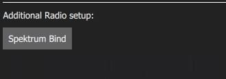
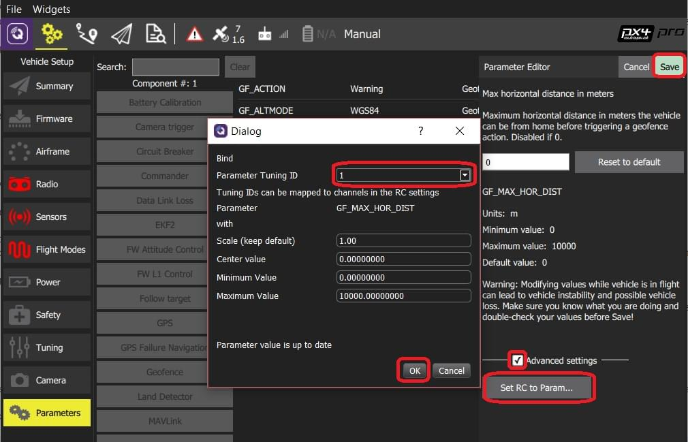

# 라디오 설정

무선 조종기 설정은 주요 송신기 자세 제어 스틱(롤, 피치, 요, 스로틀)의 매핑 채널을 설정하고, 다른 모든 송신기 제어/RC 채널에 대한 최소, 최대, 트림 및 역방향 설정을 보정합니다.

주요 보정 프로세스는 PX4 및 ArduPilot에서 동일합니다(여러 추가 비행 컨트롤러 관련 설정/도구는 [아래에 자세히 설명되어 있음](#additional-radio-setup)).

:::info
무선 시스템을 보정을 하기 위하여 우선 수신기와 송신기를 바인딩하여야 합니다. 송신기와 수신기를 바인딩 프로세스는 하드웨어에 따라 조금씩 차이가 날 수 있습니다 (자세한 지침은 설명서 참조).
:::

## Performing the Calibration

화면 오른쪽 상단의 트랜스미터 다이어그램에 표시된 특정 패턴으로 스틱을 움직여야 합니다. 지침에 따라 보정을 완료합니다.

To calibrate the radio:

1. 상단 도구 모음에서 **톱니 바퀴** 아이콘(기체 설정)을 선택한 다음 가장자리 표시줄에서 **무선 조종기**를 선택하십시오.

2. RC 송신기를 켭니다.

3. **확인**을 눌러 보정작업을 시작합니다.

   

   ::: info
   위 이미지는 PX4 Pro용입니다. 보정/상단 섹션은 두 펌웨어 모두 동일하지만 _추가 라디오 설정_ 섹션은 다릅니다.
   :::

4. 트랜스미터와 일치하는 _송신기 모드_ 라디오 버튼을 설정합니다 (이렇게하면 _QGroundControl_이 교정 중에 따라야 할 올바른 스틱 위치를 표시함).

   

5. 스틱을 텍스트(및 송신기 이미지)에 표시된 위치로 이동합니다. 스틱이 제자리에 있으면 **다음**을 누르십시오. 모든 위치에 대하여 반복하십시오.

6. 메시지가 표시되면 다른 모든 스위치와 다이얼을 전체 범위로 이동합니다 (_채널 모니터_에서 움직이는 것을 관찰 할 수 있습니다).

7. **다음**를 클릭하여 설정을 저장합니다.

무선 조종기 보정은 [자동 조종 장치 설정 동영상](https://youtu.be/91VGmdSlbo4?t=4m30s) (youtube)에 자세히 설명되어 있습니다.

## 추가 무선 조종기 설정

_무선 설정_ 화면 하단에는 펌웨어 관련 _추가 무선 설정_ 섹션이 있습니다. 각 자동조종장치의 옵션은 다음과 같습니다.

| PX4                                                                                                                   | ArduPilot                                                                                                                         |
| --------------------------------------------------------------------------------------------------------------------- | --------------------------------------------------------------------------------------------------------------------------------- |
|  |  |

### 스펙트럼 바인드(ArduPilot/PX4)

무선 조종기를 보정하려면, 수신기와 송신기를 먼저 바인딩하여야 합니다. _Spektrum_ 수신기가있는 경우 아래와 같이 _QGroundControl_을 사용하여 _바인드 모드_로 설정할 수 있습니다.

Spektrum 송신기/수신기 바인딩 절차

1. **Spektrum Bind** 버튼을 선택합니다

2. 수신기의 라디오 버튼을 선택하십시오.

3. **Ok** 버튼을 누릅니다

   

4. 바인드 버튼을 누른 상태에서 Spektrum 송신기의 전원을 켭니다.

### 트림 복사(PX4)

이 설정은 자동 조종 장치 내에서 자동으로 적용될 수 있도록 무선 송신기에서 수동 트림 설정을 복사합니다. 이 작업이 끝나면 수동으로 설정한 트림을 제거하여야 합니다.

To copy the trims:

1. **트림 복사**를 선택합니다.

2. 스틱을 중앙에 놓고 스로틀을 끝까지 내립니다.

3. **Ok** 버튼을 누릅니다.

   

4. 송신기의 트림을 다시 0으로 설정하십시오.

### AUX 패스스루 채널(PX4)

AUX 패스 스루 채널을 사용하면 송신기에서 임의의 옵션 하드웨어 (예 : 그리퍼)를 제어 할 수 있습니다.

AUX 패스스루 채널을 사용하려면:

1. 최대 2 개의 송신기 컨트롤을 별도의 채널에 매핑합니다.
2. 아래에 표시된 것처럼 이러한 채널을 지정하여 AUX1 및 AUX2 포트에 각각 매핑합니다. 값은 설정되는 즉시 기체에 저장됩니다.

   

비행 컨트롤러는 AUX1/AUX2의 지정된 채널에서 수정되지 않은 값을 통해 하드웨어를 구동하는 연결된 서보/릴레이로 전달합니다.

### 매개변수 튜닝 채널(PX4)

튜닝 채널을 사용하면 송신기 튜닝 노브를 매개변수에 매핑할 수 있습니다 (트랜스미터에서 매개변수를 동적으로 수정할 수 있음).

:::tip
이 기능은 수동으로 기내 튜닝을 활성화하기 위하여 제공됩니다.
:::

매개 변수 튜닝에 사용되는 채널은 _라디오_ 설정 (여기!)에서 할당되며 각 튜닝 채널에서 관련 매개변수로의 매핑은 _매개변수 편집기_에서 정의됩니다.

채널 튜닝 절차:

1. 최대 3 개의 송신기 컨트롤 (다이얼 또는 슬라이더)을 개별 채널에 매핑합니다.
2. 선택 목록을 사용하여 라디오 채널에 대한 _PARAM Tuning Id_ 매핑을 선택합니다. 값은 설정되는 즉시 기체에 저장됩니다.

   

PARAM 튜닝 채널을 매개변수에 매핑하려면:

1. **매개 변수** 사이드 바를 오픈합니다.

2. 송신기에 매핑 할 매개 변수를 선택합니다 (이렇게하면 _매개 변수 편집기_가 열립니다).

3. **고급 설정** 확인란을 선택합니다.

4. **RC를 Param으로 설정 ...** 버튼을 클릭합니다 (아래에 표시된 전경 대화 상자가 팝업됩니다).

   

5. _Parameter Tuning ID_ 선택 목록에서 매핑 할 튜닝 채널 (1, 2 또는 3)을 선택합니다.

6. 대화 상자를 닫으려면 **OK** 버튼을 클릭합니다.

7. **저장**을 눌러 모든 변경 사항을 저장하고 _매개 변수 편집기_를 닫습니다.

:::tip
_Parameters_ 화면의 오른쪽 상단에있는 메뉴 **Tools> Clear RC to Param**을 선택하여 모든 매개변수/튜닝 채널 매핑을 삭제할 수 있습니다.
:::
