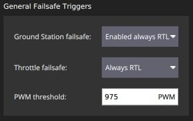
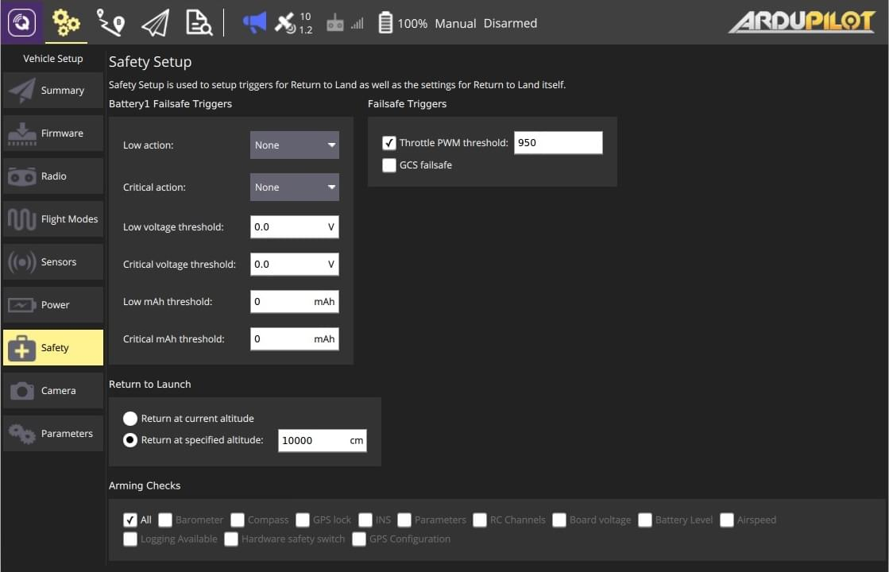
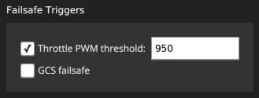
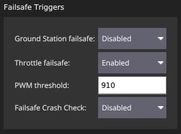

# 안전 설정 (ArduPilot)

The _Safety Setup_ page allows you to configure (vehicle specific) failsafe settings.

:::tip
다른 안전 장치 설정은 각 차량 유형에 대한 안전 장치 설명서에 설명된 [매개변수](../setup_view/parameters.md)를 통하여 설정할 수 있습니다.
:::

:::tip
_QGroundControl_은 ArduPilot에서 폴리곤 펜스 또는 랠리 포인트를 지원하지 않습니다.
:::

## 콥터

콥터의 안전 페이지는 아래와 같습니다.

:::info
추가 안전 설정 및 정보는 [안전장치](http://ardupilot.org/copter/docs/failsafe-landing-page.html)를 참고하십시오.
:::

### 배터리 안전장치 {#battery_failsafe_copter}

이 패널은 [배터리 안전장치](http://ardupilot.org/copter/docs/failsafe-battery.html) 매개변수를 설정합니다.
전압 및 남은 용량에 대해 낮거나 중요한 임계값을 설정하고 안전 장치 값이 위반되는 경우 조치를 정의할 수 있습니다.
임계값을 0으로 설정하여 비활성화할 수 있습니다.

:::tip
두 번째 배터리가 있는 경우([전원 설정](../setup_view/power.md)에서 활성화됨) 두 번째 패널이 동일한 설정으로 표시됩니다.
:::

설정 옵션은 다음과 같습니다:

- **Low action**([BATT_FS_LOW_ACT](http://ardupilot.org/copter/docs/parameters.html#batt-fs-low-act-low-battery-failsafe-action)) - 없음, Land, RTL, SmartRTL, SmartRTL 또는 Land, Terminate 중 하나를 선택합니다.
- **Critical action**([BATT_FS_CRT_ACT](http://ardupilot.org/copter/docs/parameters.html#batt-fs-crt-act-critical-battery-failsafe-action)) - 없음, Land, RTL, SmartRTL, SmartRTL 또는 Land, Terminate 중 하나를 선택합니다.
- **Low voltage threshold**([BATT_LOW_VOLT](http://ardupilot.org/copter/docs/parameters.html#batt-low-volt-low-battery-voltage)) - _낮은 동작_을 트리거하는 배터리 전압입니다.
- **Critical voltage threshold<**([BATT_CRT_VOLT](http://ardupilot.org/copter/docs/parameters.html#batt-crt-volt-critical-battery-voltage))- _중요 작업_을 트리거하는 배터리 전압입니다.
- **Low mAh threshold**([BATT_LOW_MAH](http://ardupilot.org/copter/docs/parameters.html#batt-low-mah-low-battery-capacity)) - _낮은 작업_을 트리거하는 배터리 용량입니다.
- **Critical mAh threshold**([BATT_CRT_MAH](http://ardupilot.org/copter/docs/parameters.html#batt-crt-mah-battery-critical-capacity)) - _중요한 작업_을 트리거하는 배터리 용량입니다.

### 일반적인 안전장치 트리거 {#failsafe_triggers_copter}

이 패널은 [GCS 안전장치](http://ardupilot.org/copter/docs/gcs-failsafe.html)를 활성화하고 스로틀 안전장치를 설정합니다.

설정 옵션은 다음과 같습니다:

- **Ground Station failsafe** - 비활성화, 항상 RTL 활성화, 자동 모드에서 미션 계속 활성화, 항상 SmartRTL 또는 RTL 활성화, 항상 SmartRTL 또는 Land 활성화.
- **Throttle failsafe** - 비활성화됨, 항상 RTL, 자동 모드에서 미션 계속, 항상 착륙.
- **PWM Threshold**([FS_THR_VALUE](http://ardupilot.org/copter/docs/parameters.html#fs-thr-value-throttle-failsafe-value)) - 스로틀 페일세이프가 트리거되는 PWM 값입니다.

### 지오펜스 {#geofence_copter}

이 패널은 원통형 [Simple Geofence](http://ardupilot.org/copter/docs/ac2_simple_geofence.html)에 대한 매개변수를 설정합니다.
울타리 반경 또는 높이 활성화 여부, 위반 최대값 및 위반 시 조치를 설정할 수 있습니다.

설정 옵션은 다음과 같습니다:

- **Circle GeoFence enabled**([FENCE_TYPE](http://ardupilot.org/copter/docs/parameters.html#fence-type-fence-type), [FENCE_ENABLE](http://ardupilot.org/copter/docs/parameters.html#fence-enable-fence-enable-disable)) - 원형 지오펜스를 활성화합니다.
- **Altitude GeoFence enabled**([FENCE_TYPE](http://ardupilot.org/copter/docs/parameters.html#fence-type-fence-type), [FENCE_ENABLE](http://ardupilot.org/copter/docs/parameters.html#fence-enable-fence-enable-disable)) - 고도 지오펜스를 활성화합니다.
- 울타리 작업([FENCE_ACTION](http://ardupilot.org/copter/docs/parameters.html#fence-action-fence-action)) 다음 중 하나:
  - **보고만** - 울타리 위반을 보고합니다.
  - **RTL 또는 Land** - 출발지 복귀 또는 펜스 경계 착륙
- **최대 반경**([FENCE_RADIUS](http://ardupilot.org/copter/docs/parameters.html#fence-radius-circular-fence-radius)) - 부서졌을 때 RTL을 유발하는 원형 울타리 반경.
- **최대 고도**([FENCE_ALT_MAX](http://ardupilot.org/copter/docs/parameters.html#fence-alt-max-fence-maximum-altitude))- 고도 지오펜스를 트리거하는 최대 고도를 표시합니다.

### 출발지 복귀 {#rtl_copter}

이 패널은 [RTL 모드](http://ardupilot.org/copter/docs/rtl-mode.html)의 기능을 설정합니다.

설정 옵션은 다음과 같습니다:

- RTL 복귀 고도 선택([RTL_ALT](http://ardupilot.org/copter/docs/parameters.html#rtl-alt-rtl-altitude)):
  - **현재 고도에서 복귀** - 현재 고도에서 복귀합니다.
  - **지정된 고도에서 복귀** - 현재 고도 미만인 경우 지정된 고도로 상승하여 복귀합니다.
- **집 위 배회**([RTL_LOIT_TIME](http://ardupilot.org/copter/docs/parameters.html#rtl-loit-time-rtl-loiter-time)) - 착륙 전 배회 시간을 설정합니다.
- 다음 중 하나
  - **하강 속도가 있는 착지**([LAND_SPEED](http://ardupilot.org/copter/docs/parameters.html#land-speed-land-speed)) - 최종 하강 속도를 선택합니다.
  - **최종 배회 고도**([RTL_ALT_FINAL](http://ardupilot.org/copter/docs/parameters.html#rtl-alt-final-rtl-final-altitude)) - RTL 또는 임무 후 착륙을 위한 최종 고도를 선택하고 설정합니다(착륙하려면 0으로 설정).

### 시동 검사 {#arming_checks_copter}

이 패널은 어떤 [사전 ARM 안전 검사](http://ardupilot.org/copter/docs/prearm_safety_check.html) 활성 여부를 설정합니다.

설정 옵션은 다음과 같습니다:

- **수행할 무장 점검**([ARMING_CHECK](http://ardupilot.org/copter/docs/parameters.html#arming-check-arm-checks-to-peform-bitmask)) - 모든 적절한 점검: 기압계, 나침반, GPS 잠금, INS, 매개변수, RC 채널, 보드 전압, 배터리 잔량, 대기 속도, 사용 가능한 로깅 , 하드웨어 안전 스위치, GPS 구성, 시스템.

## 비행기

비행기의 안전 페이지는 아래와 같습니다.

:::info
추가 안전 설정 및 정보는 [비행기 안전 장치 기능](http://ardupilot.org/plane/docs/apms-failsafe-function.html) 및 [고급 안전 장치 설정](http://ardupilot.org/plane/docs/advanced-failsafe-configuration.html)을 참고하십시오.
:::

### 배터리 안전장치 {#battery_failsafe_plane}

비행기 배터리 안전 장치는 [낮음](http://ardupilot.org/plane/docs/parameters.html#batt-fs-low-act-low-battery-failsafe-action) 및 [치명적](http://ardupilot.org/plane/docs/parameters.html#batt-fs-crt-act-critical-battery-failsafe-action) 작업(없음, RTL, 착륙, 종료)에 대해 다른 옵션이 있다는 점을 제외하고 헬리콥터와 동일합니다.

자세한 내용은 [배터리 안전장치](#battery_failsafe_copter)(콥터)를 참고하십시오.

### 안전장치 트리거 {#failsafe_triggers_plane}

이 패널은 [GCS 안전장치](http://ardupilot.org/plane/docs/advanced-failsafe-configuration.html#ground-station-communications-loss)를 활성화하고 스로틀 안전장치를 설정합니다.

설정 옵션은 다음과 같습니다:

- **스로틀 PWM 임계치**([THR_FS_VALUE](http://ardupilot.org/plane/docs/parameters.html#thr-fs-value-throttle-failsafe-value)) - 스로틀 페일세이프가 트리거되는 PWM 값입니다.
- **GCS 비상안전장치**([FS_GCS_ENABL](http://ardupilot.org/plane/docs/parameters.html#fs-gcs-enabl-gcs-failsafe-enable)) - GCS 비상안전장치를 활성화합니다.

### 출발지 복귀 {#rtl_plane}

이 패널은 [RTL 모드](http://ardupilot.org/copter/docs/rtl-mode.html)의 기능을 설정합니다.

설정 옵션은 다음과 같습니다:

- RTL 복귀 고도 선택([RTL_ALT](http://ardupilot.org/copter/docs/parameters.html#rtl-alt-rtl-altitude)):
  - **현재 고도에서 복귀** - 현재 고도에서 복귀합니다.
  - **지정된 고도에서 복귀** - 현재 고도 미만인 경우 지정된 고도로 상승하여 복귀합니다.

### 시동 검사 {#arming_checks_plane}

[시동 점검](#arming_checks_copter)은 헬리콥터와 동일합니다.

## 로버

로버의 안전 페이지는 아래와 같습니다.

:::info
추가 안전 설정 및 정보는 [비상안전장치](http://ardupilot.org/rover/docs/rover-failsafes.html)를 참고하십시오.
:::

### 배터리 비상안전장치 {#battery_failsafe_rover}

로버 배터리 비상안전장치는 [콥터](#battery_failsafe_copter)와 동일합니다.

### 비상안전장치 트리거 {#failsafe_triggers_rover}

이 패널은 로버 [비상안전장치](http://ardupilot.org/rover/docs/rover-failsafes.html)를 활성화합니다.

설정 옵션은 다음과 같습니다:

- **지상국 비상안전장치**([FS_GCS_ENABL](http://ardupilot.org/rover/docs/parameters.html#fs-gcs-enable-gcs-failsafe-enable)) - GCS 비상안전장치를 활성화합니다.
- **안전 장치 조절**([FS_THR_ENABLE](http://ardupilot.org/rover/docs/parameters.html#fs-thr-enable-throttle-failsafe-enable)) - 안전 장치 조절을 활성화 또는 비활성화합니다(값은 아래 _PWM 임계값_).
- **PWM Threshold**([FS_THR_VALUE](http://ardupilot.org/rover/docs/parameters.html#fs-thr-value-throttle-failsafe-value)) - 스로틀 페일세이프가 트리거되는 PWM 값입니다.
- **Failsafe Crash Check**([FS_CRASH_CHECK](http://ardupilot.org/rover/docs/parameters.html#fs-crash-check-crash-check-action)) - 충돌 발생 시 수행할 작업: Disabled, Hold, HoldAndDisarm

### 시동 검사 {#arming_checks_rover}

[시동 점검](#arming_checks_copter)은 헬리콥터와 동일합니다.

## Sub

잠수정의 안전 페이지는 아래와 같습니다.

:::info
추가 안전 설정 및 정보는 [비상안전장치](https://www.ardusub.com/operators-manual/failsafes.html)를 참고하십시오.
:::

### 비상안전장치 동작 {#failsafe_actions_sub}

설정 옵션은 다음과 같습니다:

- **GCS 하트비트** - 비활성화, 경고만, 무장 해제, 수심 유지 모드로 들어가기, 수면 모드로 들어가기 중 하나를 선택합니다.
- **누출** - 사용 안 함, 경고만, 수면 모드로 전환 중 하나를 선택합니다.
  - **검출기 핀** - 비활성화, Pixhawk Aux(1-6), Pixhawk 3.3ADC(1-2), Pixhawk 6.6ADC 중 하나를 선택합니다.
  - **건조 시 논리** - 낮음, 높음 중 하나를 선택합니다.
- **배터리** - ?.
- **EKF** - 비활성화, 경고만, 무장 해제 중 하나를 선택합니다.
- **파일럿 입력** - 비활성화, 경고만, 무장 해제 중 하나를 선택합니다.
- **내부 온도** - 비활성화, 경고만 중 하나를 선택합니다.
- **내부 압력** - 비활성화, 경고만 중 하나를 선택합니다.

### 시동 검사 {#arming_checks_sub}

[시동 점검](#arming_checks_copter)은 헬리콥터와 동일합니다.
