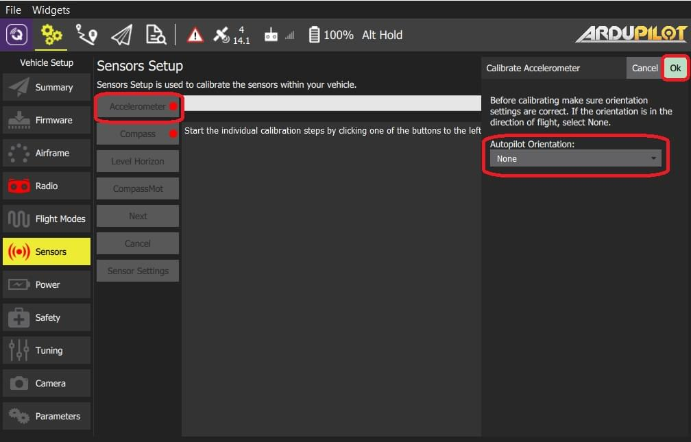
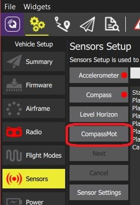
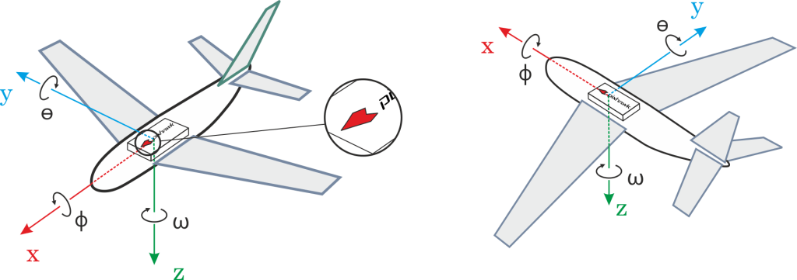

# 센서 설정 (ArduPilot)

_센서 설정_ 섹션에서는 차량의 나침반, 자이로스코프, 가속도계 및 기타 센서를 구성하고 보정할 수 있습니다(사용 가능한 센서는 차량 유형에 따라 다름).

사용 가능한 센서는 사이드바 옆에 버튼 목록으로 표시됩니다.
녹색으로 표시된 센서는 이미 보정된 반면 빨간색으로 표시된 센서는 비행 전에 보정이 필요합니다.
조명이 없는 센서는 보정하지 않도록 선택할 수 있는 기본값이 있는 간단한 설정입니다.

각 센서의 버튼을 클릭하여 보정 시퀀스를 시작합니다.

## 가속도계 {#accelerometer}

비행 컨트롤러의 가속도계를 보정하려면 차량을 여러 방향으로 배치하고 유지하여야 합니다(위치 사이를 이동할 때 메시지가 표시됨).

보정 절차는 다음과 같습니다:

1. **가속도계** 버튼을 클릭합니다.
   지자기센서는 전류와 자기간섭을 측정하므로, 배터리 전류 측정이 설정되어 있어야 올바르게 작동합니다.

   헬리콥터의 경우 이 자세가 부양 자세입니다.
   미리 설정하지 않았다면, 여기에서 설정하십시오.
   :::

2. 보정을 시작하려면 **확인** 버튼을 클릭합니다.

3. 중앙 디스플레이의 지침에 따라 기체를 배치하십시오.
   각 위치를 캡처하려면 **다음** 버튼을 클릭하세요.
   

## 나침반 {#compass}

ArduPilot은 보다 정확한 보정을 가능한 온보드 보정 기능을 사용합니다.

:::info
이전 ArduPilot 펌웨어는 [PX4와 동일한 프로세스](../setup_view/sensors_px4.md#compass)를 사용하여 보정합니다.
:::

진행률 표시줄이 오른쪽 끝까지 채워지고 보정이 완료될 때까지, 모든 축을 중심으로 기체를 무작위로 회전합니다. 보정이 완료되면 다음과 같은 결과가 나타납니다.

이것은 각 나침반에 대한 보정 품질을 보여줍니다. 이 값을 사용하여 성능이 좋지 않은 나침반의 사용 여부를 결정합니다.

## 수평 보정 {#level_horizon}

가속도계 보정 후, 수평선(HUD에 표시됨)이 수평이 아닌 경우 차량의 수평 수평을 보정할 수 있습니다.
정보를 캡처하는 동안 기체를 수평 방향으로 배치하라는 메시지가 표시됩니다.

1. **수평 보정** 버튼을 클릭합니다.
    **참고** 위의 [비행 컨트롤러 방향](#flight_controller_orientation)을 미리 설정하여야 합니다.

    **참고** 위의 [비행 컨트롤러 방향](#flight_controller_orientation)을 미리 설정하여야 합니다.
   미리 설정하지 않았다면, 여기에서 설정하십시오.
   :::

2. 기체를 방향을 유지한 채로 평평한 바닥에 두십시오:

- 고정익의 경우 이 자세가 수평 비행 자세입니다 (비행기는 날개가 약간 올라가는 경향이 있습니다!).
- For copters this is the hover position.

1. 보정을 시작하려면 **확인** 버튼을 클릭합니다.

## 압력/기압계 {#pressure}

이 보정 세트는 현재 압력값에서 고도를 0으로 설정합니다.

**압력** 보정을 수행하려면:

1. **압력 보정** 버튼을 클릭한 다음 **확인** 버튼을 클릭합니다.

   

   보정 결과가 즉시 표시됩니다:

   

## CompassMot(선택 사항)

CompassMot 보정은 선택 사항입니다! 내부 나침반만 있는 기체와 모터, 전선 등의 간섭이 심한 경우에 권장됩니다.
CompassMot only works well if you have a battery current monitor because the magnetic interference is linear with current drawn.

**CompassMot** 보정을 수행하려면:

1. **CompassMot** 버튼을 클릭합니다.

   

2. 화면의 대화상자를 따라 진행합니다.

   

## 센서 설정 {#sensor_settings}

_센서 설정_ 섹션에서 나침반 방향과 활성화된 나침반을 지정할 수 있습니다.

:::tip
비행 컨트롤러와 나침반이 차량에 똑바로 장착되어 있고 정면을 향하고 있는 경우 이 섹션을 건너뛸 수 있습니다(기본 방향 - `ROTATION_NONE`).
:::

자동조종장치/나침반이 다른 방식으로 장착된 경우 해당 방향을 YAW, PITCH 및/또는 ROLL 오프셋으로 지정하여야 합니다(Z, Y 및 X축을 중심으로 시계 방향 회전)

예를 들어 아래 이미지는 `ROTATION_NONE`, `ROTATION_YAW_90`,`ROTATION_YAW_180`,`ROTATION_YAW_270` 방향입니다.

사용되는 방향과 나침반을 설정하려면:

1. **센서 설정** 버튼을 클릭합니다.

   

2. **자동조종장치 방향**을 선택합니다.

3. **나침반 1(기본/외부) > 방향**에서 _방향_을 선택하거나 **나침반2(보조, 외부) > 나침반 사용**을 선택하여 대신 내부 나침반).

4. **OK** 버튼을 클릭합니다.
