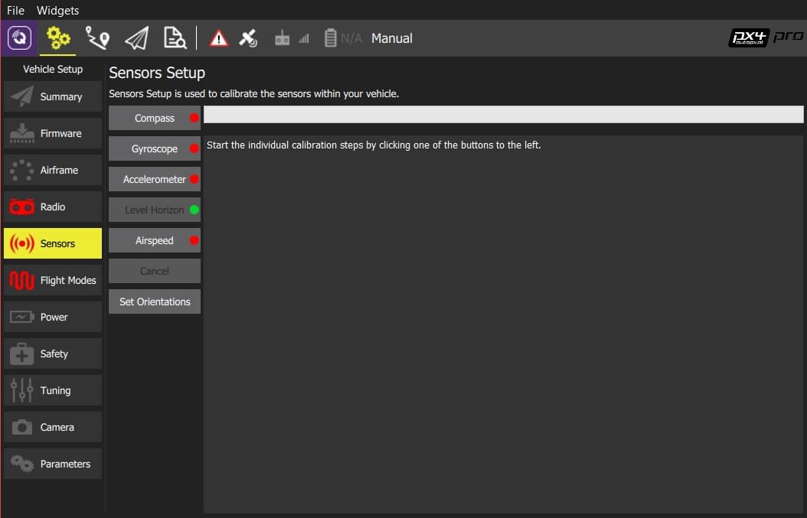
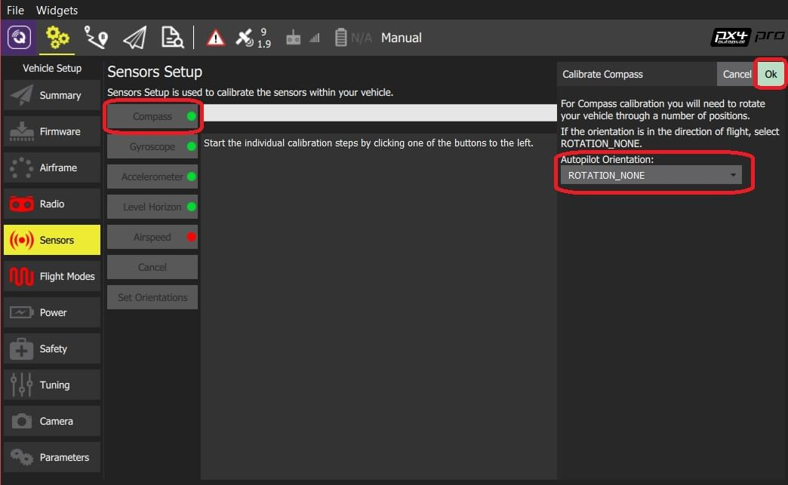
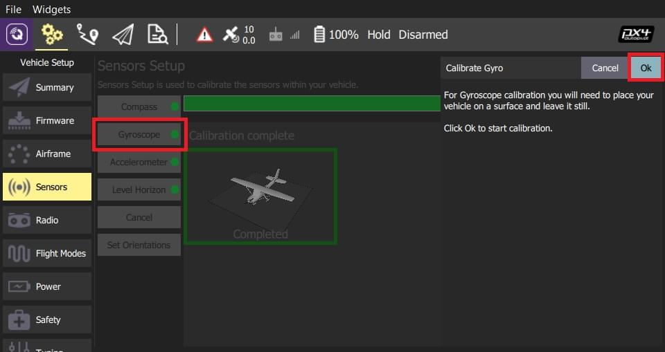
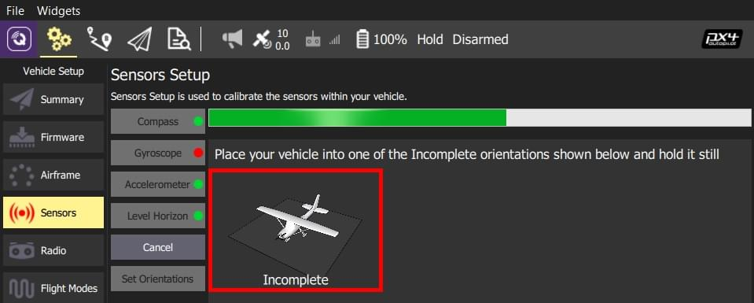
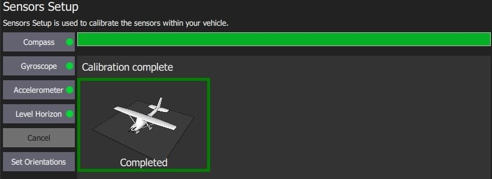
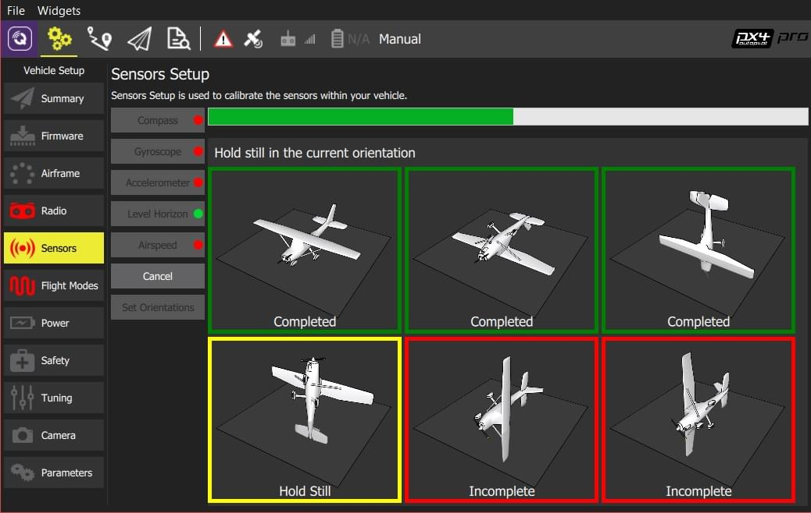
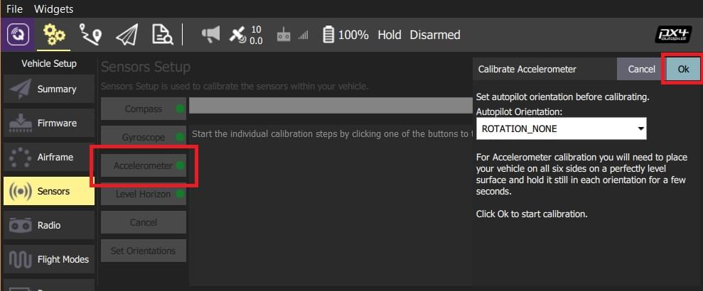
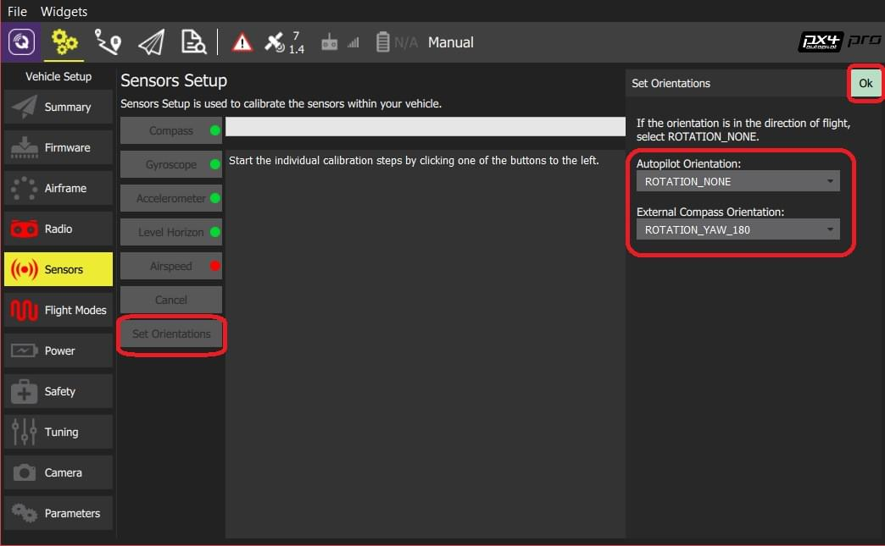

# 센서 설정 (PX4)

_센서 설정_ 섹션에서는 차량의 나침반, 자이로스코프, 가속도계 및 기타 센서를 구성하고 보정할 수 있습니다(사용 가능한 센서는 차량 유형에 따라 다름).

사용 가능한 센서는 사이드바 옆에 버튼 목록으로 표시됩니다.
녹색으로 표시된 센서는 이미 보정된 반면 빨간색으로 표시된 센서는 비행 전에 보정이 필요합니다.
조명이 없는 센서는 보정하지 않도록 선택할 수 있는 기본값이 있는 간단한 설정입니다.

각 센서의 버튼을 클릭하여 보정 시퀀스를 시작합니다.

:::info
표시된 이미지는 PX4 펌웨어를 실행하는 VTOL 차량입니다.
다른 자동 조종 장치 펌웨어 및 차량은 약간 다른 옵션을 제공합니다.
:::

## 나침반 {#compass}

이 프로세스는 여러 설정된 방향으로 기체를 배치하고, 지정된 축을 중심으로 기체를 회전하도록 안내합니다.

보정 절차는 다음과 같습니다:

1. **나침반** 센서 버튼을 클릭합니다.

    **참고** 기본 비행 컨트롤러 방향은 `ROTATION_NONE`입니다(비행 컨트롤러와 나침반은 차량에 수직으로 장착되고 전면을 향하게 장착됨).
   여기 또는 [방향 설정](#flight_controller_orientation)에서 다른 값을 설정할 수 있습니다.
   :::

2. 보정을 시작하려면 **확인** 버튼을 클릭합니다.

3. 빨간색(불완전)으로 표시된 방향으로 기체를 가만히 정지시킵니다.
   메시지가 표시되면(방향 이미지가 노란색으로 변함) 기체를 지정축을 기준으로 한 방향으로 회전시킵니다.
   해당 방향으로 보정이 완료되면, 화면의 관련 이미지가 녹색으로 변경됩니다.
   

4. 기체의 모든 방향에 대하여 보정 작업을 반복합니다.

모든 위치에서 기체를 회전하면 _QGroundControl_에 _보정 완료_가 표시됩니다(모든 방향 이미지가 녹색으로 표시되고 진행률 표시줄이 완전히 채워짐).

## 자이로스코프 {#gyroscope}

차량을 평평한 곳에 놓은 채로 움직이지 않도록 합니다.

보정 절차는 다음과 같습니다:

1. 

2. Place the vehicle on a surface and leave it still.

3. **확인**을 눌러 보정작업을 시작합니다.

   상단의 Progressive Bar에서 진행 상황을 나타냅니다.

   

4. 완료되면 _QGroundControl_에 _Calibration complete_가 표시되고 진행률 표시줄이 완전히 채워집니다.
   

:::info
보정 중에 기체를 움직이면 _QGroundControl_이 자동으로 보정을 다시 시작합니다.
:::

그런 다음 다음 센서로 진행할 수 있습니다.

## 가속도계 {#accelerometer}

비행 컨트롤러의 가속도계를 보정하려면 차량을 여러 방향으로 배치하고 유지하여야 합니다(위치 사이를 이동할 때 메시지가 표시됨).

보정 절차는 다음과 같습니다:

1. **가속도계** 버튼을 클릭합니다.
   항속 센서 보정 절차

    **참고** 위의 [비행 컨트롤러 방향](#flight_controller_orientation)을 미리 설정하여야 합니다.
   미리 설정하지 않았다면, 여기에서 설정하십시오.
   :::

2. 보정을 시작하려면 **확인** 버튼을 클릭합니다.

3. Position the vehicle as guided by the _images_ on the screen. 이것은 나침반 보정과 매우 유사합니다.
   

4. 기체의 모든 방향에 대하여 보정 작업을 반복합니다.

모든 위치에서 차량을 회전하면 _QGroundControl_에 _보정 완료_가 표시됩니다.

그런 다음, 다른 센서의 보정 작업을 진행합니다.

## 수평 보정

가속도계 보정 후, 수평선(HUD에 표시됨)이 수평이 아닌 경우 차량의 수평 수평을 보정할 수 있습니다.
정보를 캡처하는 동안 기체를 수평 방향으로 배치하라는 메시지가 표시됩니다.

1. **자이로스코프** 센서 버튼을 클릭합니다.
   **수평 보정** 버튼을 클릭합니다.

    **참고** 위의 [비행 컨트롤러 방향](#flight_controller_orientation)을 미리 설정하여야 합니다.
   미리 설정하지 않았다면, 여기에서 설정하십시오.
   :::

2. 기체를 방향을 유지한 채로 평평한 바닥에 두십시오:

- 고정익의 경우 이 자세가 수평 비행 자세입니다 (비행기는 날개가 약간 올라가는 경향이 있습니다!).
- For copters this is the hover position.

1. 보정을 시작하려면 **확인** 버튼을 클릭합니다.

## 대기속도 {#airspeed}

항속 보정 오프셋을 결정하기 위하여 항속이 0인 안정적인 기준선을 측정하여야 합니다.
피토 위에 손을 대고 바람을 차단한 채로(실내에서 센서를 보정할 필요가 없는 경우) 입을 사용하여 튜브에 불어 넣습니다 (보정 완료 신호를 보내기 위해).

그런 다음, 다른 센서의 보정 작업을 진행합니다.

1. **대기속도** 센서 버튼을 클릭합니다

   

2. 센서를 덮습니다(예: 손으로).

   ::: warning
   보정하는 동안 센서를 만지지 마십시오(구멍을 막음).
   :::

3. 보정을 시작하려면 **확인** 버튼을 클릭합니다.

4. 센서에 바람을 불어 넣습니다.

5. 덮개를 제거하기 전에 2-3 초간 기다립니다(몇 초 후 캘리브레이션이 자동으로 완료됩니다).

## 방향 설정 {#flight_controller_orientation}

:::tip
비행 컨트롤러와 나침반이 차량에 똑바로 장착되어 있고 정면을 향하고 있는 경우 이 섹션을 건너뛸 수 있습니다(기본 방향 - `ROTATION_NONE`).
:::

자동조종장치/나침반이 다른 방식으로 장착된 경우 해당 방향을 YAW, PITCH 및/또는 ROLL 오프셋으로 지정하여야 합니다(Z, Y 및 X축을 중심으로 시계 방향 회전)

예를 들어 아래 이미지는 `ROTATION_NONE`, `ROTATION_YAW_90`,`ROTATION_YAW_180`,`ROTATION_YAW_270` 방향입니다.

PX4 방향을 설정하려면:

1. **방향 설정** 버튼을 클릭합니다.

   

2. **자동조종장치 방향**을 선택합니다.

3. **외부 나침반 방향**을 선택합니다(이 옵션은 외부 나침반이 있는 경우에만 표시됨).

4. **OK** 버튼을 클릭합니다.
