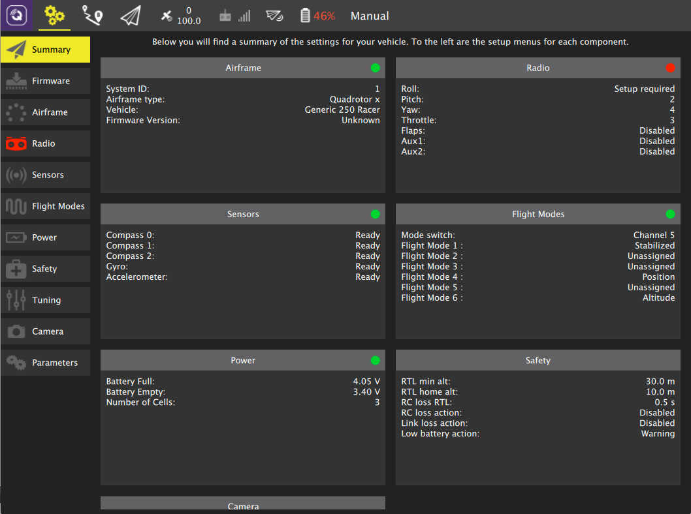

# 설정 보기

설정 보기는 첫 비행 전에 새 기체를 구성하거나 구성된 기체를 조정하는 데 사용됩니다.

## 설정 옵션

화면 왼쪽에는 사용 가능한 설정 옵션 세트가 있습니다. 아직 조정/지정해야 하는 설정이 있는 경우 설정 버튼이 빨간색 아이콘으로 표시됩니다. 이 중 하나라도 빨간색이면 비행해서는 안 됩니다. 위 이미지에서 라디오 설정은 아직 완료되지 않았습니다.

:::info
표시된 옵션 세트와 각 옵션의 내용은 차량이 PX4 Pro 또는 ArduPilot 펌웨어를 실행하는지 여부에 따라 다를 수 있습니다. 위 이미지는 PX4 Pro 펌웨어를 실행하는 기체에서 가져온 것입니다.
:::

**요약**  차량의 중요한 설정 옵션에 대한 개요를 설명합니다. 개별 설정 버튼과 같이 요약 블록은 해당 설정이 완전히 구성되지 않은 경우에는 빨간색 표시기를 표시합니다.

**[펌웨어](firmware.md)**  새 펌웨어를 차량에 플래시합니다.

**[기체](airframe.md)**  차량의 기체 유형을 지정합니다.

**[라디오](radio.md)**  무선 송신기를 보정합니다.

**[센서](sensors.md)**  차량 센서를 보정합니다.

**[비행 모드](flight_modes.md)**  RC 송신기 스위치의 비행 모드를 설정합니다.

**[전원](power.md)**  배터리 설정 및 ESC 보정과 같은 전원에 내용들을 설정합니다.

**[모터](motors.md)**  모터를 테스트하고 설정합니다.

**[안전](Safety.md)**  원위치 복귀 또는 안전 장치와 같은 안전과 관련된 옵션을 설정합니다.

**[조정](tuning.md)**  차량의 비행 특성을 조정합니다.

**[카메라](camera.md)**  카메라와 짐벌을 설정합니다.

**[매개변수](parameters.md)**  차량과 관련된 모든 매개변수를 수정합니다.    
