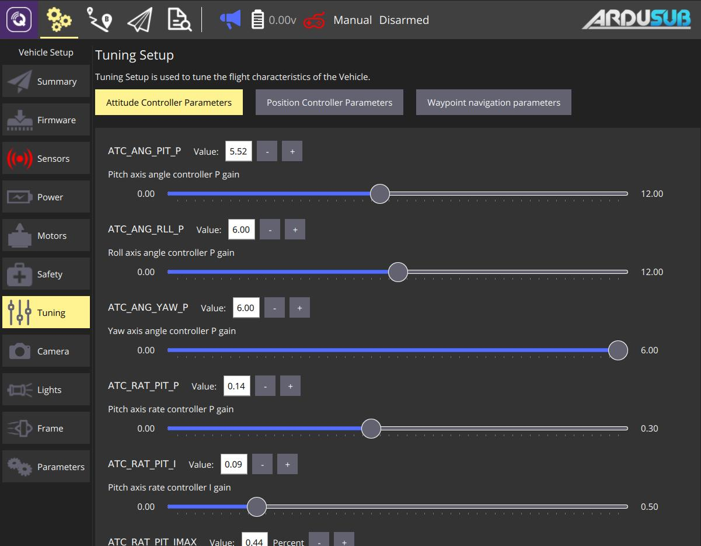

# ArduSub 튜닝

## 튜닝 기초

이 페이지에서는 PID 컨트롤러 게인을 차량과 애플리케이션에 최적화할 수 있습니다. 이를 변경하면 보다 정확한 움직임에 대하여 더 빠른 응답을 얻거나, 영화 장면 녹화시 더 부드럽게 응답하도록 할 수 있습니다. 원하는 슬라이더를 이동하거나 증가 또는 감소 버튼을 클릭하여 매개변수를 설정합니다. 여기에서 조정할 수 있는 세 가지 컨트롤러가 있습니다.

- [**자세 컨트롤러 매개변수**](https://www.ardusub.com/operators-manual/full-parameter-list.html#atc-parameters)는 기체에 충분한 파워(충분한 모터/DOF)가 있는 경우에는 차량의 방향을 원하는 대로 유지하는 컨트롤러의 매개변수입니다.

- **위치 컨트롤러 매개변수**는 3D 공간의 한 지점에서 차량의 위치를 지정하는 컨트롤러의 매개변수입니다. **Z** 매개변수는 깊이 제어가 작동하는 방식을 제어합니다(예: [_깊이 고정_](https://www.ardusub.com/operators-manual/flight-modes.html#depth-hold) 모드). **XY** 매개변수는 [_위치 활성화_](https://www.ardusub.com/operators-manual/flight-modes.html#position-enabled-modes) 모드에서 차량이 수평 위치를 제어하는 방법에 영향을 줍니다.

- **웨이포인트 탐색 매개변수**는 **자동** 및 **안내** 모드에서 다음 웨이포인트를 담당하는 컨트롤러의 매개변수입니다.

  ::: warning
  **안내** 및 **자동** 모드는 현재 지원되지 않으며 QGroundControl의 일부 기능이 비활성화됩니다.
  :::
