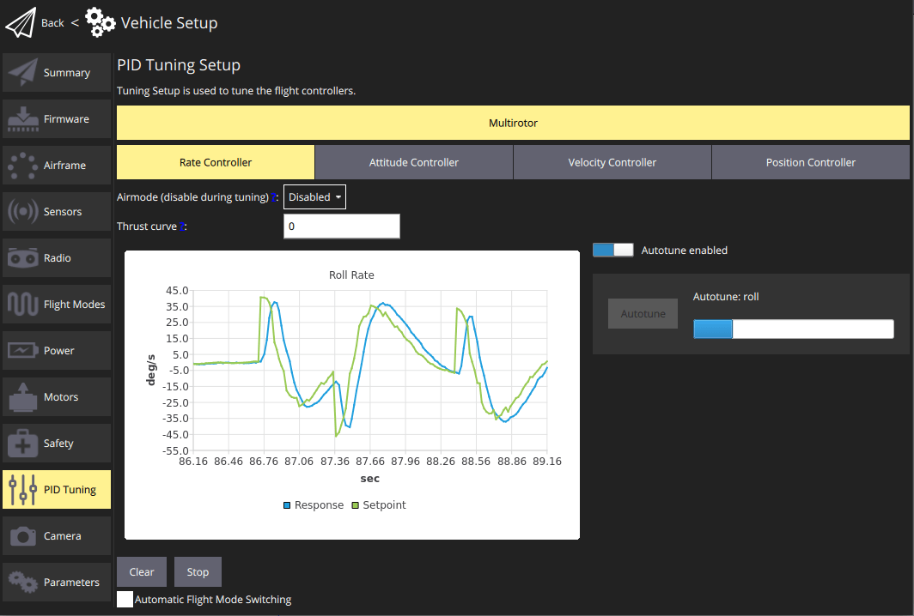
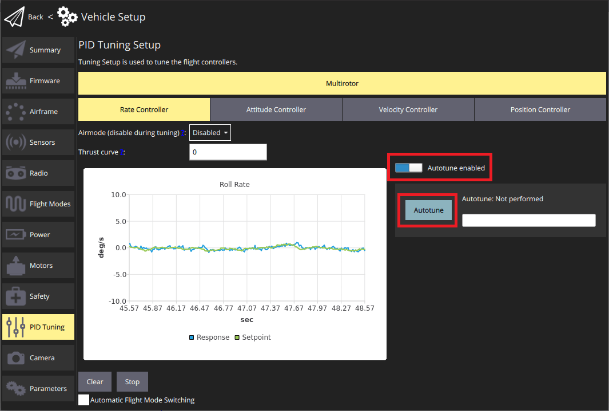
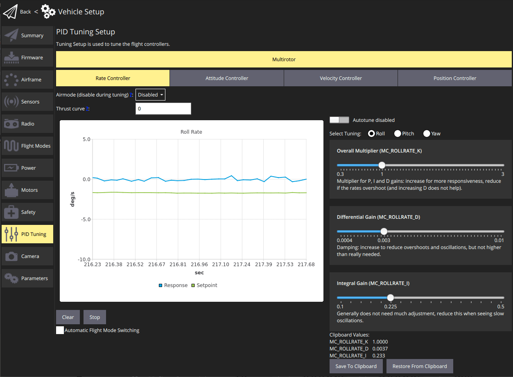
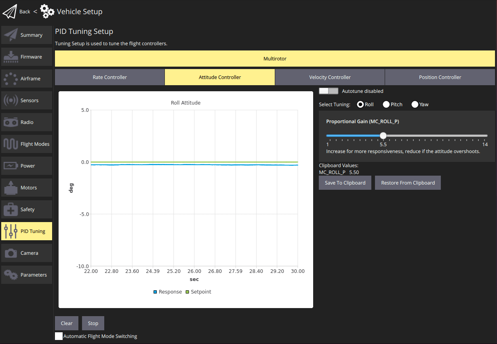
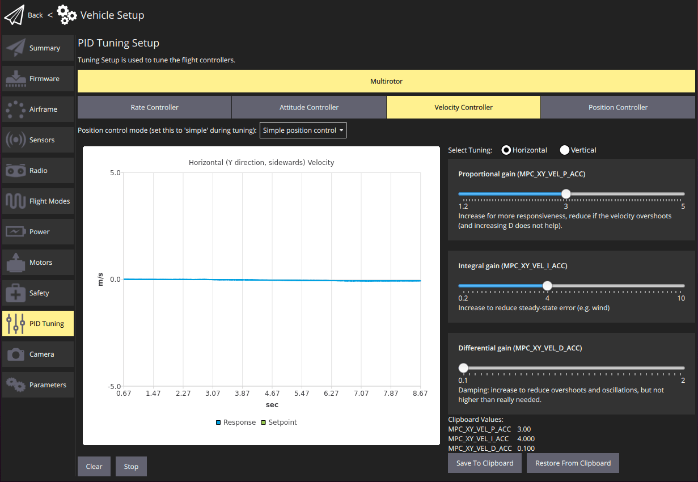

# 튜닝 (PX4)

Tuning only needs to be done once, and is recommended unless you're using vehicle that has already been tuned by the manufacturer (and not modified since).

[자동 튜닝](#autotune)은 일반적으로 프레임 유형 및 이를 지원하는 콘트롤러(멀티콥터, 고정익 및 하이브리드 VTOL 고정익)에 적용하여야 합니다.
튜닝 UI는 모든 콘트롤러의 수동 튜닝도 지원합니다.

:::info
[기체 설정](../config/airframe.md) 중에 귀하의 기체와 가장 근접하게 일치하는 프레임을 미리 선택하여야 합니다.
이것은 일반적으로 비행하기에 충분히 잘 조정되며 자동 튜닝을 실행하기에 충분히 잘 _조정될 수_ 있습니다.
:::

## 자동 튜닝

자동 튜닝은 안정적이고 반응성이 뛰어난 비행을 위한 가장 중요한 컨트롤러인 PX4의 속도 및 자세의 튜닝을 자동화합니다(다른 튜닝은 "선택 사항"에 가깝습니다).

:::info
이 가이드는 자동 튜닝의 기본 사용법을 보여줍니다.
추가 정보 및 설정은 [PX4 자동 튜닝 가이드](http://docs.px4.io/master/en/config/autotune.html)(PX4 사용자 가이드)을 참고하십시오.
:::

### 사전 자동 튜닝 테스트

비행 중에 자동 튜닝이 수행됩니다.
기체 자동 튜닝을 실행하기 전에 비행할 수 있고 적절하게 안정화되어야 합니다.
이 테스트는 기체의 위치 제어 모드에서 안전하게 비행할 수 있는 지 확인합니다.

기체 자동 튜닝을 하여도 안정적인 지 확인하는 방법:

1. 비행 구역이 깨끗하고 충분한 공간이 있는 지 확인하기 위하여 일반적인 비행 전 안전 검사를 수행합니다.
2. 이륙 및 시험 준비
   - **멀티콥터:** **고도 모드** 또는 안정화 모드에서 이륙하여 지상 1m에서 호버링합니다.
   - **고정익 모드:** **위치 모드** 또는 **고도 모드**에서 순항 속도로 이륙하고 비행합니다.
3. _좌회전 오른쪽 롤 중심_ (전체 기동은 약 3초가 소요됩니다).
   차량은 2번의 진동 내에서 안정되어야 합니다.
4. 각 시도에서 더 큰 진폭으로 기울이면서 기동을 반복합니다.
   기체가 \~20도에서 2번의 진동 내에서 안정화될 수 있으면 다음 단계로 이동합니다.
5. 피치 축에서 동일한 동작을 반복합니다.
   위의 A에서 작은 각도로 시작하여 기체의 틸트를 증가시키기 전에 2개의 진동 내에서 스스로 움직일 수 있는 지 확인하십시오.

드론이 2번의 진동 내에서 스스로 안정화될 수 있으면 자동 튜닝 절차의 준비가 완료된 것입니다.

그렇지 않으면, [PX4 사용 설명서 > 자동 튜닝 > 문제 해결](http://docs.px4.io/master/en/config/autotune.html#troubleshooting)을 참고하십시오.

### 자동 튜닝 절차

자동 튜닝은 **충분한 공간이 있는 안전한 지역**에서 진행하여야 합니다.
약 40초(19\~68초)가 걸립니다.
최상의 결과를 얻으려면 날씨가 좋고 바람이 적을 때 테스트 하는 것이 좋습니다.

:::info
RC 컨트롤러로 자동 튜닝 프로세스를 중단할 준비를 하십시오.
:::

테스트 단계는 다음과 같습니다:

1. 위의 [사전 튜닝 테스트](#pre-tuning-test)를 수행합니다.

2. RC를 사용하여 이륙하고 테스트 준비:
   - **멀티콥터:** **고도 모드**에서 조종기를 사용하여 이륙합니다.
     안전한 거리와 지상에서 몇 미터(4\~20m)에서 기체를 호버링하십시오.
   - **고정익 모드의 VTOL:** 순항 속도로 비행하면 **홀드 모드**를 활성화합니다.
     이렇게 하면 비행기가 일정한 고도와 속도로 원을 그리며 비행합니다.

3. QGroundControl에서 메뉴(**기체 PID 튜닝**)를 클릭합니다.

   

4. _Rate Controller_ 또는 _Attitude Controller_ 탭을 선택합니다.
   **자동 튜닝 활성화** 버튼이 활성화되어 있는 지 확인합니다(이렇게 하면 **자동 튜닝** 버튼이 표시되고 수동 튜닝 선택기가 제거됨).

5. 조이스틱의 움직임을 멈추고 **자동 조정** 버튼을 클릭합니다.
   경고 팝업을 읽고 **확인**을 클릭하여 튜닝을 시작합니다.

6. 드론은 먼저 빠른 롤 동작을 수행한 후 피치 및 요 동작을 수행합니다.
   진행률은 _자동 조정_ 버튼 옆의 진행률 표시줄에 표시됩니다.

7. 튜닝을 적용하려면:
   - **고정익:** 조정이 즉시 자동으로 적용되고 비행 중에 테스트됩니다(기본값).
     그런 다음, PX4는 4초 테스트를 실행하고 문제가 감지되면 새 튜닝 작업을 이전 상태로 되돌립니다.
   - **멀티콥터:** 새로운 조정 매개변수를 적용하기 위하여 수동으로 착륙하고 시동을 해제합니다.
     조심스럽게 이륙하고 기체의 안정성을 수동으로 테스트하십시오.

8. 강한 진동이 발생하면 즉시 착지하고 [PX4 사용자 가이드 > 자동 튜닝 > 문제 해결](http://docs.px4.io/master/en/config/autotune.html#troubleshooting)의 지침을 따르십시오.

 

<!--
A video of the process is shown below:

https://youtu.be/5xswOhhqrIQ -->

프로세스의 비디오는 다음과 같습니다:

<iframe width="750" height="425" src="https://www.youtube.com/embed/5xswOhhqrIQ?si=UZQ-M8A8Dt0JfL81" title="YouTube video player" frameborder="0" allow="accelerometer; autoplay; clipboard-write; encrypted-media; gyroscope; picture-in-picture; web-share" allowfullscreen></iframe>

## Manual Tuning

수동 튜닝은 비행 중에 이루어지므로 기체는 미리 비행에 적합하게 튜닝되어 있어야 합니다(일반적으로 적절한 기본 기체를 선택한 경우).

아래 지침은 수동 튜닝 UI를 사용하는 방법을 설명합니다.
PID 값을 변경할 때 사용할 스텝 크기의 종류에 대한 자세한 힌트를 제공하는 [PX4 수동 PID 튜닝 가이드](http://docs.px4.io/master/en/config/autotune.html#see-also)와 함께 읽고/사용하도록 설계되었습니다.

개요:

1. RC를 사용하여 이륙하고 테스트 준비:
   - **멀티콥터:** **고도 모드**에서 조종기를 사용하여 이륙합니다.
     안전한 거리와 지상에서 몇 미터(4\~20m)에서 기체를 호버링하십시오.
   - **고정익:** 순항 속도로 비행하면 **유지 모드**를 활성화합니다.
     이렇게 하면 비행기가 일정한 고도와 속도로 원을 그리며 비행합니다.

2. QGroundControl에서 메뉴(**차량 설정 PID 조정**)를 클릭합니다.

3. _Rate Controller_ 탭을 선택하십시오.
   **자동 튜닝 사용** 버튼이 꺼져 있는 지 확인합니다.

   

4. 조정할 _조정 축_을 선택합니다: **롤**, **피치** 또는 **요**(각 축은 개별적으로 조정됨).

5. 차트의 추적을 관찰하면서 비행합니다.
   - 슬라이더를 사용하여 그래프에 표시되는 추적을 개선하려면 _조정 값_(매개변수)을 조정합니다.
   - 값은 자동으로 저장되지만 **클립보드에 저장** 및 **클립보드에서 복원** 버튼을 사용하여 마지막으로 성공한 설정을 저장할 수 있습니다.
   - 제공된 버튼을 사용하여 차트를 **지우기**/**중지**할 수도 있습니다.

6. 다른 축을 튜닝합니다.

7. 다른 컨트롤러로 전환하고 프로세스를 반복합니다.
   튜닝 페이지의 캡쳐 화면은 아래와 같습니다.

     
