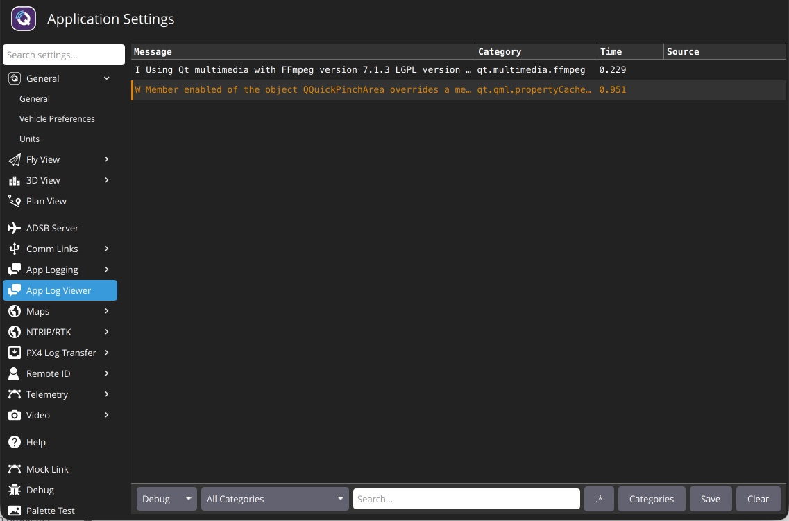

# Console Logging

The _App Log Viewer_ can be a helpful tool for diagnosing _QGroundControl_ problems. It can be found in **Application Settings > App Log Viewer**.



Click the **Categories** button to enable/disable the logging categories displayed by _QGroundControl_.

## Common Logging Categories

The most commonly used logging categories are listed below.

| Category(s)                                                                                          | Description                                                                                                                    |
| ----------------------------------------------------------------------------------------------------------------------- | ------------------------------------------------------------------------------------------------------------------------------ |
| `Comms.LinkManager`, `Vehicle.MultiVehicleManager`                                                                      | Debug connection problems.                                                                                     |
| `Comms.LinkManager:verbose`                                                                                             | Debug serial ports not being detected. Very noisy continuous output of available serial ports. |
| `VehicleSetup.FirmwareUpgrade`                                                                                          | Debug firmware flash issues.                                                                                   |
| `FactSystem.ParameterManager`                                                                                           | Debug parameter load problems.                                                                                 |
| `FactSystem.ParameterManager:debugCacheFailure`                                                                         | Debug parameter cache crc misses.                                                                              |
| `PlanManager.PlanManager`, `PlanManager.MissionManager`, `PlanManager.GeoFenceManager`, `PlanManager.RallyPointManager` | Debug Plan upload/download issues.                                                                             |
| `AutoPilotPlugins.RadioComponentController`                                                                             | Debug Radio calibration issues.                                                                                |

## Logging from the Command Line

An alternate mechanism for logging is using the `--logging` command line option. This is handy if you are trying to get logs from a situation where _QGroundControl_ crashes.

Two options work together:

- `--logging:full` (or `--logging:<comma-separated categories>`) enables the logging categories.
- `--log-output` writes the log messages to stderr (the terminal on macOS/Linux). Without it, messages are only visible in the _App Log Viewer_ and the **AppLog.log** file in the application log directory.

How you do this and where the traces are output vary by OS:

- Windows

  - Open a command prompt and run _QGroundControl_ from its install location (the installer default is shown below). Because _QGroundControl_ is a GUI application it has no console window, so stderr isn't displayed — redirect it to a file to capture it:

    ```sh
    cd "%ProgramFiles%\QGroundControl\bin"
    QGroundControl --logging:full --log-output > "%USERPROFILE%\qgc_log.txt" 2>&1
    ```

- macOS

  - You must run _QGroundControl_ from Terminal. The Terminal app is located in **Applications/Utilities**. Once Terminal is open paste the following into it:

    ```sh
    cd /Applications/QGroundControl.app/Contents/MacOS
    ./QGroundControl --logging:full --log-output
    ```

  - Log traces will output to the Terminal window.

- Linux

  - Run the AppImage from a terminal:

    ```sh
    ./QGroundControl-<arch>.AppImage --logging:full --log-output
    ```

  - Log traces will output to the shell you are running from.
