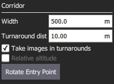
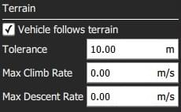

# Corridor Scan (Plan Pattern)

A corridor scan allows you to create a flight pattern that follows a poly-line. This can be used to, for example, survey a road. It is supported on all autopilots and vehicle types.

> **Important** When planning a Corridor Scan using camera specifications the ground elevations under your survey area are assumed to be at the same altitude as your launch/home location. If the ground elevation under your survey area is either higher or lower than your launch/home location the effective overlap in your images will be less or more (respectively) than calculated. If ground elevation under your survey area is significantly higher than your launch/home location you could inadvertently plan a mission which causes the vehicle to fly into trees, obstacles, or the ground. Use Terrain Follow to create a survey that more closely maintains the desired altitude above terrain that has significant elevation differences from your launch/home altitude.

You can specify the path, the width of the corridor, and camera settings appropriate for creating geotagged images.

## Creating a Scan

To create a corridor scan:

1. Open [PlanView](../plan_view/plan_view.md) _Plan Tools_.

2. Choose the _Pattern Tool_ from the _Plan Tools_ and then select _Corridor Scan_.

   

   This will add a corridor to the map, and a _Corridor Scan_ item to the mission list (on the right).

3. On the map drag the ends of the corridor to the start and end positions of the scan, respectively.

4. Click the `(+)` symbol at the centre of a line to create a new vertix.
   The new vertix can then be dragged into position to follow the path of the desired corridor.

The corridor scan settings are covered in the next section.

## Settings

The corridor scan can be further configured in the associated mission item (in the mission item list on the right hand side of the Plan View).

### Camera

Camera triggering behaviour depends on the camera/camera settings.
You can select an existing camera or manually enter the settings.
The list of available cameras (QGC 3.4) is given below.

#### Known Camera

Selecting a known camera from the option dropdown allows you to generate a grid pattern based on the camera's specifications.

The configurable options are:

- **Landscape/Portrait** - Camera orientation relative to the "normal" orientation of the vehicle.
- **Image Overlap** - Overlap between each image.
- Select one of:
  - **Altitude** - Survey altitude (ground resolution will be calculated/displayed for this altitude).
  - **Ground resolution** - Ground resolution for each image (altitude required to achieve this resolution calculated and shown).

#### Manual Camera

The manual camera option allows you to specify desired survey height, trigger interval and appropriate grid spacing for your camera.

The configurable options are:

- **Altitude** - Survey altitude.
- **Trigger Distance** - The distance over ground between each camera shot.
- **Spacing** - Distance between adjacent grid (flight path) lines across the corridor.

### Corridor

The configurable options are:

- **Width** - Set the width of the scan around the polyline that defines the path.
- **Turnaround dist** - Amount of additional distance to add outside the survey area for vehicle turn around.
- **Take images in turnarounds** - Check to enable image capture a turnaround points.
- **Relative altitude** - Check to specify a relative altitude. This is only supported for manual grids that are not using [terrain following](#terrain_following).
- **Rotate entry point** - Press button to swap the start and end point of the corridor scan.

### Terrain Following {#terrain\_following}

By default a flying vehicle will follow the corridor path at a fixed altitude.
Enabling _Terrain Following_ makes the vehicle maintain a constant height relative to ground.

:::info
Terrain following uses terrain heights queried from _AirMap_ servers.
:::

The configurable options are:

- **Vehicle follows terrain** - Check to enable terrain following (and display the following options).
  - **Tolerance** - The accepted deviation in altitude from the target altitude.
  - **Max Climb Rate** - Maximum climb rate when following terrain.
  - **Max Descent Rate** - Maximum descent rate when following terrain.

### Statistics

The _Statistics_ section shows the calculated survey area, photo interval, photo spacing and planned photo count.

