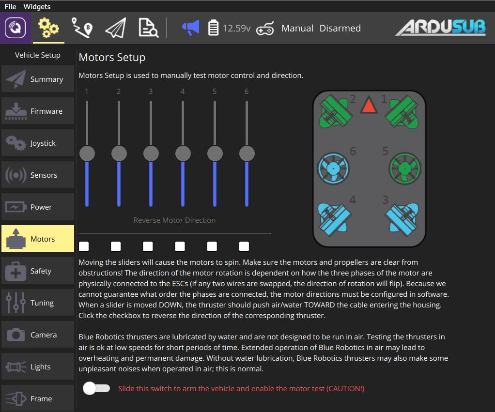
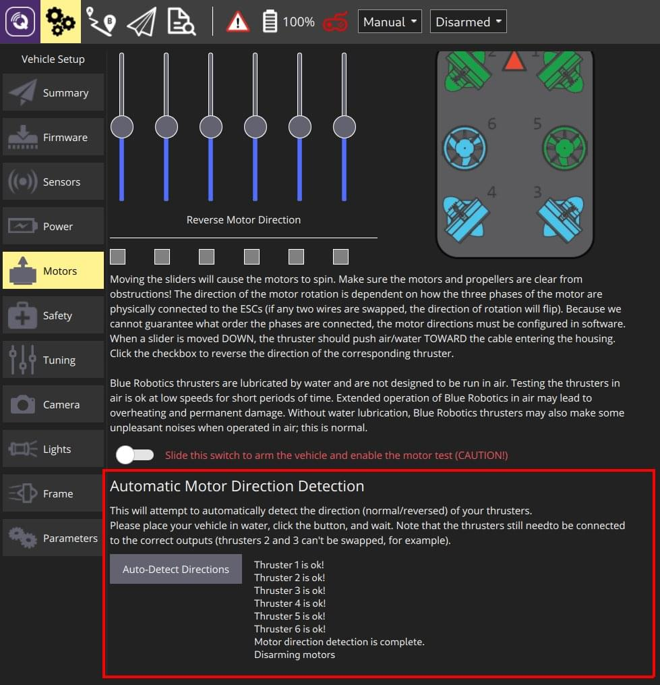

# Motors Setup (ArduSub)

In order for ArduSub to function properly, the motors must be correctly set up.

If you just assembled your ROV, first make sure that the thrusters are connected to the correct outputs in the **Manual Test** section.
Drag each slider and make sure that the _correct motor_ spins accordingly to the frame displayed.

Once you know that the thrusters are connected to the proper outputs you can check for _correct direction_ (forward/reverse) using either [automatic direction detection](#automatic) (recommended from ArduSub 4.0) or the [manual test](#manual).

:::info
[Manual Test](#manual) is supported by ArduSub up to 3.5, while ArduSub 4.0 supports both [Manual Test](#manual) and [automatic direction detection](#automatic).
:::

## Manual Test {#manual}

The ArduSub motor setup allows you to test individual motors.
The sliders allow spinning each motor in forward or reverse mode, and the checkboxes under the sliders allow reversing the operation of individual thrusters.

The image at the right shows the frame currently in use, along with the location and orientation of each thruster.
If the frame selection does not match your vehicle, first select the correct frame in the [Frame](../setup_view/airframe_ardupilot.md#ardusub) tab.

To manually set up and test the motors, read and follow the instructions on the page.

:::warning
Make sure the motors and propellers are clear from obstructions before sliding the switch to arm the vehicle and enable the test!
:::

## Automatic Direction Detection {#automatic}

Ardusub 4.0 and newer support automatic detection of the motor directions.
This works by applying pulses to each motor, checking if the frame reacts as expected, and reversing the motor if necessary.
The process takes around one minute.

To perform the automatic motor direction detection, navigate to **Vehicle Setup->Motors** tab, click the **Auto-Detect Directions** button and wait.
Additional output about the process will be shown next to the button as it runs.

:::warning
This procedure still requires that the motors are connected to the _correct outputs_ as shown in the frame view!
:::

