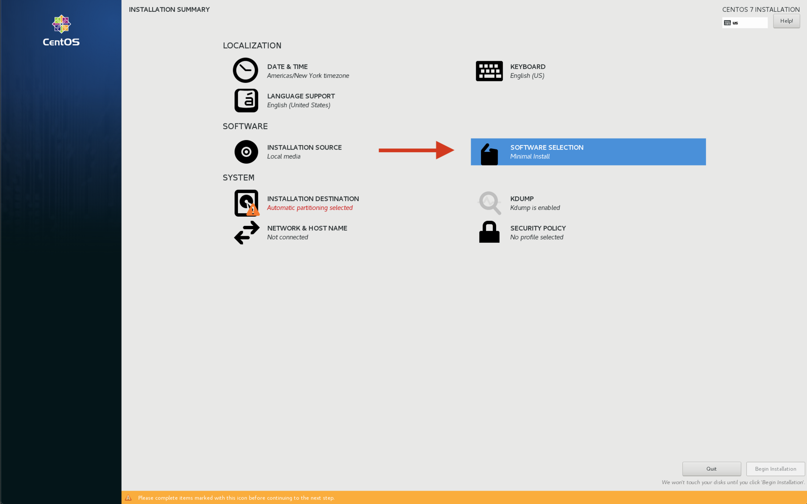
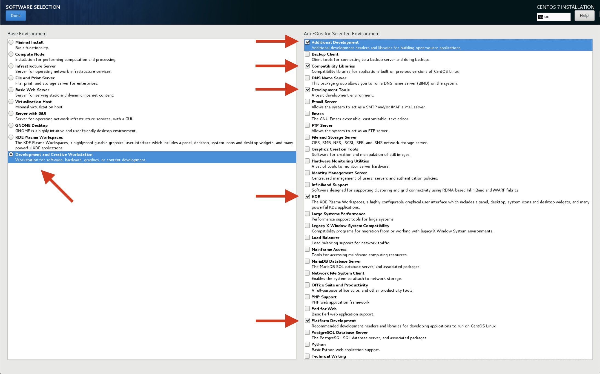
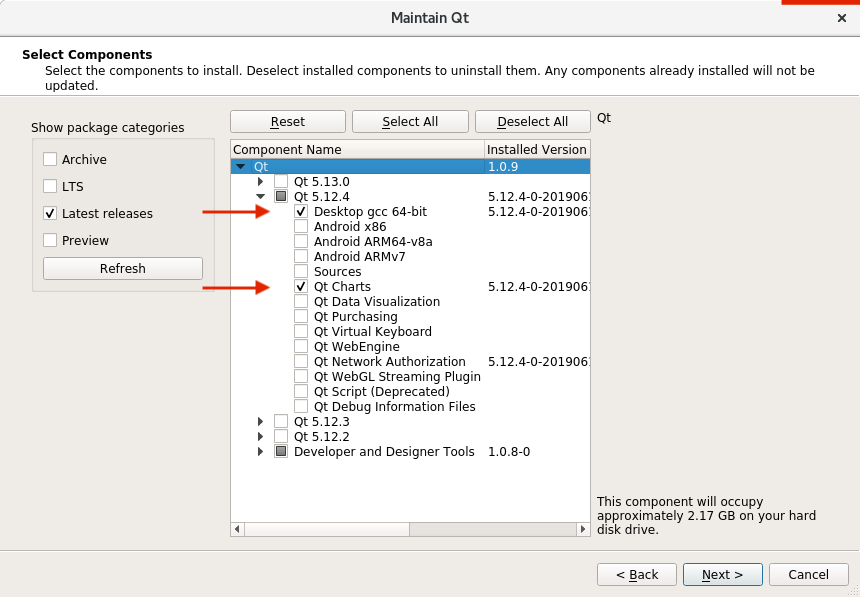

# Using QGC on CentOS 7

## OS Installation

To install CentOS 7:

1. Fetch the latest [CentOS 7 ISO from here](http://isoredirect.centos.org/centos/7/isos/x86_64/CentOS-7-x86_64-DVD-1810.iso)
2. Make a bootable USB stick out of the ISO e.g. by [following this guide](https://linuxize.com/post/how-to-create-a-bootable-centos-7-usb-stick/).
3. Boot the target device from the stick.

The following examples show how to boot the target device from the stick.

**Example:** _Panasonic Toughpad FZ-M1_ (attaching a keyboard and mouse to the device to follow this guide is recommended).

1. Enter the BIOS menu by holding **Delete** on an attached USB keyboard or pressing all hardware buttons around the power button during boot.
2. Once inside the BIOS switch to the _Exit_ tab using the arrow keys or the touchscreen.
3. Select your previously created and plugged in USB stick under Boot device override.

**Example** [UAV Components Micronav](https://www.uavcomp.com/command-control/micronav/) device:

1. The setup of CentOS will not start with the default configuration.
   To solve this
   1. Go to the BIOS menu as explained in the example above.
   2. Disable the "Extension Port" device under the "Advanced" tab.
   3. "Exit and save" the BIOS menu on the Exit page of the BIOS and try again.
   4. After CentOS is installed, you revert the changes again so that the Microhard network works.
2. Make sure to never do a warm reboot but always first shut down the device if you want to reboot into Linux.
   Otherwise the Microhard network adapter will not work properly and slows down the whole system.

### CentOS Software Selection Installation Options

These were the options used to setup a CentOS development system.
Use it as a guideline.





### Update GStreamer

Once CentOS is installed and booted we need to set up the environment for QGC.
First, we need to update GStreamer to a more recent version.
This guide follows Alice Wonder's tips found here: https\://media.librelamp.com

```
sudo yum install epel-release -y
wget http://awel.domblogger.net/7/media/x86_64/awel-media-release-7-6.noarch.rpm
sudo yum localinstall awel-media-release-7-6.noarch.rpm -y
sudo yum clean all
sudo yum update
sudo yum install gstreamer1* --skip-broken -y
```

**Note:** Make sure these are installed (vaapi for Intel GPUs)

```
sudo yum install gstreamer1-vaapi
sudo yum install gstreamer1-libav
```

**Note:** Install these to enable hardware accelerated video decoding

```
sudo yum install libva
sudo yum install libva-utils
sudo yum install libva-intel-driver
```

If libva-intel-driver is not found you can download it and install it manually

```
wget http://download1.rpmfusion.org/free/el/updates/7/x86_64/l/libva-intel-driver-1.8.3-4.el7.x86_64.rpm
sudo yum localinstall libva-intel-driver-1.8.3-4.el7.x86_64.rpm -y
```

### Installing SDL2

SDL2 is used for joystick support.

```
sudo yum install SDL2 SDL2-devel -y
```

### Update Kernel (optional)

:::tip
If your Joystick gets recognized and shows up as `/dev/input/js0` when you run the command `/dev/input/*` you can skip this step.
:::

We recommend updating the kernel for:

- Better touch screen responsiveness.
- Correct recognition of some USB devices - in particular joysticks.

The following joysticks are known not do work out of the box with the default CentOS 7 kernel (3.10.0):

- Logitech F310
- Microsoft Xbox 360 controller (USB)

To fix the joystick not being recognized (even if the same unit is working under Windows or Ubuntu) please [follow this guide to update the kernel](https://www.howtoforge.com/tutorial/how-to-upgrade-kernel-in-centos-7-server/).

Here's a short summary of the commands that you need to execute to update the kernel:

```
sudo rpm --import https://www.elrepo.org/RPM-GPG-KEY-elrepo.org
sudo rpm -Uvh http://www.elrepo.org/elrepo-release-7.0-2.el7.elrepo.noarch.rpm
sudo yum --enablerepo=elrepo-kernel install kernel-ml -y
```

Reboot your device afterwards and make sure the new kernel version shows up as the default start option in the GRUB menu on boot.

:::info
You might need to disable secure boot in the BIOS to allow the new kernel to be booted.
:::

## Running QGC on CentOS

Before launching QGC, you need to make sure the current user has access to the dialout group (serial port access permission):

```
sudo usermod -a -G dialout $USER
```

### Firewall

The default firewall security level of Red Hat distributions like CentOS block MAVLink communication and also the camera video stream.
So you need to create rules to open the incoming ports for MAVLink and camera stream.
For non-production local environment testing purposes ONLY you can temporarily disable the firewall using the following commands ([from here](https://www.liquidweb.com/kb/how-to-stop-and-disable-firewalld-on-centos-7/)):

Temporary:

```
systemctl stop firewalld
```

Permanent (at your own risk):

```
systemctl disable firewalld
```

Undo permanent change:

```
systemctl enable firewalld
```

### Connection problems with multiple networks

In our test with CentOS we had problems when connecting to multiple networks through multiple network devices even with appropriate IP address and subnet assignment.

Issues consisted of:

- Losing Internet access when connecting to a second network
- Having flaky connection to the vehicle with a lot of hiccups and packet losses (e.g. 30 seconds perfect connection 4 seconds of packet loss in a regular pattern)

If you face any of these problems avoid them by only connecting one network at a time e.g. switching between WiFi and Microhard.

### Executing a Prebuilt QGC Binary

- Get hold of an archive containing a prebuilt binary of QGC for CentOS.
  At the moment there is no automatic deployment for this build if you urgently need one get in touch with the developers.
- [Unpack the archive](https://www.hostdime.com/kb/hd/command-line/how-to-tar-untar-and-zip-files).
- Go inside the unpacked files and locate the script named `qgroundcontrol-run.sh`
- Run it by executing the command
  ```
  ./qgroundcontrol-run.sh
  ```

## Building QGC on CentOS

### Installing Qt

```
mkdir ~/devel
cd ~/devel
```

Install Qt 5.12.4 from the Qt installation script that can be downloaded [here](https://www.qt.io/download-thank-you?os=linux\&hsLang=en).
Once downloaded, make it executable and run it:

```
chmod +x qt-unified-linux-x64-3.1.1-online.run
./qt-unified-linux-x64-3.1.1-online.run
```

Select the following options and install it under `~/devel/Qt`:



### Clone and Build QGC

```
git clone --recursive https://github.com/mavlink/qgroundcontrol.git
mkdir build
cd build
```

For a debug/test build:

```
../Qt/5.12.4/gcc_64/bin/qmake ../qgroundcontrol/qgroundcontrol.pro -spec linux-g++ CONFIG+=debug
```

For a release build:

```
../Qt/5.12.4/gcc_64/bin/qmake ../qgroundcontrol/qgroundcontrol.pro -spec linux-g++ CONFIG+=qtquickcompiler
```

Build it:

```
make -j4
```

You can alternatively launch _QtCreator_ (found under `~/devel/Qt/Tools/QtCreator/bin/qtcreator`), load the `qgroundcontro.pro` project and build/debug from within its IDE.

By default, this will build the regular QGC.
To build the sample, customized UI version, follow [these instructions](https://github.com/mavlink/qgroundcontrol/blob/master/custom-example/README.md).
