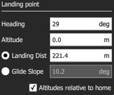

# Sabit Kanat İniş Yolu (Plan Şablonu)

*Fixed Wing Landing Pattern* aracı, göreve sabit kanat iniş yolu eklemenize olanak tanır. Hem ArduPilot hem de PX4'de desteklenir.

Yolun ilk noktası, belirli bir yükseklikte oyalanacağı yer; ikincisi de iniş noktasıdır. Araç, ilk noktada hedeflenen yüksekliğe erişene kadar oyalanacaktır, ardından iniş için belirlenen iniş noktasına doğru alçalmaya başlayacaktır.

Hem oyalanma hem de iniş noktaları, istenilen yeni noktalara sürüklenebilir ve ilişkili görev öğesinden bir takım başka ayarlar yapılabilir.

## İniş Yolu Oluşturma

İniş yolu oluşturmak için:

1. Open [PlanView](../PlanView/PlanView.md) *Plan Tools*.
2. *Plan Tools* 'dan *Plan Tools*'u açın ve *Fixed Wing Landing Pattern*'i seçin.
  
  
  
  Bu, görev listesine (sağda) *Landing Pattern* öğesi ekleyecektir.
  
  

3. Click on the map to create both the loiter point and the landing point. Bu noktalar harita üzerinde hareket ettirilebilir.

Ek ayarlar bir sonraki bölümde ele alınmıştır.

## Ayarlar

İniş yolu, ilişkili görev öğesinde (Plan Görünümü'nün sağ tarafındaki görev öğesi listesinde) daha da yapılandırılabilir.

### Oyalanma Noktası

*Loiter Point* ayarları, oyalanmanın yüksekliğini, yarı çapını ve yönünü ayarlamak için kullanılır.

Ayarlanabilir seçenekler şunlardır:

- **Altitude** - Oyalanma yüksekliği.
- **Radius** - Oyalanma yarıçapı.
- **Loiter clockwise** - Oyalanmanın yönünün saat yönü olması için işaretleyin (varsayılan olarak yön, saat yönünün tersidir). 

### İniş noktası

*Landing Point* ayarları, iniş pozisyonunu ve yolunu ayarlamak için kullanılır.

Ayarlanabilir seçenekler şunlardır:

- **Heading** - Oyalanma noktasından iniş noktasına yönelme.
- **Altitude** - İniş noktası için yükseklik (nominal olarak sıfır).
- *Radyo Butonları* 
  - **Landing Dist** - Distance between loiter point and landing point.
  - **Glide Slope** - Glide slope between loiter point and landing point.
- **Altitudes relative to home** - Tüm yüksekliklerin ev konumuna bağlı olması için işaretleyin (varsayılan olarak deniz seviyesidir).

## Uygulama

Bu şablon 3 gören öğresi oluşturur:

- `DO_LAND_START` - Eğer inişi iptal ederseniz araca `DO_GO_AROUND` komutunu gönderir ki bu komut aracın tekrar bu noktaya gelerek inmeye çalışmasına neden olur.
- `NAV_LOITER_TO_ALT` - İniş için başlangıç noktası
- `NAV_LAND` - İniş için bitiş noktası

Araç, yazılım tarafından `NAV_LOITER_TO_ALT` ve `NAV_LAND` noktaları arasında oluşturulan yolu kullanarak inişe geçer.

Eğer bu 2 konum aracın iniş kısıtlamalarını ihlal ederse (ör. alçalma açısı çok dikse), araca bu geçersiz görev yüklendikten sonra bir hata ortaya çıkacaktır.

> **Note** PX4'te, yükleme esnasında iniş kısıtlamalarının ihlali yer istasyonuna bir hata mesajı gönderir, ve otopilot görevi başlatmayı reddeder (bütünlük kontrolünde başarısız olacağı için).