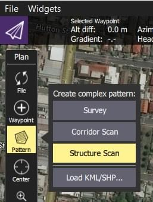
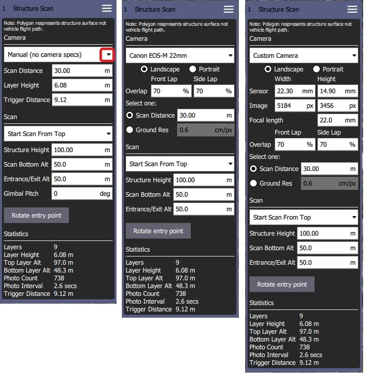

# Yapı Taraması (Plan Şablonu)

*Structure Scan*, çok köşeli (veya dairesel) zemin ayak izine sahip bir yapının *dikey yüzeyleri* üzerinde (ör. duvarlar) görüntüler yakalayabilmek için ızgara şeklinde bir uçuş şablonu oluşturmanıza olanak sağlar. Structure Scans are typically used for the visual inspection or creating 3D models of structures.

*Yapı Taramaları*, Plan ekranında **Pattern > Structure Scan** aracı kullanılarak bir görevin içine yerleştirilebilir.

> **Note** *Structure Scan*'ın yeni versiyonu, eski *Structure Scan* planlarını okuyamaz. Eskilerin tekar oluşturulmaları gerekir.

> **Warning** Bu özellik henüz ArduPilot yazılımı tarafından desteklenmemektedir. PX4'de desteklenir.

## Genel Bakış

Aşağıdaki resim, yapı taramasının bir ekran görüntüsünü göstermektedir. Yeşil çokgen, yapının zemin ayak izini işaretlemek için kullanılırken, etrafındaki beyaz çizgi aracın uçuş yolunu gösterir. Uçuş yolundaki yeşil numaralı daire, taramaya giriş/çıkış noktasıdır (taramanın başladığı yer).

Tarama, yapıyı eşit olarak katmanlara ayırır; araç, yapının çevresinde belirli bir irtifada ve yapıya * scan distance*'den uçar, ardından tüm yüzey taranana kadar işlemi her katmanda tekrarlar.

Kullanıcılar, yapının altındaki engellerden kaçınmak için *scan bottom altitude* ve araç taramaya / taramaya giderken engellerden kaçınmak için *entrance/exit altitude* ayarlayabilir.

## Tarama Oluşturma

Tarama oluşturmak için:

1. **Plan View**'den **Pattern tool > Structure Scan**'ı seçin.
  
  

2. Bu haritada basit kare bir yapı taraması oluşturacaktır.
  
  
  
  Yeşil bölge, yapıyı kaplayacak şekilde düzenlenmelidir.
  
  - Haritadaki opak köşeleri yapının kenarlarına sürükleyin (yukarıda leylak rengi daire içine alınmış köşeler). 
  - Yapının kapladığı alan basit bir kareden fazlaysa, yeni bir köşe noktası oluşturmak için köşeler arasındaki yarı saydam dairelere tıklayabilirsiniz.

3. Ayrıca merkezdeki "daire"ye (kırmızı ile işaretlenmiş) tıklayarak ve açılır menüden *Circle* 'ı seçerek dairesel bir alana geçebilirsiniz.
  
  .
  
  - Açılır menüden çokgen alana geri dönebilir ve taramanın yarıçapını ve/veya konumunu değiştirebilirsiniz.
  - Çemberin merkezini konumlandırmak için merkezdeki daireyi sürükleyin. 

4. Geri kalan düzenlemeler, ekranın sağındaki *Structure Scan* editörü kullanılarak halledilir. İlk olarak manuel tarama, belirli bir kamera kullanarak tarama veya özel bir kamera tanımı kullanarak tarama seçeneklerinden hangisini istediğinizi seçin.
  
  > **Note** Modlar arasındaki temel fark, önceden tanımlanmış kameraların etkili bir katman yüksekliğini ve deklanşör mesafesini doğru bir şekilde hesaplamak için zaten ayarlanmış olmasıdır.
  
  Farklı modlar için seçenekler aşağıda gösterilmiştir.
  
  

Kullanıcı her zaman aşağıdaki ayarları yapılandırabilir:

- **Start scan from top/bottom:** Katmanların taranma yönü.
- **Structure height:**Taranan nesnenin yüksekliği.
- **Scan distance:** Distance from the structure to the flight path.
- **Entrance/Exit Alt:** Son/sonraki hedef noktası ile taranacak yapı arasındaki engellerden kaçınmak için bu ayarı kullanın. 
  - Araç, bu irtifada *Entrance/Exit* noktasına yükselecek ve ardından taramayı başlatmak için ilk katmana alçalacaktır. 
  - Araç, taramayı tamamladıktan sonra bu irtifaya yükselecek ve ardından bir sonraki hedef noktaya geçecektir.
- **Scan Bottom Alt:**Yapının tabanı etrafındaki engellerden kaçınmak için bu ayarı kullanın. Bu ayar, yapının altını yerden yukarıda olacak şekilde ayarlar ve bu nedenle ilk tarama uçuşu yolunun yüksekliği (en alt katmanın yüksekliği) tarama istatistiklerinde *Bottom Layer Alt* olarak gösterilir.
- **Rotate Entry Point:** Başlangıç/bitiş noktasını uçuş yolundaki bir sonraki köşeye/konuma taşıyın.

Kalan ayarlar *camera mode*'a bağlıdır:

- *Manuel Mod* şunları ayarlamanıza olanak verir: 
  - **Layer height:** Her katmanın yüksekliğini.
  - **Trigger Distance:** Her kamera çekimi arasındaki mesafe. Kamera sadece katman yolunda uçarken çekim yapar. Bir katmandan diğerine geçerken görüntü çekmez.
  - **Gimbal Pitch** -Tarama için kullanmak istediğiniz gimbal eğimi.

- *Bilinen/önceden tanımlanmış kameralar* görüntü örtüşmesi için gerekli katman yüksekliklerini ve görüntü çekim aralıklarını otomatik olarak hesaplar ve tarama mesafesini değiştirmenize ve görüntü çözünürlüğü ayarlamanıza olanak tanır. It also ensures that the camera is pointed directly at the surface when it is capturing images (i.e. at a right angle rather than some tangent). Ayarlar şunlardır:
  
  - **Camera Orientation:** Dikey veya Yatay
  - *Örtüşme*: 
    - **Front Lap:** Görüntünün yukardan aşağıya örtüşmesi. (arttırılırsa katman boyu küçülür katman sayısı artar).
    - **Side Lap:** Görüntü kenarlarda örtüşür. (arttırılırsa, her turda/katman taramasında daha fazla görüntü çeker).
  - **Scan distance:** Distance from the structure to the flight path.
  - **Ground Res:** Yüzey için gerekli görüntü çözünürlüğü/numune kalitesi.

- *Custom camera* seçimi, kendi kamera özelliklerinizi girmenize olanak tanır, ancak aksi takdirde önceden tanımlanmış bir kamerayla aynı şekilde davranır.