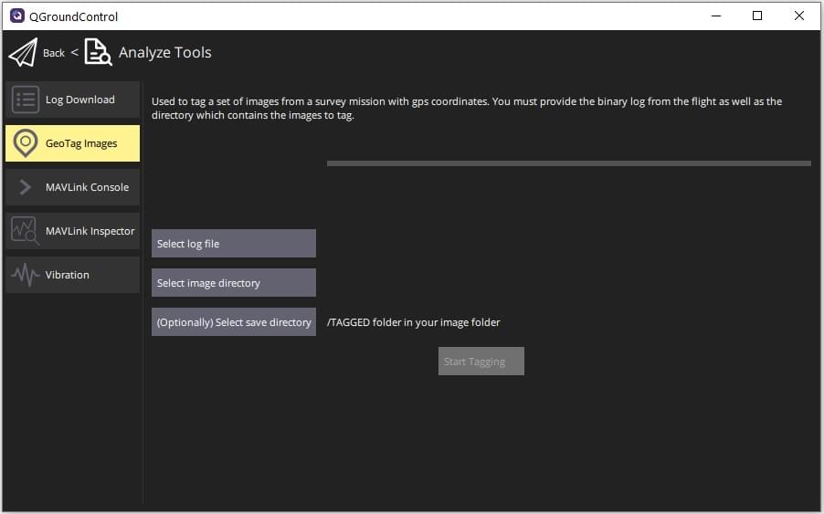

# GeoTag Görüntüleri (Analiz Görünümü)

_GeoTag Images_ ekranı (**Analyze > GeoTag Images**) uçuş kayıtlarındaki bilgileri kullanarak bir gözlem görevindeki görüntüleri çoğrafi etiketlemenize olanak tanır.

:::info
Bu özellik sadece _PX4_ uçuş kayıtlarıyla çalışır.
Ardupilot desteklenmemektedir.
:::

Select the log file, image directory and (optionally) output directory for geotagged images using the buttons provided.
Görüntüleri coğrafi etiketlemeye başlamak için **Start Tagging** 'e tıklayın.
