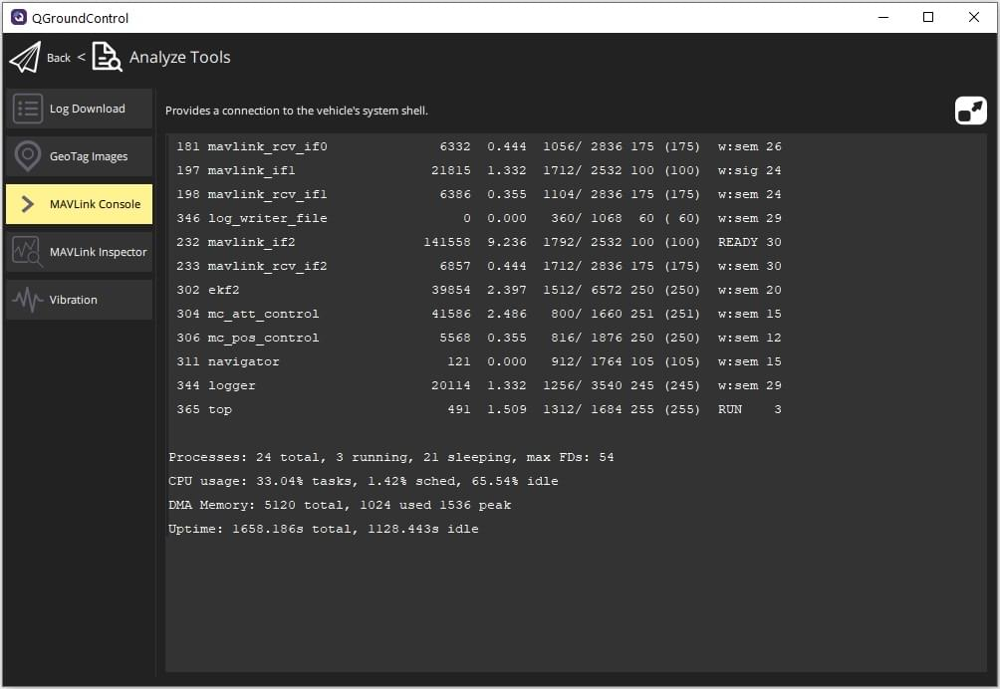

# MAVLink Console (Analyze View)

The MAVLink Console (**Analyze > Mavlink Console**) allows you to connect to the PX4 [System Console](https://docs.px4.io/main/en/debug/system_console.html) and send commands.

:::info
The console only works when connected to _hardware_ running the _PX4_ flight stack.
PX4 SITL and ArduPilot are not supported.
:::

:::tip
This is a very useful feature for developers as it allows deep access to the system. In particular, if you are connected via Wifi, you can have this same level of access while the vehicle is flying.
:::

The view does not display any output except in response to commands.
Once the vehicle is connected, you can enter commands in the bar provided (for a full list of available commands enter: `?`).

Command output is displayed in the view above the command bar.
Click **Show Latest** to jump to the bottom of the command output.
