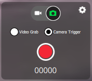

# Camera Tools

The camera tools are used to capture still images and video, and to configure the camera.

The camera capture and configuration options depend on the connected camera.
The configuration options are selected using the panel gear icon.
The configuration for a simple autopilot-connected camera are shown below.

When connected to camera that supports the [MAVLink Camera Protocol](https://mavlink.io/en/services/camera.html) you can additionally configure and use other camera services that it makes available.
For example, if your camera supports video mode you will be able to switch between still image capture and video mode, and start/stop recording.

::: info
Most of the settings that are displayed depend on the camera (they are defined in its [MAVLink Camera Definition File](https://mavlink.io/en/services/camera_def.html)).

> A few common settings at the end are hard-coded: Photo Mode (Single/Time Lapse), Photo Interval (if Time Lapse), Reset Camera Defaults (sends a reset command to the camera), Format (storage)
> :::

### Video Stream {#video_instrument_page}

The video page is used to enable/disable video streaming.
When enabled, you can start/stop the video stream, enable a grid overlay, change how the image fits the screen, and record the video locally with QGC.

