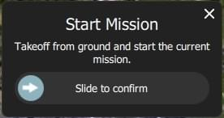
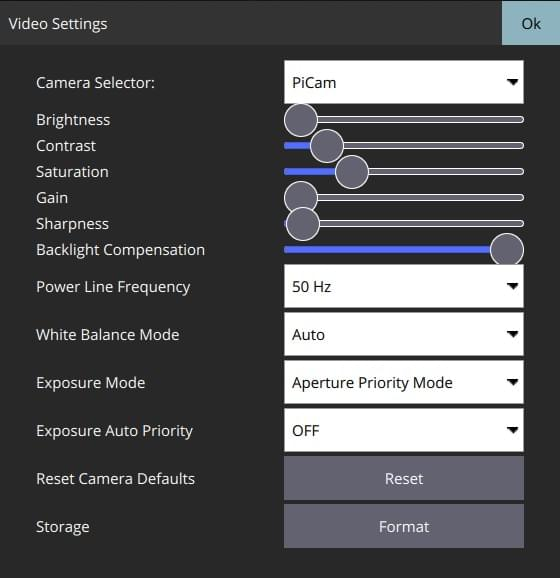

# Fly View

The Fly View is used to command and monitor the vehicle.

## Overview

- **[Toolbar](fly_view_toolbar.md):** The toolbar is at the top of the screen. It provides controls to select views, show flight status and mode as well as the status of the main components of the vehicle.
- **[Vehicle Actions](fly_tools.md):** Allows you command the vehicle to take a specific action.
- **[Instrument Panel](instrument_panel.md):** A widget that displays vehicle telemetry.
- **[Attitude/Compass](hud.md):** A widget that provides virtual horizon and heading information.
- **[Camera Tools](camera_tools.md)**: A widget for switching between still and video modes, starting/stopping capture, and controlling camera settings.
- **[Video](video.md):** Display the video from the vehicle. Allows you to toggle between video or map as the main display.
- **Map:** Displays the positions of all connected vehicles and the mission for the current vehicle.
  - You can drag the map to move it around (the map automatically re-centres on the vehicle after a certain amount of time).
  - You can zoom the map in and out using the zoom buttons, mouse wheel, track pad or pinch on a tablet.
  - Kalkıştan sonra, haritaya tıklayarak bir konuma [Go to](#goto) veya [Orbit at](#orbit) ayarlayabilirsiniz.

There are a number of other elements that are not displayed by default and are only displayed in certain conditions or for certain vehicle types.

## İşlemler/Görevler

Aşağıdaki bölümler, Uçuş Ekranı'nda genel işlemlerin / görevlerin nasıl gerçekleştirileceğini açıklamaktadır.

:::info
Many of the available options depend on both the vehicle type and its current state.
:::

### Actions associated with a map position (#map_actions)

There are a number of actions which can be taken which are associated with a specific position on the map. To use these actions:

1. Click on the map at a specific position
2. A popup will display showing you the list of available actions
3. Select the action you want
4. Confirm the action

Examples of map position actions are Go To Location, Orbit and so forth.

### Pause

You can pause most operations, including taking off, landing, RTL, mission execution, orbit at location. Duraklatıldığında aracın davranışı aracın tipine bağlıdır, genellikle multikopterler havada asılı kalırken sabit kanatlar çember çizer.

:::info
Bir _Goto location_ operasyonunu durduramazsınız.
:::

Durdurmak için:

1. _Fly Tools_'dan **Pause** butonuna basın.
2. İsterseniz yeni bir yüksekliği sağda bulunan dikey kaydırıcıyla ayarlayabilirsiniz.
3. Confirm the pause using the slider.

### Görevler

#### Görevi Başlatma {#start_mission}

Araç inmiş durumdayken bir görevi başlatabilirsiniz (görevi başlatma onay kaydıracı varsayılan olarak çoğu kez gösterilir).

Yerdeki bir aracın görevini başlatmak için:

1. _Fly Tools_'dan **Action** butonuna basın

2. İletişim kutusundan _Start Mission_'ı seçin.

   

   (kaydırmalı onay çubuğunu görüntülemek için)

3. Onay kaydıracı belirdiğinde görevi başlatmak için kaydırın.

   

#### Göreve Devam Etme (Continue Mission) {#continue_mission}

Göreve _sıradaki_ hedef noktanızdan _devam_ edebilirsiniz (_Continue Mission_ kaydırmalı onay butonu kalkıştan sonra çoğu kez varsayılan olarak gösterilir).

:::info
Continue ve [Resume mission](#resume_mission) farklıdır!
Continue komutu durdurulmuş bir görevi tekrar başlatmak veya zaten kalkmış bir araç için yani kalkış görevi komutunu kaçırmış durumdaysanız kullanılır.
Resume mission is used when you've used a RTL or landed midway through a mission (e.g. for a battery change) and then wish to continue the next mission item (i.e. it takes you to where you were up to in the mission, rather than continuing from your place in the mission).
:::

Görevinize aşağıdakileri yaparak devam edebilirsiniz (hali hazırda bir görevde değilseniz!):

1. _Fly Tools_'dan **Action** butonuna basın

2. İletişim kutusundan _Continue Mission_'ı seçin.

   

3. Kaydırmalı onay butonunu kaydırarak göreve devam edin.

   

#### Göreve Devam Etme (Resume Mission) {#resume_mission}

_Resume Mission_, bir görevin içinde [RTL/Return](#rtl) ya da [Land](#land) gerçekleştirdikten sonra (ör. batarya değiştirmek için) kullanılır.

:::info
Eğer bataryayı değiştiricekseniz, bataryanın bağlantısını kestikten sonra QGC ile aracın bağlantısını **kesmeyin**.
Yeni bataryayı yerleştirdikten sonra _QGroundControl_ cihazı tekrar tespit edip, bağlantıyı otomatik olarak yeniden kuracaktır.
:::

İnişten sonra size görev planını cihazdan kaldırma, cihazda bırakma ya da göreve kaldığı yerden devam etme seçeneklerini sunan bir _Flight Plan complete_ iletişim kutusu karşınıza çıkacaktır.

If you select to resume the mission, then _QGroundControl_ will rebuild the mission and upload it to the vehicle.
Ardından _Start Mission_ kaydıracıyla göreve devam edebilirsiniz.

Aşağıdaki görüntü inişten sonra yeniden yapılandırılan bir görevi göstermektedir.

:::info
Bir görev, basit bir şekilde aracın son gerçekleştirdiği görev aşamasından devam edemez, çünkü son yapılan aşamada görevin sonraki aşamalarına etki edebilecek birden fazla etken olabilir (ör. hız komutları ya da kameranın kontrol komutları).
Basit bir şekilde devam etmek yerine, _QGroundControl_ son gerçekleştirilen görev aşamasından başlayarak, ilgili komutları da dikkate alarak görevi tekrar yapılandırır.
:::

#### İnişten Sonra Görevi Kaldırma {#resume_mission_prompt}

Görev bittikten sonra aracın inişi ve devre dışı bırakılmasının ardından görevi araçtan kaldırmanız istenecektir.
This is meant to prevent issues where stale missions are unknowingly left on a vehicle, potentially resulting in unexpected behavior.

### Videoyu Görüntüleme {#video_switcher}

Video akışı etkinleştirildiğinde, _QGroundControl_ haritanın sol altında bulunan "videoya geçiş penceresi"nde videoyu göstermeye başlıyacaktır.
You can press the switcher anywhere to toggle _Video_ and _Map_ to foreground (in the image below, the video is shown in the foreground).

:::info
video akışı [Application Settings > General tab > Video](../settings_view/general.md#video)'dan etkinleştirilebilir/düzenlenebilir.
:::

Video görüntüsünü geçiş penceresindeki kontrolleri kullanararak daha da düzenleyebilirsiniz:

- Resize the switcher by dragging the icon in the top right corner.
- Hide the switcher by pressing the toggle icon in the lower left.
- Sol üst köşedeki ikona basarak video geçiş pencersini ayırabilirsiniz. (ayrıldığında, işletim sisteminizdeki her hangi bir pencere gibi hareket ettirip tekrar boyutlandırabilirsiniz).
  Eğer ayrılan pencereyi kapatırsanız, geçiş penceresi tekrardan QGC uçuş görünüme sabitlenecektir.

### Video Kaydı

Eğer araç ve kamera tarafından destekleniyorsa, _QGroundControl_ kendiliğinden video kaydını başlatıp durdurabilirsiniz. Ayrıca _QGroundControl_ videoyu yayınlayıp, yerel dosyalara kaydedebilir.

:::tip
Kameranın kendisinde kaydedilen video daha kaliteli olacak olsa da, yüksek ihtimalle yer istasyonunun daha büyük kayıt kapasitesi olacaktır.
:::

#### Video Akışını Kaydetme (GCS'de)

Video akışı kaydı [video stream instrument page](#video_instrument_page)'dan kontrol edilir.
Yeni bir video kaydı başlatmak için kırmızı daireye tıklayın (daireye her tıklanıldığında yeni bir video dosyası oluşturulur); kayıt devam ederken çember kırmızı bir kareye dönüşecektir.

Video akışı kaydı [Application Settings > General tab](../settings_view/general.md)'dan düzenlenir:

- [Video Recording](../settings_view/general.md#video-recording) - kayıt dosyası formatını ve depolama sınırlarını belirtir.

  ::: info
  Videolar varsayılan olarak Matroska format (.mkv) olarak kaydedilir.
  Bu format, hata durumunda bozulmaya karşı nispeten dayanıklıdır.
  :::

- [Miscellaneous](../settings_view/general.md#miscellaneous) - Video **Application Load/Save Path**'e kaydedilir.

:::tip
Kaydedilen video, sadece video akışının kendisini içerir.
QGroundControl uygulamasının öğeleriyle videoyu kaydetmek için başka bir ekran kaydı uygulaması kullanmanız gerekir.
:::

#### Videoyu Kamerada Kaydetme

_Kameranın kendisinde_ video kaydını durdurup/başlatmak için [camera instrument page](#camera_instrument_page)'i kullanabilirsiniz.
İlk olarak video moduna geçiş yapın, ardından kırmızı butona basarak kaydı başlatabilirsiniz.

