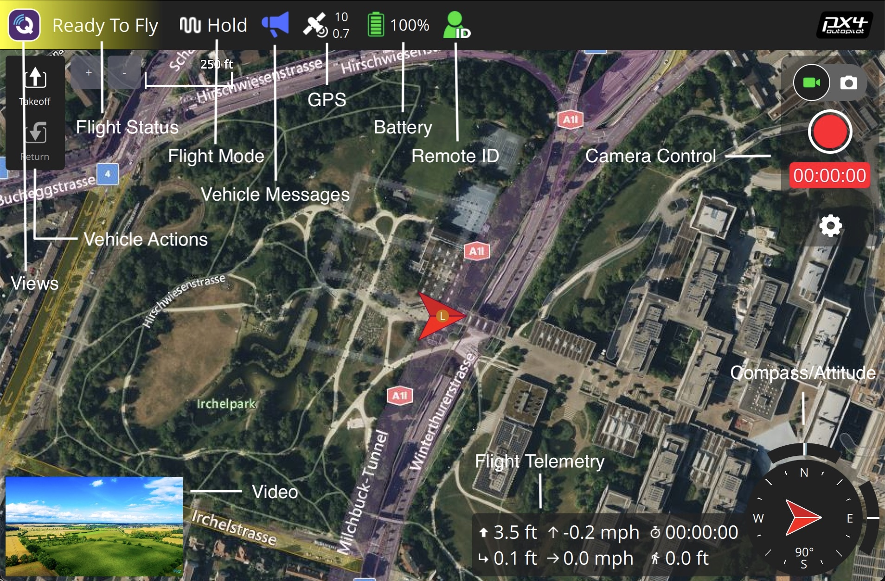
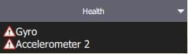
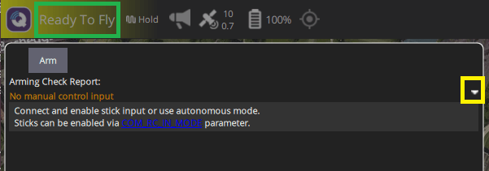
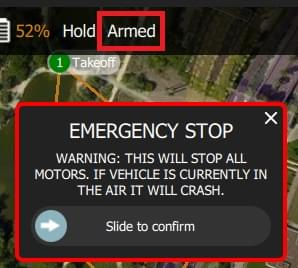
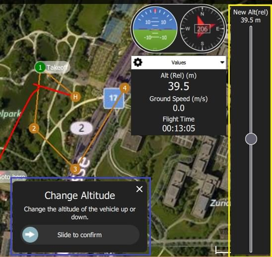
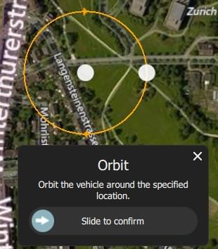
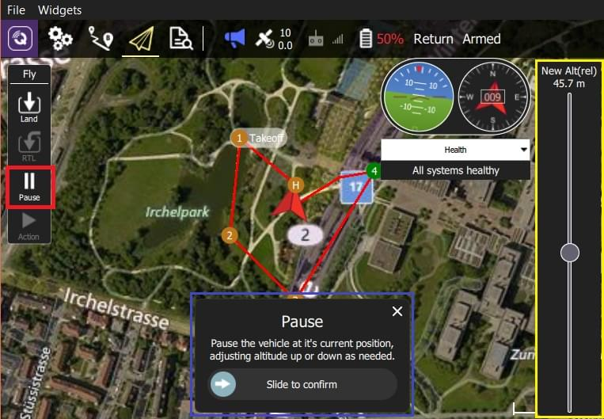
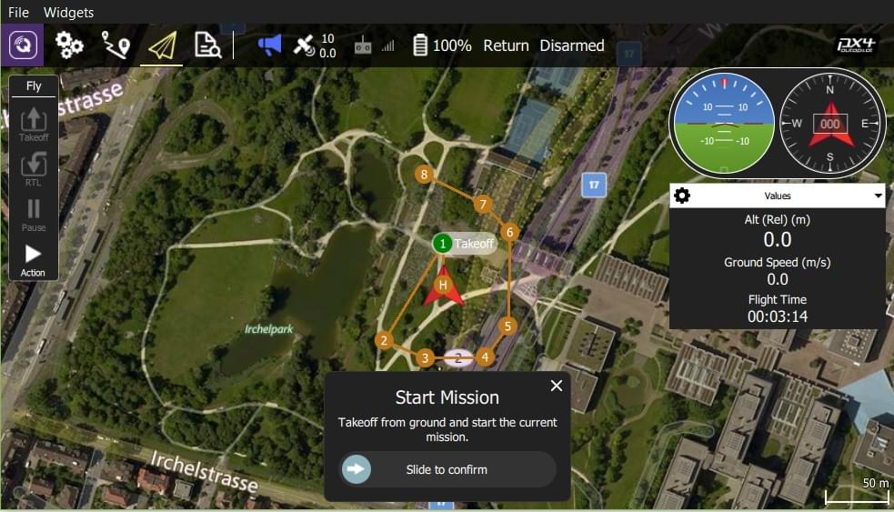

# Fly View

Uçuş Ekranı, aracı uçarken izlemek ve araca komut vermek için kullanılır.

Şunları yapmak için kullanabilirsiniz:

- Otomatik şekilde [pre-flight checklist](#preflight_checklist) çalıştırın.
- Arm the vehicle (or check why it won't arm).
- Görevleri kontrol edin: [start](#start_mission), [continue](#continue_mission), [pause](#pause), ve [resume](#resume_mission).
- Aracı [arm](#arm)/[disarm](#disarm)/[emergency stop](#emergency_stop), [takeoff](#takeoff)/[land](#land), [change altitude](#change_altitude), belirli bir konuma [go to](#goto) veya [orbit](#orbit), ve [return/RTL](#rtl) için yönlendirin.
- Harita görünümü ile video görünümü (eğer varsa) arasında geçiş yapın
- Mevcut araç için video, görev, telemetri ve diğer bilgileri görüntüleyin ve ayrıca bağlı araçlar arasında geçiş yapın.

## UI Overview

Yukarıdaki ekran görüntüsü, uçuş ekranının ana öğelerini gösterir:

- **Harita:** Bağlı tüm araçların pozisyonlarını ve mevcut aracın görevini gösterir.
  - Haritada gezinmek için haritayı sürükleyebilirsiniz (harita belirli bir süre sonra otomatik olarak yeniden ortalanır).
  - Kalkıştan sonra, haritaya tıklayarak bir konuma [Go to](#goto) veya [Orbit at](#orbit) ayarlayabilirsiniz.
- **Uçuş Araç Çubuğu:** Sensörler (GPS, pil, RC kontrolü) ve araç durumu (Uçuş modu, Etkin (armed) / Devre Dışı (disarmed) durumu) hakkında anahtar bilgiler.
  - Daha fazla ayrıntı görmek için sensör göstergelerini seçin.
  - Yeni bir mod seçmek için _ Flight mode _ metnine (ör. "Hold") tıklayın.
    Tüm modlar mevcut olmayabilir.
  - The text next to the **Q** icon indicates the flight readiness using text: "Not Ready", "Ready to Fly", "Flying", and status using colour: "green" (all good!), amber (a warning), red (serious problem).
    Select the text when the background is amber or red to find out the cause of any preflight issues (QGC 4.2.0 and later).
    You can also select the text to reach a button to arm/disarm/emergency-stop the vehicle.
- **Uçuş araçları:** Şunları yapmak için kullanabilirsiniz:
  - Kalkış/iniş arasında geçiş yapın.
  - Mevcut işlemi durdur/tekrar başlat (ör. iniş, ya da görev).
  - Güvenli geri dönüş (RTL ya da Return olarakta bilinir).
  - _Action_ butonu mevcut durum için diğer uygun seçenekleri sunar (bunlar _Confirmation Slider_'ın üstünde gözükür).
    İşlemler, yüksekliği değiştirmeyi veya bir göreve devam etmeyi içerir.
  - [preflight checklist](#preflight_checklist)'i etkinleştirin (varsayılan olarak devre dışıdır).
- **[Instrument Panel](#instrument_panel):** A widget that displays vehicle telemetry.
- **Attitude/Compass**: A widget that provides virtual horizon and heading information.
- **Camera Tools**: A widget for switching between still and video modes, starting/stopping capture, and controlling camera settings.
- **[Video/Harita](#video_switcher):** Bir pencerede video ile harita arasında geçiş yapın.
  - _Video_ ya da _Map_'i ön plana almak için öne almak istediğinize tıklayın.
  - _QGroundControl_, aracınızın UDP bağlantısı üzerinden RTP ve RTSP video yayını yapmanızı destekler.
    It also supports directly connected UVC devices.
    QGC'nin video desteği hakkında daha ayrıntılı bilgiyi [Video README](https://github.com/mavlink/qgroundcontrol/blob/master/src/VideoStreaming/README.md)'de bulabilirsiniz.
  - Bir [Telemetry Overlay](../fly_view/video_overlay.md) dosyası otomatik olarak oluşturulacaktır
- **Kaydırmalı Onay Butonu:** İstenen işlemi gerçekleştirmek için onay butonu.
  Operasyonu başlatmak için kaydırın. İptal etmek için **X** 'e basın.

Ayrıca varsayılan olarak görüntülenmeyen/ belirli koşullarda görüntülenebilen bazı öğelerde var.
Mesela, çoklu-araç seçici sadece birden çok aracınız varsa veya uçuş öncesi kontrol listesi eğer etkinleştirilmişse görüntülenir.

## Bilgi Paneli {#instrument_panel}

The instrument panel displays telemetry information about the current vehicle.

The default values include altitude (relative to the home location), horizontal and vertical speed, total flight time, and distance between vehicle and ground station.

You can configure where the information is displayed by hovering over the panel and selecting the left-side square tool.
This toggles the position of the panel between bottom centre and right-centre.

You configure what information is display by selecting the edit/pencil icon.
The grid will then display "+" and "-" icons that you can use to add or remove rows and columns (and the pencil icon is replaced by a "lock" icon that you can use to save the settings).

**[Bilgi Paneli](#instrument_panel):** Telemetri, kamera, video, sistem durumu ve titreşim dahil olmak üzere araç bilgilerini görüntüleyebileceğiniz çok sekmeli widget.

Select a value to launch its "Value Display" editor.
This allows you to change the icon, text, size, units and so on of the current telemetry value.

The selection list on the top left is used to change the source of the telemetry.
By default this is the vehicle, but you can use the selector to choose a particular sensor type.

 

The selection list on the top right is used to select a particular telemetry value for the vehicle or sensor.

Aracı devre dışı bırakmak için araç **landed** halindeyken _Fly Toolbar_ 'dan **Armed**'ı seçin.

### Kamera {#camera_instrument_page}

Kamera sayfası, kamerayı ayarlamak ve kontrol etmek için kullanılır.

The camera capture and configuration options depend on the connected camera.
The configuration options are selected using the panel gear icon.
The configuration for a simple autopilot-connected camera are shown below.

[MAVLink Camera Protocol](https://mavlink.io/en/services/camera.html)'ü destekleyen bir kameraya bağlandığınızda ek olarak geçerli hale gelen diğer kamera özelliklerini ayarlayıp kullanabilirsiniz.
Örnek olarak, eğer kameranız video modunu destekliyorsa, fotoğraf ve video modları arasında geçiş yapabilir, kaydı başlatıp/durdurabilirsiniz.

::: info
Most of the settings that are displayed depend on the camera (they are defined in its [MAVLink Camera Definition File](https://mavlink.io/en/services/camera_def.html)).

> Sondaki bir kaç ortak ayar sabit olarak kodlanmıştır: Fotoğraf Modu (Tekli/Photolapse), Fotoğraf Aralığı (Timelapse için), Kamera Ayarlarını Varsayılana Sıfırla (kameraya bir sıfırlama komutu gönderir), Format (depolama)

### Video Akışı {#video_instrument_page}

Video sayfası video akışını etkinleştirmek ve devre dışı bırakmak için kullanılır.
Etkinleştirildiğinde, video akışını durdurup başlatabilir, ızgara çizgilerini açabilir, görüntünün ekrana nasıl sığacağını değiştirebilir ve videoyu yerel olarak QGC ile kaydedebilirsiniz.

## İşlemler/Görevler

Aşağıdaki bölümler, Uçuş Ekranı'nda genel işlemlerin / görevlerin nasıl gerçekleştirileceğini açıklamaktadır.

Mevcut seçeneklerin çoğu, hem aracın türüne hem de mevcut durumuna bağlıdır.
:::

### Uçuş Öncesi Kontrol Listesi {#preflight_checklist}

Aracın doğru ayarlandığını ve uçmak için güvenli olduğu gösteren standart kontrollerin yapılması için otomatik bir uçuş öncesi kontrol listesi kullanılabilir.

To view the checklist, first enable the tool by navigating to [Application Settings > General > Fly View](../settings_view/general.md) and selecting the **Use preflight checklist** checkbox.
Liste _Flight Tools_'a eklenecektir.
Kontrol listesini oradan açabilirsiniz:

Once you have performed each test, select it on the UI to mark it as complete.

### Arming and Preflight Checks {#arm}

Bir aracı devreye almak, kalkışa hazırlık için motorları çalıştırır.
You will only be able to arm the vehicle if it is safe and ready to fly.

:::tip
Genel olarak _ QGroundControl _ aracı manuel olarak devreye almanızı gerektirmez; Bir göreve veya kalkışa başlarsanız bu sizin için yapılır.
:::

The vehicle is ready to fly in all modes if the status text says "Ready to Fly" and the background is green.

If the background is amber then it is ready to take off in the current mode, but may not be able to switch to other modes.
If the background is red and the text is "Not Ready" then you will not be able to arm in the current mode.

From QGC 4.2.0 (at time of writing, a daily build) you can find out the exact cause of the warning or error, and possible solutions, by pushing the status text.

This launches the preflight arming checks popup with a list of all preflight warnings.
The toggle on the right expands each error with additional information and possible solutions.

Once each issue is resolved it will disappear from the UI.
When all issues blocking arming have been removed you can use the arm button to display the arming confirmation slider, and arm the vehicle (or you can just take off - note that the vehicles will (by default) disarm automatically if you do not take off after a few seconds.

::: info
The status text also displays when flying.

>  > 
>
> The arming checks UI will open even when flying, allowing you to emergency disarm.
> :::

### Aracı Devre Dışı Bırakma {#disarm}

Aracı devre dışı bırakmak motorları durdurur (aracı güvenli hale getirir).

Generally you do not need to explicitly disarm as vehicles will disarm automatically after landing, or shortly after arming if you do not take off.

If needed, you can do so from the Arming Preflight Checks UI.

Aracın uçuşa hazır olma durumunu değiştirmek için _Armed/Disarmed_ metnine tıklayın.

You will then need to use the disarming slider.

Aracı uçarken devre dışı bırakmak [Emergency Stop](#emergency_stop) olarak adlandırılır

### Acil Durdurma {#emergency_stop}

Emergency stop is effectively the same as disarming the vehicle while it is flying.
Aracınız çarpacaktır/çakılacaktır!

If needed, you can do so from the Arming Preflight Checks UI.

Aracı devre dışı bırakmak için uçuş sırasında _Fly Toolbar_'dan **Armed**'ı seçin.

You will then need to use the emergency disarming slider.

### Kalkış {#takeoff}

:::tip
If you are starting a mission for a multicopter, _QGroundControl_ will automatically perform the takeoff step.
:::

Kalkmak için (iniş yapıldığında):

1. _Fly Tools_'dan **Land** butonuna basın (kalkıştan sonra bu buton **Takeoff** butonu olarak değişecektir).
2. İsterseniz kalkış yüksekliğini sağda bulunan dikey kaydırıcıyla ayarlayabilirsiniz.
3. Confirm takeoff using the slider.

### İniş {#land}

Uçuş sırasında istediğiniz zaman mevcut konuma inebilirsiniz:

1. _Fly Tools_'dan **Takeoff** butonuna basın (kalkıştan sonra bu buton **Land** butonu olarak değişecektir).
2. Confirm landing using the slider.

### RTL/Geri Dönüş

Return to a "safe point" at any time while flying:

1. _Fly Tools_'dan **RTL** butonuna basın.
2. Confirm RTL using the slider.

:::info
Vehicles commonly return to the "home" (takeoff) location and land.
This behaviour depends on the vehicle type and configuration.
For example, rally points or mission landings may be used as alternative return targets.
:::

### Yükleklik Değiştirme {#change_altitude}

Uçuş esnasında eğer bir görevde değilse aracın yükseliği değiştirilebilir:

1. _Fly Tools_'dan **Action** butonuna basın

2. İletişim kutusundan _Change Altitude_'ı seçin.

   

3. Dikey kaydırıcıyla istenilen yüksekliği ayarlayın, ardından kaydırmalı onay butonu ile onaylayın.

   

### Goto Location {#goto}

Kalkıştan sonra belirli bir konuma uçmayı ayarlayabilirsiniz.

1. Left click/Press on the map where you want the vehicle to move and select **Go to location** on the popup.

1. Konum harita üzerinde kaydırmalı onay butonuyla birlikte gözükecektir.

   

2. Hazır olduğunuzda kaydırarak onay verin (ya da **X**'e basarak iptal edin).

:::info
Hedef konum aracın 1 km çevresinde seçilmelidir (QGC'de sabit olarak ayarlanmıştır).
:::

### Yörünge Konumu {#orbit}

Kalkıştan sonra belirli bir konumun çevresinde yörüngede dolaşmasını ayarlayabilirsiniz.

1. Left click/Press on the map (near the centre of your desired orbit) and select **Orbit at location** on the popup.

1. Önerile yörünge kaydırmalı onay butonu ile harita üzerinde belirecektir.

   

   - Yörüngenin konumunu değiştirmek için merkezini seçin ve kaydırın.
   - Yörüngenin yarıçapını, çemberin dışındaki noktayı seçip sürükleyerek ayarlayabilirsiniz.

2. Hazır olduğunuzda kaydırarak onay verin (ya da **X**'e basarak iptal edin).

### Pause

You can pause most operations, including taking off, landing, RTL, mission execution, orbit at location.
Duraklatıldığında aracın davranışı aracın tipine bağlıdır, genellikle multikopterler havada asılı kalırken sabit kanatlar çember çizer.

:::info
Bir _Goto location_ operasyonunu durduramazsınız.
:::

Durdurmak için:

1. _Fly Tools_'dan **Pause** butonuna basın.
2. İsterseniz yeni bir yüksekliği sağda bulunan dikey kaydırıcıyla ayarlayabilirsiniz.
3. Confirm the pause using the slider.

### Görevler

#### Görevi Başlatma {#start_mission}

Araç inmiş durumdayken bir görevi başlatabilirsiniz (görevi başlatma onay kaydıracı varsayılan olarak çoğu kez gösterilir).

Yerdeki bir aracın görevini başlatmak için:

1. _Fly Tools_'dan **Action** butonuna basın

2. İletişim kutusundan _Start Mission_'ı seçin.

   

   (kaydırmalı onay çubuğunu görüntülemek için)

3. Onay kaydıracı belirdiğinde görevi başlatmak için kaydırın.

   

#### Göreve Devam Etme (Continue Mission) {#continue_mission}

Göreve _sıradaki_ hedef noktanızdan _devam_ edebilirsiniz (_Continue Mission_ kaydırmalı onay butonu kalkıştan sonra çoğu kez varsayılan olarak gösterilir).

:::info
Continue ve [Resume mission](#resume_mission) farklıdır!
Continue komutu durdurulmuş bir görevi tekrar başlatmak veya zaten kalkmış bir araç için yani kalkış görevi komutunu kaçırmış durumdaysanız kullanılır.
Resume mission is used when you've used a RTL or landed midway through a mission (e.g. for a battery change) and then wish to continue the next mission item (i.e. it takes you to where you were up to in the mission, rather than continuing from your place in the mission).
:::

Görevinize aşağıdakileri yaparak devam edebilirsiniz (hali hazırda bir görevde değilseniz!):

1. _Fly Tools_'dan **Action** butonuna basın

2. İletişim kutusundan _Continue Mission_'ı seçin.

   

3. Kaydırmalı onay butonunu kaydırarak göreve devam edin.

   

#### Göreve Devam Etme (Resume Mission) {#resume_mission}

_Resume Mission_, bir görevin içinde [RTL/Return](#rtl) ya da [Land](#land) gerçekleştirdikten sonra (ör. batarya değiştirmek için) kullanılır.

:::info
Eğer bataryayı değiştiricekseniz, bataryanın bağlantısını kestikten sonra QGC ile aracın bağlantısını **kesmeyin**.
Yeni bataryayı yerleştirdikten sonra _QGroundControl_ cihazı tekrar tespit edip, bağlantıyı otomatik olarak yeniden kuracaktır.
:::

İnişten sonra size görev planını cihazdan kaldırma, cihazda bırakma ya da göreve kaldığı yerden devam etme seçeneklerini sunan bir _Flight Plan complete_ iletişim kutusu karşınıza çıkacaktır.

If you select to resume the mission, then _QGroundControl_ will rebuild the mission and upload it to the vehicle.
Ardından _Start Mission_ kaydıracıyla göreve devam edebilirsiniz.

Aşağıdaki görüntü inişten sonra yeniden yapılandırılan bir görevi göstermektedir.

:::info
Bir görev, basit bir şekilde aracın son gerçekleştirdiği görev aşamasından devam edemez, çünkü son yapılan aşamada görevin sonraki aşamalarına etki edebilecek birden fazla etken olabilir (ör. hız komutları ya da kameranın kontrol komutları).
Basit bir şekilde devam etmek yerine, _QGroundControl_ son gerçekleştirilen görev aşamasından başlayarak, ilgili komutları da dikkate alarak görevi tekrar yapılandırır.
:::

#### İnişten Sonra Görevi Kaldırma {#resume_mission_prompt}

Görev bittikten sonra aracın inişi ve devre dışı bırakılmasının ardından görevi araçtan kaldırmanız istenecektir.
This is meant to prevent issues where stale missions are unknowingly left on a vehicle, potentially resulting in unexpected behavior.

### Videoyu Görüntüleme {#video_switcher}

Video akışı etkinleştirildiğinde, _QGroundControl_ haritanın sol altında bulunan "videoya geçiş penceresi"nde videoyu göstermeye başlıyacaktır.
You can press the switcher anywhere to toggle _Video_ and _Map_ to foreground (in the image below, the video is shown in the foreground).

:::info
video akışı [Application Settings > General tab > Video](../settings_view/general.md#video)'dan etkinleştirilebilir/düzenlenebilir.
:::

Video görüntüsünü geçiş penceresindeki kontrolleri kullanararak daha da düzenleyebilirsiniz:

- Resize the switcher by dragging the icon in the top right corner.
- Hide the switcher by pressing the toggle icon in the lower left.
- Sol üst köşedeki ikona basarak video geçiş pencersini ayırabilirsiniz. (ayrıldığında, işletim sisteminizdeki her hangi bir pencere gibi hareket ettirip tekrar boyutlandırabilirsiniz).
  Eğer ayrılan pencereyi kapatırsanız, geçiş penceresi tekrardan QGC uçuş görünüme sabitlenecektir.

### Video Kaydı

Eğer araç ve kamera tarafından destekleniyorsa, _QGroundControl_ kendiliğinden video kaydını başlatıp durdurabilirsiniz. Ayrıca _QGroundControl_ videoyu yayınlayıp, yerel dosyalara kaydedebilir.

:::tip
Kameranın kendisinde kaydedilen video daha kaliteli olacak olsa da, yüksek ihtimalle yer istasyonunun daha büyük kayıt kapasitesi olacaktır.
:::

#### Video Akışını Kaydetme (GCS'de)

Video akışı kaydı [video stream instrument page](#video_instrument_page)'dan kontrol edilir.
Yeni bir video kaydı başlatmak için kırmızı daireye tıklayın (daireye her tıklanıldığında yeni bir video dosyası oluşturulur); kayıt devam ederken çember kırmızı bir kareye dönüşecektir.

Video akışı kaydı [Application Settings > General tab](../settings_view/general.md)'dan düzenlenir:

- [Video Recording](../settings_view/general.md#video-recording) - kayıt dosyası formatını ve depolama sınırlarını belirtir.

  ::: info
  Videolar varsayılan olarak Matroska format (.mkv) olarak kaydedilir.
  Bu format, hata durumunda bozulmaya karşı nispeten dayanıklıdır.
  :::

- [Miscellaneous](../settings_view/general.md#miscellaneous) - Video **Application Load/Save Path**'e kaydedilir.

:::tip
Kaydedilen video, sadece video akışının kendisini içerir.
QGroundControl uygulamasının öğeleriyle videoyu kaydetmek için başka bir ekran kaydı uygulaması kullanmanız gerekir.
:::

#### Videoyu Kamerada Kaydetme

_Kameranın kendisinde_ video kaydını durdurup/başlatmak için [camera instrument page](#camera_instrument_page)'i kullanabilirsiniz.
İlk olarak video moduna geçiş yapın, ardından kırmızı butona basarak kaydı başlatabilirsiniz.

