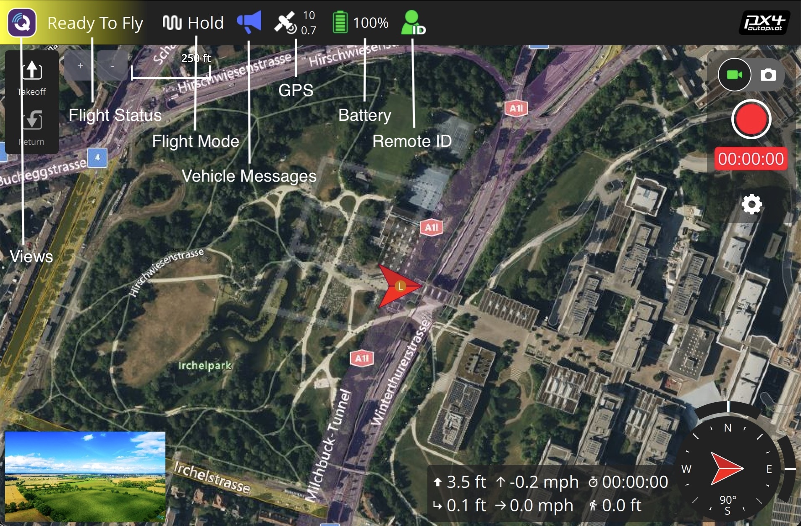

# Fly View Toolbar

## Views

The "Q" icon on the left of the toolbar allows you to select between additional top level views:

- **[Plan Flight](../plan_view/plan_view.md):** Used to create missions, geo-fences and rally points
- **Analyze Tools:** A set of tools for things like log download, geo-tagging images, or viewing telemetry.
- **Vehicle Configuration:** The various options for the initial configuration of a new vehicle.
- **Application Settings:** Settings for the QGroundControl application itself.

## Toolbar Indicators

Next are a multiple toolbar indicators for vehicle status. The dropdowns for each toolbar indicator provide additional detail on status. You can also expand the indicators to show additional application and vehicle settings associated with the indicator. Press the ">" button to expand.

### Flight Status

The Flight Status indicator shows you whether the vehicle is ready to fly or not. It can be in one of the following states:

- **Ready To Fly** (_green background_) - Vehicle is ready to fly
- **Ready To Fly** (_yellow background_) - Vehicle is ready to fly in the current flight mode. But there are warnings which may cause problems.
- **Not Ready** - Vehicle is not ready to fly and will not takeoff.
- **Armed** - Vehicle is armed and ready to Takeoff.
- **Flying** - Vehicle is in the air and flying.
- **Landing** - Vehicle is in the process of landing.
- **Communication Lost** - QGroundControl has lost communication with the vehicle.

The Flight Status Indicator dropdown also gives you acess to:

- **Arm** - Arming a vehicle starts the motors in preparation for takeoff. You will only be able to arm the vehicle if it is safe and ready to fly. Generally you do not need to manually arm the vehicle. You can simply takeoff or start a mission and the vehicle will arm itself.
- **Disarm** - Disarming a vehicle is only availble when the vehicle is on the ground. It will stop the motors. Generally you do not need to explicitly disarm as vehicles will disarm automatically after landing, or shortly after arming if you do not take off.
- **Emergency Stop** - Emergency stop is used to disarm the vehicle while it is flying. For emergency use only, your vehicle will crash!

In the cases of warnings or not ready state you can click the indicator to display the dropdown which will show the reason(s) why. The toggle on the right expands each error with additional information and possible solutions.

Once each issue is resolved it will disappear from the UI. When all issues blocking arming have been removed you should now be ready to fly.

## Flight Mode

The Flight Mode indicator shows you the current flight mode. The dropdown allows you to switch between flight modes. The expanded page allows you to:

- Configure vehicle land settings
- Set global geo-fence settings
- Add/Remove flight modes from the displayed list

## Vehicle Messages

The Vehicle Messages indicator dropdown shows you messages which come from the vehicle. The indicator will turn red if there are important messages available.

## GPS

The GPS indicator shows you the satellite count and the HDOP in the toolbar icon. The dropdown shows you additional GPS status. The expanded page give you access to RTK settings.

## Battery

The Battery indicator shows you a configurable colored battery icon for remaining charge. It can also be configured to show percent remaining, voltage or both. The expanded page allows you to:

- Set what value(s) you want displayed in the battery icon
- Configure the icon coloring
- Set up the low battery failsafe

## Remote ID

## Other Indicators

There are other indicators which only show in certain situations:

- Telemetry RSSI
- RC RSSI
- Gimbal - Only displayed if the vehicle supports the [Mavlink Gimbal Protocol](https://mavlink.io/en/services/gimbal_v2.html)
- VTOL transitions
- Select from multiple connected vehicles
