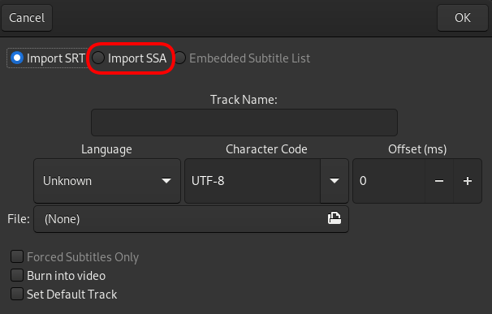
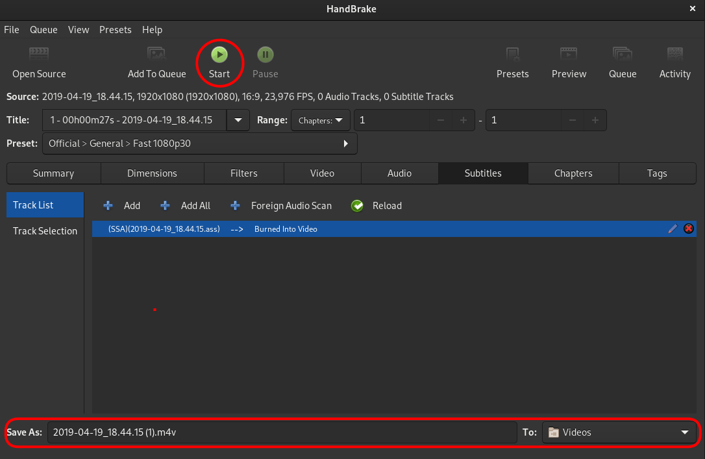

# Video Overlay

When QGroundControl is recording a video stream to a file, it will also export a subtitle file with telemetry data that can be used to overlay the telemetry on the video during playback. Telemetri [değerleri widget](FlyView.md#values-telemetry)ında gösterilmesi için hangi telemetri değerleri seçilirse seçilsin, onlar da overlaye aktarılacaktır. Overlay değerleri 1Hz hızla güncellenecektir.

Seçilen değerler ekran kullanımını optimize etmek için 3 sütun halinde düzenlenmiştir.

## Oynatma

Overlay, [SubStation Alpha](https://en.wikipedia.org/wiki/SubStation_Alpha#Players_and_renderers) altyazı formatını destekleyen tüm oynatıcılarla birlikte kullanılabilir.
Çoğu oynatıcı videoyu oynatmayı denediğinizde iki dosyayı birden açacaktır. QGC tarafından oluşturuldukları gibi, iki dosyanında aynı dosyada aynı isimle olması gerekmektedir.

## Handbrake'i Kullanarak Kalıcı Video Altyazıları

Altyazılar [HandBrake](https://handbrake.fr/)'i kullanarak kalıcı olarak video dosyalarına eklenebilir.
Bu, altyazıları tüm oynatıcılar için kalıcı olarak görünür yapacaktır.

**HandBrake**'i açın, ana arayüzünü göreceksiniz.
**Open**'a tıklayın ve video dosyasını seçin.

Video dosyası yüklenirken, subtitles sekmesine geçin.
Altyazı dosyasını yüklemek için **Add**'e tıklayın.

**import SSA**'ı seçin ( [ASS](https://en.wikipedia.org/wiki/SubStation_Alpha#Advanced_SubStation_Alpha) SSA'nın bir uzantısıdır).

Videonuza karşılık gelen **.ass** dosyasını videonuza yükleyin ve **Burn into video**'u işaretleyin.

Yeni dosyanın nereye kaydedilmesini istediğinizi seçin ve **Start**'a tıklayın.

Bu, altyazıyı ve videoyu yeni bir dosyaya yazmaya başlayacaktır.
