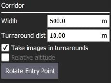

# Koridor Taraması (Plan Şablonu)

Koridor taraması, çoklu çizgileri takip eden bir uçuş şablonu oluşturmanıza olanak verir. Bu, mesela, bir yolu gözlemlemek için kullanılır. Tüm otopilot ve araç tiplerince desteklenir.

> **Important** Kamera özelliklerini kullanan bir Koridor Taraması planlarken, araştırma alanınızın zemin yüksekliklerinin kalkış/ev konumunuzla aynı yükseklikte olduğu varsayılır. Eğer araştırma alanınızın zemin yüksekliği fırlatma/ev konumunuzdan daha yüksek veya daha alçaksa, görüntülerinizdeki etkili örtüşme hesaplanandan daha az veya daha fazla (sırasıyla) olacaktır. Araştırma alanınızın zemin yüksekliği fırlatma/ev konumunuzdan önemli ölçüde daha yüksekse, aracın yanlışlıkla ağaçlara, engellere veya zemine çarpmasına neden olacak bir görev planlayabilirsiniz. Kalkış/ev rakımınızdan önemli yükseklik farklılıkları olan arazi üzerinde istenen yükseklik farkını daha yakından koruyan bir tarama oluşturmak için Terrain Follow'u kullanın.

Coğrafi etiketli görüntüler oluşturmak için uygun yolu, koridor genişliğini ve kamera ayarlarını özelleştirebilirsinz.

## Creating a Scan

Bir koridor taraması oluşturmak için:

1. [PlanView](../plan_view/plan_view.md)'den _Plan Tools_'u açın.

2. _Plan Tools_ 'dan _Pattern Tool_'u seçin ve _Corridor Scan_'a tıklayın.

   

   Bu haritaya bir koridor ve görev listesine (sağda) bir _Corridor Scan_ öğesi ekleyecektir.

3. Koridorun uçlarını, sırasıyla taramanın başlangıç ve bitiş noktalarına sürükleyin.

4. Yeni bir köşe noktası oluşturmak için hattın ortasındaki `(+)` semboüne tıklayın.
   Yeni köşe noktası, istenen koridor yolunu takip edeceği bir noktaya sürüklenebilir.

Koridor taraması ayarları bir sonraki bölümde ele alınmıştır.

## Ayarlar

Koridor taraması, ilişkili görev öğesinde (Plan Görünümü'nün sağ tarafındaki görev öğesi listesinde) daha da yapılandırılabilir.

### Kamera

Kamera başlatma davranışı, kamera/kamera ayarlarına bağlıdır.
Var olan bir kamerayı seçebilir ya da ayarları manuel olarak girebilirsiniz.
Mevcut kameraların listesi (QGC 3.4) aşağıda verilmiştir.

#### Bilinen Kamera

Seçenekler açılır listesinden bilinen bir kamerayı seçmek, kameranın özelliklerine göre bir ızgara deseni oluşturmanıza olanak sağlar.

Ayarlanabilir seçenekler şunlardır:

- **Landscape/Portrait** - Aracın "normal" yönüne göre kamera yönü.
- **Image Overlap** - Her görüntü arasında örtüşme.
- Birini Seç:
  - **Altitude** - Tarama yüksekliği (bu yükseklik için zemin çözünürlüğü hesaplanacak/görüntülenecektir).
  - **Ground resolution** - Her görüntü için zemin çözünürlüğü (bu çözünürlüğü sağlamak için gerekli yükseklik hesaplanacak/görüntülenecektir).

#### Manuel Kamera

Manuel kamera seçeneği, kameranız için istenen tarama yüksekliğini, deklanşör aralığını ve uygun ızgara aralığını belirlemenize olanak tanır.

Ayarlanabilir seçenekler şunlardır:

- **Altitude** - Tarama yüksekliği.
- **Trigger Distance** - Her bir kamera çekimi arasındaki zemin üzerinde alınan mesafe.
- **Spacing** - Koridor boyunca bitişik ızgara (uçuş yolu) çizgileri arasındaki mesafe.

### Koridor

Ayarlanabilir seçenekler şunlardır:

- **Width** - Taramada, yolu tanımlayan çoklu çizgilerin etrafındaki genişliğini ayarlayın.
- **Turnaround dist** - Aracın geri dönmesi için tarama alanının dışına eklenecek olan mesafe miktarı.
- **Take images in turnarounds** Geri dönüş noktalarında da görüntü yakalanması için işaretleyin.
- **Relative altitude** - Bağlı bir yüksekik belirtmek için işaretleyin. Bu özellik sadece [terrain following](#terrain_following) kullanmayan manuel ayarlanmış ızgaralarda desteklenir.
- **Rotate entry point** - Koridor taramasının başlangıç ve bitiş noktasını birbirleriyle değiştirmek için butona basın.

### Arazi Takibi {#terrain_following}

Varsayılan olarak, uçan bir araç sabit bir yükseklikte koridor yolunu takip edecektir.
_Terrain Following_'i aktif hale getirmek, aracın yere göre sabit bir yükseklikte devam etmesini sağlar.

:::info
Arazi takibi, _AirMap_ serverlarından sağlanan arazi yüksekliklerini kullanır.
:::

Ayarlanabilir seçenekler şunlardır:

- **Araç araziyi takip eder** - Arazi takibini etkinleştirmek için işaretleyin (ve aşağıdaki seçenekleri görüntüleyin).
  - **Tolerance** - Hedeflenen yükseklikten kabul edilen sapma miktarı.
  - **Max Climb Rate** - Araziyi takip ederken maksimum yükselme oranı.
  - **Max Descent Rate** - Araziyi takip ederken maksimum alçalma oranı.

### İstatistikler

_Statistics_ bölümü, hesaplanan tarama alanını, fotoğraf aralığını, fotoğraflar arası boşluğu ve planlanan fotoğraf sayısını gösterir.

