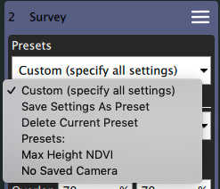
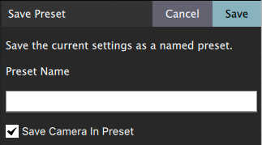

# Plan Ekranı - Mod Ön Ayarları

Yaygın olarak kullanılan ayarları adlandırılmış bir ön ayar olarak kaydetmenize olanak sağlar.

:::info
Şuan için sadece Gözlem modu tarafından desteklenmektedir. Diğer modların desteği için geliştirme devam etmektedir.
:::

## Ön Ayarları Yönetme

Mod öğelerinin üst kısmında ön ayarları yönetmenize izin veren bir seçenek vardır:

- **Custom (specify all settings)** Bu bir ön ayar _kullanmamanıza_ ve tüm ayarları manuel ayarlamanıza olanak verir.
- **Save Settings As Preset** Mevcut ayarları adlandırılmış bir ön ayar olarak kaydeder.
- **Delete Current Preset** Seçili olan ön ayarı siler.
- **Presets:** Bu öğenin altında bu mod için mevcut ön ayarlar listelenecektir.

## Ön Ayar Oluşturma/Güncelleme

**Save Settings As Preset**'i seçtiğinizde sizden ön ayar için isim istenecektir. Varolan bir ön ayara yeni ayarlar kaydetmek için ön ayar seçiliyken **Save Settings As Preset**'i seçin.

Ayrıca o anda seçili olan kamerayı da ön ayara kaydetmek isteyip istemediğinizi de belirtebilirsiniz. Kamerayı ön ayar ile kaydetmemeyi seçerseniz, ön ayar yüklenirken mevcut kamera kullanılacaktır. Ayrıca ön ayarı kullanırken farklı bir kameraya da geçebilirsiniz. Aracınızı aynı ön ayarla farklı zamanlarda farklı kameralarla uçurmadığınız sürece, kamerayı ön ayara kaydetmeyi seçmelisiniz.

## Ön Ayar Ayarlarını Görüntüleme

Bir ön ayarın ayarlarının neler olduğunu görmek istiyorsanız **Custom (specify all settings)** seçeneğini seçin, tüm ayarları size gösterecektir. İşiniz bittiğinde adlandırılmış ön ayarı kullanmaya geri dönebilirsiniz.

## Plan Dosyasında Ön Ayarlar

Halihazırda seçili olan Ön Ayar Plan dosyasına da kaydedilir, böylece Planı geri yüklediğinizde ön ayar tekrar seçilebilecektir. Ön ayarların kullandığınız QGroundControl sürümüne özel olduğunu unutmayınız. If you share a Plan file with a preset with another user, incorrect behavior may occur if that other user also has a preset of the same name but different settings.
