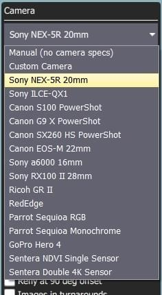
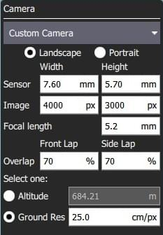
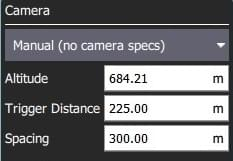
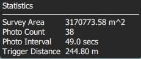

# Gözlem (Plan Şablonu)

Gözlem modu, poligonal bir alan üzerinde bir ızgara uçuş modeli oluşturmanıza olanak sağlar.
İstediğiniz şekli, ızgaranın açısını ve diğer özelliklerini ve coğrafi etiketli görüntüler oluşturmak için uygun kamera ayarlarını belirtebilirsiniz.

::: warning
If the survey area has significant elevation variation then consider enabling [Terrain Following](#terrain).

Kamera özelliklerini kullanan bir Gözlem planlanırken, gözlem alanınızın zeminin düz olduğu varsayılır - ör. kalkış/rv konumuyla aynı yükseklik.
Eğer araştırma alanınızın zemin yüksekliği ev konumunuzdan daha yüksek veya daha alçaksa, görüntülerinizdeki etkili örtüşme hesaplanandan daha az veya daha fazla (sırasıyla) olacaktır.
Araştırma alanınızın zemin yüksekliği ev konumunuzdan _önemli_ ölçüde daha yüksekse, yanlışıla aracın zemin seviyesindeki engellere çarpmasına neden olacak bir görev planlayabilirsiniz.

Terrain Following'in kullanılması, araştırmanın arazi üzerinde istenen irtifaya daha yakın olmasını sağlar ve yer seviyesine çok yakın bir görev planlanması olasılığını azaltır.
:::

## Creating a Survey

Bir gözlem görevi oluşturmak için:

1. [PlanView](../plan_view/plan_view.md)'den _Plan Tools_'u açın.

2. _Plan Tools_ 'dan _Pattern Tool_'u seçin ve _Survey_'e tıklayın.

   

   Bu haritaya bir gözlem alanı ve görev listesine (sağda) bir _Survey_ öğesi ekleyecektir.

3. On the map drag the vertices to change the shape of the polygon.

4. Yeni bir köşe noktası oluşturmak için var olan köşelerin ortalarındaki `(+)` semboüne tıklayın.
   Yeni köşe, yeni pozisyonlara çekilebilir.

Gözlem modu ayarları bir sonraki bölümde ele alınmıştır.

## Ayarlar

Gözlem görevi, ilişkili görev öğesinde (_Plan View_'in sağ tarafındaki görev öğesi listesinde) daha da yapılandırılabilir.

### Kamera

Kamera başlatma davranışı, kamera/kamera ayarlarına bağlıdır.
Var olan veya özel bir kamerayı seçebilir ya da ayarları manuel olarak girebilirsiniz.
Mevcut kameraların listesi (QGC 3.4) aşağıda verilmiştir.

#### Bilinen Kamera {#known_camera}

Seçenekler açılır listesinden bilinen bir kamerayı seçmek, kameranın özelliklerine göre bir ızgara deseni oluşturur.

Varsayılan ayarlar, yapılandırma seçenekleri kullanılarak gözleminiz için ayarlanabilir:

- **Landscape/Portrait** - Aracın "normal" yönüne göre kamera yönü.
- **Overlap** - Yakalanan her görüntü arasında örtüşme.
  Bu, ızgara hatları boyunca uçarken veya bu hatların üzerinden geçerken olmak üzere ayrı ayrı yapılandırılabilir.
- Birini Seçin:
  - **Altitude** - Tarama yüksekliği (bu yükseklik için zemin çözünürlüğü hesaplanacak/görüntülenecektir).
  - **Ground resolution** - Her görüntü için zemin çözünürlüğü (bu çözünürlüğü sağlamak için gerekli yükseklik hesaplanacak/görüntülenecektir).

#### Özel Kamera {#custom_camera}

Özel kamera seçeneğinin seçilmesi, yeni bir kamera için ayarları bilinen bir kameraya benzer şekilde belirlemenize olanak tanır.

Özel kameraya özgü ayarlar şunlardır:

- **Sensor width/height** - Kameranın fotoğraf sensörünün boyutu.
- **Image width/height** - Kameranın çektiği görüntünün çözünürlüğü.
- **Focal Length** - Kamera lensinin odak uzaklığı.

Geri kalan ayarlar [bilinen kamera](#known_camera) ile aynıdır.

#### Manuel Kamera

Manuel kamera seçeneği, kameranız için istenen tarama yüksekliğini, deklanşör aralığını ve uygun ızgara aralığını belirlemenize olanak tanır.

Ayarlanabilir seçenekler şunlardır:

- **Altitude** - Tüm rotayı uçmak için gözlem irtifası.
- **Trigger Distance** - Her bir kamera çekimi arasındaki zemin üzerinde alınan mesafe.
- **Spacing** - Rota boyunca bitişik ızgara (uçuş yolu) çizgileri arasındaki mesafe.

### Transects

_Transects_ sekmesi kameradan bağımsız olan ızgara ayarları için kullanılır.

Ayarlanabilir seçenekler şunlardır:

- **Angle** - Kuzeye göre, ızgara çizgilerinin açısı.
  
- **Turnaround dist** - Aracın geri dönmesi için tarama alanının dışına eklenecek olan mesafe miktarı.
- **Rotate entry point** - Gözlem görevinin başlangıç ve bitiş noktasını birbirleriyle değiştirmek için butona basın.
- **Hover and capture image** - Görüntü yakalamak için havada durmak (sadece multikopterler).
- **Refly at 90 degree offset** - Tüm görevi 90 derece dönmüş şekliyle yeniden uçmak için işaretleyin.
  
- **Images in turnarounds** - Dönüşlerde fotoğraf çekilmesi için işaretleyin
- **Relative altitude** - Ev konumuna bağlı olarak belirli yükseklikleri ayarlamak için işaretleyin (işaretlenmezse ortalama deniz seviyesine göre olur).

### Arazi

Varsayılan olarak, uçan bir araç sabit bir yükseklikte gözlem rotasını takip edecektir.
_Terrain Following_'i aktif hale getirmek, aracın yere göre sabit bir yükseklikte devam etmesini sağlar.

:::info
Arazi takibi, _AirMap_ serverlarından sağlanan arazi yüksekliklerini kullanır.
:::

Ayarlanabilir seçenekler şunlardır:

- **Araç araziyi takip eder** - Arazi takibini etkinleştirmek için işaretleyin (ve aşağıdaki seçenekleri görüntüleyin).
  - **Tolerance** - Hedeflenen yükseklikten kabul edilen sapma miktarı.
  - **Max Climb Rate** - Araziyi takip ederken maksimum yükselme oranı.
  - **Max Descent Rate** - Araziyi takip ederken maksimum yükselme oranı.

### İstatistikler

_Statistics_ bölümü, hesaplanan tarama alanını, fotoğraf aralığını, fotoğraflar arası boşluğu ve planlanan fotoğraf sayısını gösterir.

