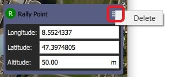

# Plan Ekranı - Toparlanma Noktaları

Toparlanma noktaları, iniş ya da oyalanma noktalarına alternatif noktalardır.
Genellikle Geri Dönüş / RTL modunda ana konumdan daha güvenli veya daha uygun (örneğin daha yakın) bir varış noktası sağlamak için kullanılırlar.

:::info
Toparlanma Noktaları sadece Rover 3.6 ve Copter3.7 (ve üzeri sürümlerde) desteklenir.
PX4 desteği, PX4 v1.10 zaman dilimlerinde planlanmıştır.
Ek olarak günlük sürümlerin ya da stabil 3.6 sürümünün (erişilebilir olduğunda) kullanılmasını gerektirir.
Eğer bağlanan cihaz tarafından Toparlanma Noktası seçeneği desteklenmiyorsa _QGroundControl_ seçeneği göstermeyecektir.
:::

## Rally Point Usage

Toparlanma Noktası oluşturmak için:

1. Plan Ekranı'na gidin
2. Görev Komutları Listesi'nin üstünden _Rally_'i seçin
3. Haritanın neresinde toparlanma noktası olmasını istiyorsanız tıklayın.
   - Her biri için bir **R** işareti eklenir
   - şu anda aktif olan işaretçi farklı bir renge (yeşil) sahiptir ve _Rally Point_ paneli kullanılarak düzenlenebilir.
4. Harita üzerinde seçerek herhangi bir toplanma noktasını etkinleştirin:
   - Seçilen toplanma noktasını harita üzerinde sürükleyerek veya paneldeki konumu düzenleyerek hareket ettirin.
   - Aktif toplanma noktasını _ Rally Point_ panelindeki menü seçeneğini seçerek silin 

## Upload Rally Points

Toparlanma Noktaları bir görevle aynı şekilde yüklenir, [Plan tools](../plan_view/plan_view.md)'dan **File**'ı kullanarak.

## Diğer Araçlar

The rest of the tools work exactly as they do while editing a Mission.
