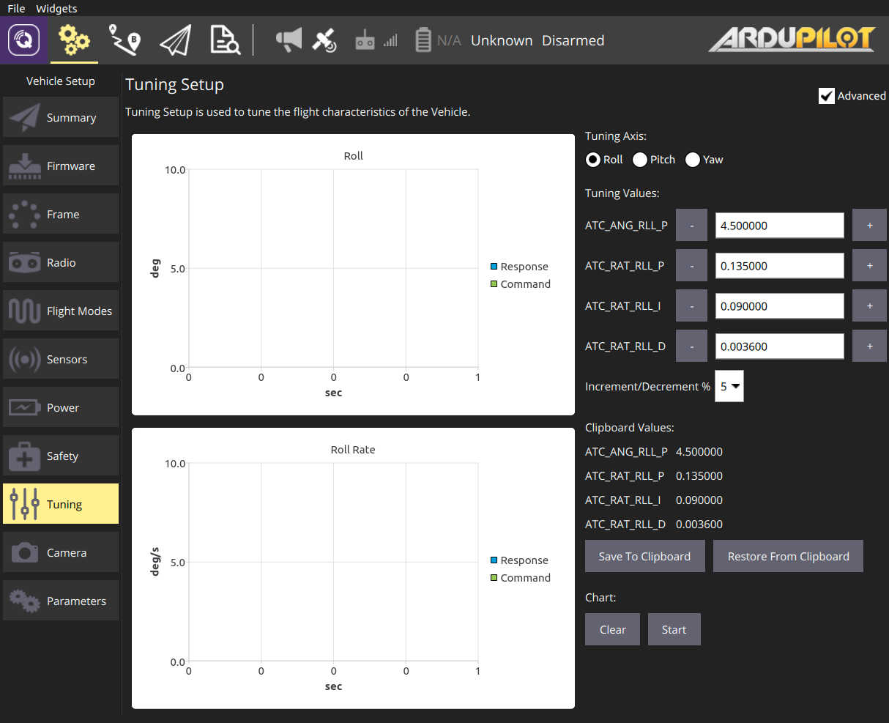
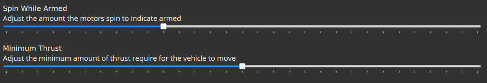
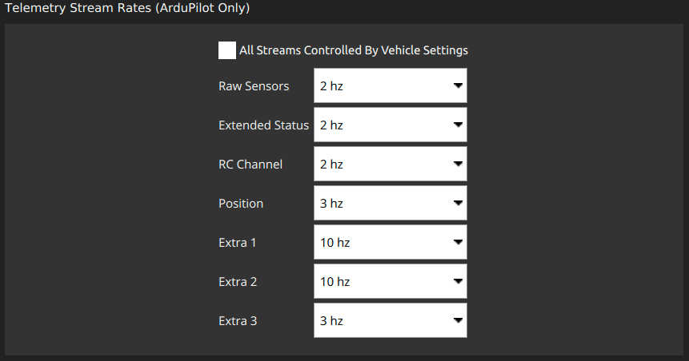

# QGroundControl v4.0 Release Notes (Additional)

This topic contains additional notes about QGroundControl 4.0.
These should be integrated into main documentation in coming months (and this document deleted).

- [Pattern Presets](../plan_view/pattern_presets.md) - Allows you to save settings for a Pattern item (Survey, Corridor Scan, ...) into a named preset. You can then use this preset over and over again as you create new Pattern.
- ArduPilot:
  - Copter - PID Tuning support 
  - Copter - Additional Basic Tuning options 
  - Copter/Rover - Frame setup ui 
  - Improved support for flashing ChibiOS firmware
  - Improved support for connecting to ChibiOS bootloader boards
  - Support configurable mavlink stream rates. Available from Settings/Mavlink page. 
