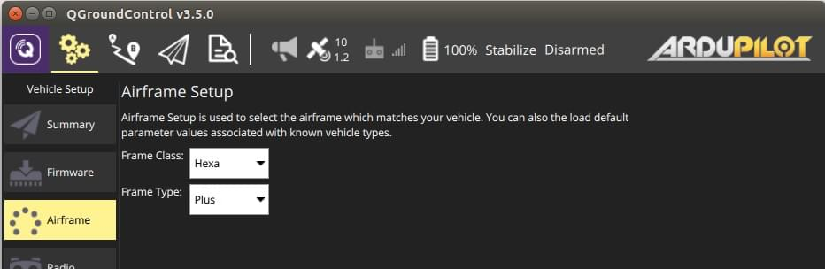
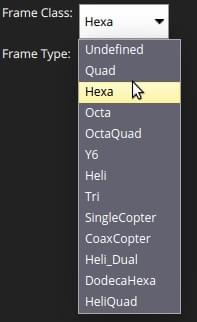

# Gövde Kurulumu (ArduPilot)

Gövde kurulumu, sınıfı ve modeli aracınızla eşleşen gövde seçiminde kullanılır

:::info
Gövde Kurulumu sadece _ArduCopter_ ve _ArduSub_ araçları için mevcuttur (_ArduPilot_ arazi araçları ya da uçaklar için gösterilmez).
:::

## Arducopter Gövde Kurulumu

Copter'den gövde seçmek için:

1. İlk olarak üstteki araç çubuğundan **dişli** simgesini (Vehicle Setup), daha sonra kenar çubuğundan **Airframe**'i seçin.

   

2. Aracınız için uygun olan _Frame Class_ 'ı seçin:

   

   ::: info
   Sınıf değişikliklerinin geçerli olması için aracı yeniden başlatmanız gerekecektir.
   :::

3. Aracınız için spesifik _Frame Type_ 'ını seçin:
   

   

## ArduSub Gövde Kurulumu {#ardusub}

Sub için gövde modelini seçmek için:

1. İlk olarak üstteki araç çubuğundan **dişli** simgesini (Vehicle Setup), daha sonra kenar çubuğundan **Frame**'i seçin.
2. Aracınız için uygun olan gövde tipini seçin (bir gövde seçmek, seçimi uygular).
3. Tüm \*\* yeşil \*\* iticilerin \*\* saat yönünde \*\* pervanelere ve tüm \*\* mavi \*\* iticilerin dede \*\* saat yönünün tersine \*\* pervanelere sahip olduğundan emin olun (veya tersi).

   

   - ArduSub için varsayılan parametre setini yüklemek için \*\* Load Vehicle Default Parameters\*\* 'ye de tıklayabilirsiniz.

     
