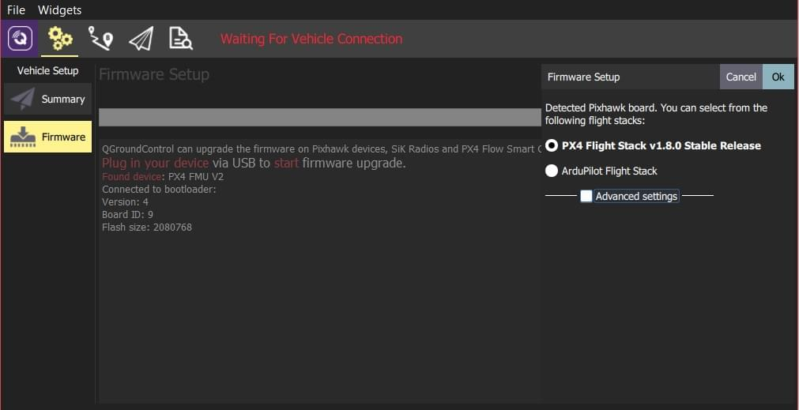

# Loading Firmware

QGroundControl \*'ün \*\* masaüstü \*\* sürümleri [ PX4 Pro ](http://px4.io/) veya [ ArduPilot ](http://ardupilot.com) yazılımını Pixhawk ailesinin uçuş kontrolörü kartlarına yükleyebilir. Varsayılan olarak QGC, seçili otopilotun mevcut kararlı sürümünü kuracaktır, ancak beta sürümleri, günlük sürümleri veya özel donanım yazılımı dosyalarını da kurmayı seçebilirsiniz.

QGroundControl \* ayrıca SiK Radyoları ve PX4 Flow cihazları için yazılımları da yükleyebilir.

> **Caution** Yazılım Yükleme özelliği şu anda _ QGroundControl _ tablet veya telefon sürümlerinde kullanılamamaktadır.

## Yazılım Güncellemesi için Cihazı Bağlayın

> **Caution** **Before you start installing Firmware** all USB connections to your vehicle must be _disconnected_ (both direct or through a telemetry radio). Araca bir batarya ile _ güç verilmemelidir _.

1. İlk olarak üstteki araç çubuğundan **dişli** simgesini (_Vehicle Setup_), daha sonra kenar çubuğundan **Firmware**'i seçin.

1. Cihazınızı (Pixhawk, SiK Radio, PX4 Flow) USB aracılığıyla doğrudan bilgisayarınıza bağlayın.

   ::: info
   Doğrudan makinenizdeki elektrik akışı olan bir USB bağlantı noktasına bağlayın (bir USB hub aracılığıyla bağlamayın).
   :::

## Yüklenecek Yazılımı Seçin

Cihaz bağlandıktan sonra, hangi aygıt yazılımının yükleneceğini seçebilirsiniz (_ QGroundControl _, bağlı donanıma göre mantıklı seçenekler sunar).

1. Pixhawk uyumlu bir anakart için _ mevcut kararlı sürümü _ indirmek için \*\* PX4 Flight Stack vX.X.X Stable Release \*\* veya \*\* ArduPilot Flight Stack \*\* seçeneklerinden birini seçin.

   

   If you select _ArduPilot_ you will also have to choose the specific firmware and the type of vehicle (as shown below).

   

2. Belirli geliştirici sürümlerini seçmek veya yerel dosya sisteminizden ürün yazılımı yüklemek için \*\* Advanced settings \*\*'i kontrol edin.

   

## Update the firmware

1. Güncellemeyi başlatmak için \*\* OK \*\* tuşuna tıklayın.

   Ardından, aygıt yazılımı bir dizi yükseltme adımından geçecektir (yeni aygıt yazılımının indirilmesi, eski aygıt yazılımının silinmesi vb.).
   Her adım ekrana yazdırılır ve genel ilerleme bir ilerleme çubuğunda görüntülenir.

   

Once the firmware has finished loading the device/vehicle will reboot and reconnect.
Daha sonra [ gövdeyi](../setup_view/airframe.md) (ve sonra sensörler, radyo vb.)
