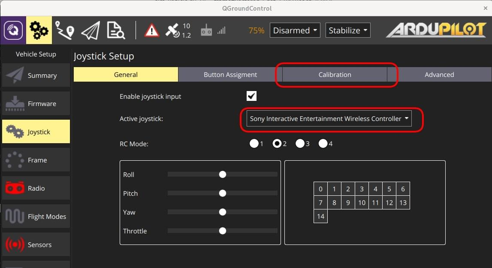
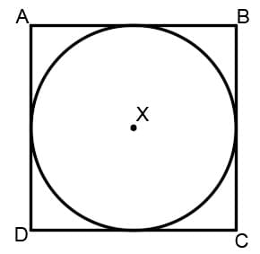
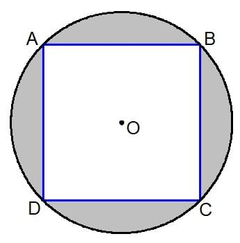

# Joystick Kurulumu

QGroundControl \*, bir aracı RC Verici yerine bir joystick veya gamepad kullanarak kontrol etmenizi sağlar.

:::info
\*\* Note \*\* Bir Joystick (veya [ sanal analoglar ](../settings_view/virtual_joystick.md)) ile uçmak, aracın kumanda kolu hareketlerine yanıt vermesini sağlamak için güvenilir bir yüksek bant genişliğine sahip telemetri kanalı gerektirir (çünkü joystick bilgileri MAVLink üzerinden gönderilir).
:::

:::info
\*\* Note \*\* Joystick ve Gamepad desteği, çapraz platform [ SDL2 ](http://www.libsdl.org/index.php) kitaplığı kullanılarak etkinleştirilir.
Belirli bir kontrolcüyle uyumluluk, SDL'ye bağlıdır (bu API tarafından gösterilen tüm düğmeler, _ QGroundControl _ arayüzü aracılığıyla görüntülenir).
[Çok sayıda yaygın oyun çubuğu ve oyun kolunun ](#supported-joysticks) çalıştığı bilinmektedir.
:::

:::info
\*\* Note \*\* Kumanda kolu, kalibrasyon işleminin son adımı olarak _ etkinleştirilir _.
:::

## PX4 Joystick Desteğini Etkinleştirme

To enable Joystick support in PX4 you need to set the parameter [`COM_RC_IN_MODE`](https://docs.px4.io/en/main/advanced_config/parameter_reference.html#COM_RC_IN_MODE) to `1` - _Joystick_.
If this parameter is `0` then _Joystick_ will not be offered as a setup option.

Bu, PX4 SITL yapıları için varsayılan olarak etkindir (belirli bir parametrenin nasıl bulunacağı ve ayarlanacağı hakkında bilgi için [Parametreler](../setup_view/parameters.md) konusuna bakın).

## Ardupilot Joystick Desteği

Tüm ArduPilot araçları desteklenmektedir. Parametre yapılandırmasına gerek yoktur.

## Joystick'i Ayarlama {#configure}

Joystick'i ayarlamak için:

1. QGroundControl \* 'ı başlatın ve bir araca bağlayın.

2. Joystick ya da Gamepad'i bir USB portuna bağlayın.

3. Üstteki araç çubuğundan **dişli** simgesini (Vechicle Setup), daha sonra kenar çubuğundan **Joystick**'i seçin.
   Aşağıdaki ekran görünecektir.

   

4. \*\* Active joystick \*\* açılır menüsünde kumanda çubuğunuzun seçildiğinden emin olun.

5. \*\*Calibrate \*\* Sekmesine gidin, \*\* Start \*\* tuşuna basın ve sonra çubukları kalibre etmek/hareket ettirmek için ekrandaki talimatları izleyin.

   

   Joystick, kalibrasyon işleminin son adımı olarak _ etkinleştirilir _.

6. Düğmelerin ve çubukların amaçlandığı gibi çalışıp çalışmadığını onlara basarak ve sonucu \*\* General \*\* sekmesindeki Axis/Buton monitöründe görüntüleyerek test edin.

7. Her bir kumanda kolu düğmesiyle etkinleştirilen uçuş modlarını/araç işlevlerini seçin.
   

## Gelişmiş Seçenekler

Bazı ek Seçenekler \*\* Advanced \*\* sekmesinde mevcuttur.
Bu seçenekler, duyarlılığı artırmak için belirli alışılmadık kurulumlarda ve sıkıntılı joystickleri kullanmak için yararlı olabilir.

### Gaz Kolu Seçenekleri


- **Center stick is zero throttle**: Ortalanmış veya alçaltılmış gaz çubuğu [ MANUAL_CONTROL **z** ](https://mavlink.io/en/messages/common.html#MANUAL_CONTROL) ile 0, kaldırılmış gaz çubuğu 1000 gönderir.
  - **Spring loaded throttle smoothing**: Bu modda gazın kendisini değil, artıp / azaldığı hızı kontrol edersiniz.
    This is useful for setups where the throttle stick is spring loaded, as the user can hold the desired throttle while releasing the stick.
- **Full down stick is zero throttle**: Bu modda, alçaltılmış çubuk [ MANUAL_CONTROL **z** ](https://mavlink.io/en/messages/common.html#MANUAL_CONTROL) için 0, ortalanmış çubuk 500 ve kaldırılmış çubuk 1000 gönderir.
- **Allow negative thrust**: \*\* Center stick is zero throttle \*\* modundayken, bu mod, kullanıcının çubuğu indirerek negatif değerler göndermesini sağlar.
  Böylece, indirilen çubuk [ MANUAL_CONTROL **z** ](https://mavlink.io/en/messages/common.html#MANUAL_CONTROL) 'de -1000 gönderir, ortalanmış çubuk 0 gönderir ve yükseltilmiş çubuk 1000 gönderir.
  Bu mod sadece [ Rover ](http://ardupilot.org/rover/index.html) gibi negatif itişi destekleyen araçlar için etkinleştirilebilir.

### Expo

Expo kaydırıcısı, çubukları merkezde daha az hassas hale getirmenize ve bu bölgede daha iyi kontrol sağlamanıza olanak tanır.


Kaydırıcı, üstel eğrinin eğriliğini ayarlar.


Expo değeri ne kadar yüksekse, eğri merkezde o kadar düz ve kenarlarda diktir.

### Gelişmiş Ayarlar

Gelişmiş ayarlar, günlük kullanıcılar için önerilmez.
Yanlış kullanılırlarsa beklenmeyen sonuçlara neden olabilirler.


Şu seçenekler mevcuttur:

- **Enable Gimbal Control**: Bir gimbali kontrol etmek için iki ek kanal etkinleştirilir.

- **Joystick Mode**: Joystick'in gerçekte neyi kontrol ettiğini ve araca gönderilen MAVLink mesajlarını değiştirir.

  - **Normal**: Kullanıcı normal bir RC radyo kullanıyormuş gibi kontrol eder, MAVLink [ MANUAL_CONTROL ](https://mavlink.io/en/messages/common.html#MANUAL_CONTROL) mesajları kullanılır.
  - **Attitude**: Kullanıcı aracın duruşunu kontrol eder, MAVLink [ SET_ATTITUDE_TARGET ](https://mavlink.io/en/messages/common.html#SET_ATTITUDE_TARGET) mesajları kullanılır.
  - **Position**: Kullanıcı araç konumunu kontrol eder, \*\* konumu \*\* için yalnızca bit maskeli MAVLink [ SET_POSITION_TARGET_LOCAL_NED ](https://mavlink.io/en/messages/common.html#SET_POSITION_TARGET_LOCAL_NED) mesajları kullanılır.
  - **Force**: Kullanıcı araca uygulanan kuvvetleri kontrol eder, \*\* kuvvet \*\* için yalnızca bit maskeli MAVLink [ SET_POSITION_TARGET_LOCAL_NED ](https://mavlink.io/en/messages/common.html#SET_POSITION_TARGET_LOCAL_NED) mesajları kullanılır.
  - **Velocity**: Kullanıcı araca uygulanan kuvvetleri kontrol eder, \*\* hız \*\* için yalnızca bit maskeli MAVLink [ SET_POSITION_TARGET_LOCAL_NED ](https://mavlink.io/en/messages/common.html#SET_POSITION_TARGET_LOCAL_NED) mesajları kullanılır.

- **Axis Frequency**: Joystick boştayken (gelen veriler değişmiyorken), joystick komutları araca 5Hz'de gönderilir. Joystick kullanımdayken (giriş değerleri değişiyorken), joystick komutları araca bu ayarla yapılandırılan (daha yüksek) frekansta gönderilir. Varsayılan değer 25Hz'dir.

- **Button Frequency**: Tekrarlanan buton eylemlerinin gönderilme sıklığını kontrol eder.

- **Enable Circle Correction**: Uzaktan kumanda çubukları bir kareyi tanımlarken, kumanda çubukları genellikle bir daireyi tanımlar.
  Bu seçenek etkinleştirildiğinde, daha çok bir RC kontrolörü gibi olmasını sağlamak için joystick hareket alanının içine bir kare yazılır (böylece dört köşenin tamamına ulaşmak mümkündür). Çubuğun etkili hareket alanı azaldığından, çözünürlükte azalır.

  - \*\*Disabled:\*\*Bu \*\* devre dışı bırakıldığında \*\* joystick konumu değiştirilmeden araca gönderilir (joystick cihazından okunma şekli).
    Bazı oyun çubuklarında, (yuvarlanma, eğim) değerleri, bir karenin içindeki bir dairenin alanıyla sınırlıdır.
    Bu şekilde, B noktası tam adım ileri ve sağa tam yuvarlanma komutu verir, ancak kumanda kolu B noktasına ulaşamaz çünkü tutucu daireseldir.
    Bu, aynı anda tam roll ve adım pitch elde edemeyeceğiniz anlamına gelir.

    

  - **Enabled:** Joystick değerleri, komut aralığını eksiksiz sağlamak için yazılımda ayarlanır.
    Kullanılabilir hareket alanı ve çözünürlük azalır, ancak şekilde gri ile vurgulanan alan artık kullanılmamaktadır.

    

- \*\*Deadbands:\*\*Deadbandler, çubuklar nötr konumlarına yakın olduğunda giriş değişikliklerinin göz ardı edilmesini sağlar.
  Bu, hassas çubuklarda komut olarak yorumlanabilecek parazitleri veya küçük salınımları ya da çubuklar yeniden ortalanmadığında küçük farkları önlemeye yardımcı olur.
  [ Kalibrasyonunun ](#configure) ilk adımı sırasında veya ilgili eksen monitöründe dikey olarak sürüklenerek ayarlanabilirler.

## Desteklenen Joystickler

Aşağıdaki kumanda kollarının/kontrol cihazlarının nispeten yeni _ QGroundControl _ versiyonlarıyla çalıştığı görülmüştür.

### Sony Playstation 3/4 Kontrolcüleri

Both these joysticks are highly recommended.
"Kutudan çıkar çıkmaz" iyi çalışırlar ve uçuş modlarına eşleyebileceğiniz birçok düğme vardır.

#### Sony PS4 - DualShock 4 Kontrolcü V2 (Kablosuz kurulum)

Bu kontrolcü hem USB hem de Bluetooth kablosuz bağlantısını destekler.
Kablolu USB bağlantısı genellikle kutudan çıkar çıkmaz çalışır.
Kablosuz bağlantı için bazı kurulumlara ihtiyacı vardır.

##### Linux Ubuntu'da Kurulumu

Kontrolcünün Linux altında kablosuz olarak çalışmasını sağlamak için [ jstest-gtk ](https://jstest-gtk.gitlab.io/) ve [ ds4drv ](https://github.com/chrippa/ds4drv) yardımcı programlarına ihtiyaç vardır.

Adımlar şunlardır:

1. <span></span>
   ```
   jstest-gtk \* 'yi yükleyin: `sudo apt install jstest-gtk`
   ```
2. Bu, gaz kolunun yaylı olduğu kurulumlar için kullanışlıdır, çünkü kullanıcı çubuğu bırakarak gazı istenen seviyede tutabilir.
   ```
   ds4drv \* yükleyin: `sudo pip install ds4drv`
   ```
3. Ds4drv'yi çalıştırın `sudo ds4drv`
   ```
   <span></span>
   ```
4. Kontrolcünün LED'i hızla yanıp sönmeye başlayana kadar \*\* Share \*\* düğmesini ve sonra \*\* PS \*\* düğmesini basılı tutun.
   Daha sonra _ ds4drv _ yeni bir aygıt algılamalıdır.
5. Son olarak, _ jstest-gtk _ yardımcı programını çalıştırarak denetleyici kurulumunu kontrol etmelisiniz.

### FrSky Taranis XD9 plus

FrSky Taranis XD9 plus \* uzaktan kumandası da bir joystick olarak bağlanabilir.
Arkadaki USB bağlantı noktası üzerinden bağlanması gerekecektir.

Taranis, düğme seçeneklerini kullanmanıza izin vermez (kesin olmak gerekirse, seçenekleri ayarlayabilirsiniz, ancak vericinizdeki düğmelerin değiştirilmesi, bunlara basılmasına neden olmaz).

:::info
The Taranis is an open system that is openly being worked on.
Yazma sırasında, bir joystick olarak etkili bir şekilde çalışmasına izin veren bir aygıt yazılımı veya konfigürasyon olması mümkündür.
:::

### Logitech Gamepad F310

Logitech Gamepad F310, MacOS "Sierra" üzerinde USB aracılığıyla test edilmiştir.

### Logitech Extreme 3D Pro

[ Logitech Extreme 3D Pro ](http://gaming.logitech.com/en-ch/product/extreme-3d-pro-joystick) Joystick tüm platformlarda (Linux, Windows, Mac OSX) test edilmiştir.
Bu, aynı zamanda bükülebilen tek çubuklu bir kontrolcüdür. Ana çubuk eksenleri eğim ve yuvarlanma için kullanılırken, bükme hareketi sapma için kullanılır. Gaz pedalı ayrı bir tekerleğe yerleştirilmiştir.

### Logitech F710 Gamepad

<!-- This is from http://qgroundcontrol.org/users/joystick -->

Bu oyun kumandası, QGroundControl aracılığıyla bir multirotoru manuel olarak uçurmak için mükemmeldir. Windows, Linux ve Mac OS üzerinde çalışır.

#### Mac OS Leopard / Lion Kurulumu

F710, Leopard / Lion'da algılanır, ancak otomatik olarak bir giriş cihazı olarak yapılandırılmaz.
Çalışan bir konfigürasyon elde etmek için, F710'un _ Rumblepad2 _ olarak tanınması gerekir.

Önce nasıl tanındığını kontrol edin: \*\* Apple> Bu Mac Hakkında> Ek Bilgi> Sistem Raporu> USB \*\*.
"Logitech Cordless RumblePad 2" olarak algılanmışsa bundan sonra başka bir işlem yapılmasına gerek yoktur.

"Logitech Wireless 710" olarak algılanırsa, şu adımları gerçekleştirin:

1. Oyun kumandasının USB alıcısını çıkarın
2. Hızlı bir şekilde bir USB bağlantı noktasına takmaya hazırlanın
3. Logitech düğmesine basın (kumandanın ortasında bulunan gümüş rengi Logitech logosu)
4. USB alıcısını Mac'inize hızla bağlayın
5. Kumanda artık sistem raporunda "Logitech Cordless RumblePad 2" olarak algılanmalıdır. Eğer algılanmazsa yukarıdaki adımları tekrar deneyin.
