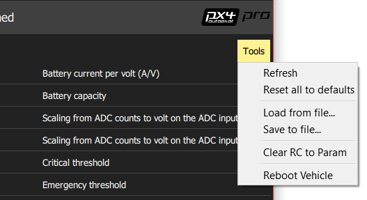

# Parametreler

_Parametreler_ ekranı, araçla ilişkili parametrelerden herhangi birini bulmanıza ve düzenlemenizi sağlar.

:::info
PX4 Pro ve ArduPilot farklı parametre setleri kullanır, ancak her ikisi de bu bölümde açıklandığı gibi yönetilir.
:::

## Bir Parametreyi Bulma

Parametreler gruplar halinde düzenlenmiştir. Soldaki butonlara tıklayarak görüntülemek için bir parametre grubu seçin (yukarıdaki görüntüde _ Pil Kalibrasyonu _ grubu seçilir).

Ayrıca _ Search_ alanına bir terim girerek bir parametre için _ arama _ yapabilirsiniz. Bu size girilen alt diziyi içeren tüm parametre adlarının ve açıklamalarının bir listesini gösterecektir (aramayı sıfırlamak için \*\* Clear \*\* tuşuna basın).

## Bir Parametreyi Değiştirme

Bir parametrenin değerini değiştirmek için bir grup ya da arama listesindeki parametre satırına tıklayın. Bu size değeri güncellemenizi sağlayacak bir yan diyalog açar (bu diyalog ayrıca parametre hakkında ek detaylı bilgilerde gösterir - değişikliğin etki etmesi için yeniden başlatmanın gerekip gerekmediği bilgisi de dahil).

:::info
**Save** butonuna basıldığında, parametre sessizce ve otomatik olarak bağlı cihaza yüklenir. Parametreye bağlı olarak, değişikliğin etki etmesi için uçuş kontrolcüsünü yeniden başlatmanız gerekebilir.
:::

## Araçlar

Ekranın sağ üstündeki **Tools** menüsünden ek seçenekler seçebilirsiniz.

**Refresh**   Tüm parametreleri araçtan tekrar isteyerek yenileyin.

**Reset all to defaults**  Tüm parametleri varsayıla değerlerine sıfırlayın.

**Load from file / Save to file**  Parametreleri var olan bir dosyadan yükleyin veya mevcut parametre ayarlarınızı bir dosyaya kaydedin.

**Clear RC to Param**  Bu, RC verici kontrolleri ve parametreleri arasındaki tüm ilişkileri siler. Daha fazla bilgi için göz atın: [Radio Setup > Param Tuning Channels](../setup_view/Radio.md#param-tuning-channels-px4).

**Reboot Vehicle**  Aracı yeniden başlatın (bazı parametre değişimlerinden sonra gereklidir).
