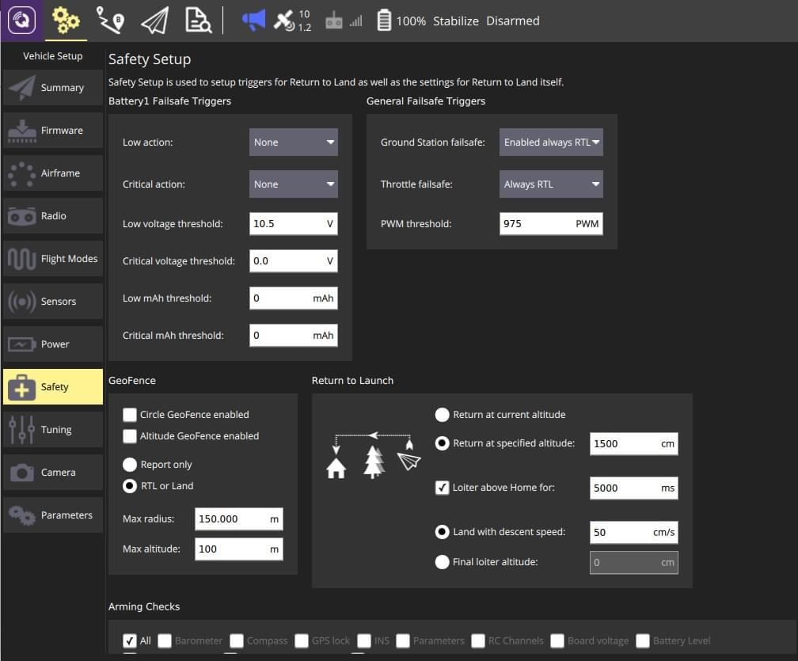
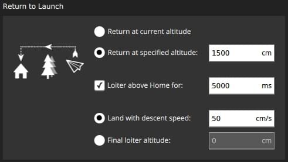
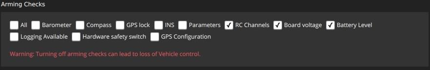

# Safety Setup (ArduPilot)

The _Safety Setup_ page allows you to configure (vehicle specific) failsafe settings.

:::tip
The setup page covers the most important safety options; other failsafe settings can be set via the [parameters](../setup_view/parameters.md) described in the failsafe documentation for each vehicle type.
:::

:::tip
_QGroundControl_ does not support polygon fences or rally points on ArduPilot.
:::

## Copter

The Copter safety page is shown below.

:::info
For additional safety settings and information see: [Failsafe](http://ardupilot.org/copter/docs/failsafe-landing-page.html).
:::

### Battery Failsafe {#battery\_failsafe\_copter}

This panel sets the [Battery Failsafe](http://ardupilot.org/copter/docs/failsafe-battery.html) parameters.
You can set low and critical thresholds for voltage and/or remaining capacity and define the action if the failsafe value is breached.
The thresholds can be disabled by setting them to zero.

:::tip
If there is a second battery (enabled in the [Power Setup](../setup_view/power.md)) a second panel will be displayed with the same settings.
:::

The configuration options are:

- **Low action** ([BATT\_FS\_LOW\_ACT](http://ardupilot.org/copter/docs/parameters.html#batt-fs-low-act-low-battery-failsafe-action)) - Select one of: None, Land, RTL, SmartRTL, SmartRTL or Land, Terminate.
- **Critical action** ([BATT\_FS\_CRT\_ACT](http://ardupilot.org/copter/docs/parameters.html#batt-fs-crt-act-critical-battery-failsafe-action)) - Select one of: None, Land, RTL, SmartRTL, SmartRTL or Land, Terminate.
- **Low voltage threshold** ([BATT\_LOW\_VOLT](http://ardupilot.org/copter/docs/parameters.html#batt-low-volt-low-battery-voltage)) - Battery voltage that triggers the _low action_.
- **Critical voltage threshold** ([BATT\_CRT\_VOLT](http://ardupilot.org/copter/docs/parameters.html#batt-crt-volt-critical-battery-voltage))- Battery voltage that triggers the _critical action_.
- **Low mAh threshold** ([BATT\_LOW\_MAH](http://ardupilot.org/copter/docs/parameters.html#batt-low-mah-low-battery-capacity)) - Battery capacity that triggers the _low action_.
- **Critical mAh threshold** ([BATT\_CRT\_MAH](http://ardupilot.org/copter/docs/parameters.html#batt-crt-mah-battery-critical-capacity)) - Battery capacity that triggers the _critical action_.

### General Failsafe Triggers {#failsafe\_triggers\_copter}

This panel enables the [GCS Failsafe](http://ardupilot.org/copter/docs/gcs-failsafe.html) and enables/configures the throttle failsafe.

The configuration options are:

- **Ground Station failsafe** - Disabled, Enabled always RTL, Enabled Continue with Mission in Auto Mode, Enabled Always SmartRTL or RTL, Enabled Always SmartRTL or Land.
- **Throttle failsafe** - Disabled, Always RTL, Continue with Mission in Auto Mode, Always land.
- **PWM Threshold** ([FS\_THR\_VALUE](http://ardupilot.org/copter/docs/parameters.html#fs-thr-value-throttle-failsafe-value)) - PWM value below which throttle failsafe triggers.

### Geofence {#geofence\_copter}

This panel sets the parameters for the cylindrical [Simple Geofence](http://ardupilot.org/copter/docs/ac2_simple_geofence.html).
You can set whether the fence radius or height are enabled, the maximum values for causing a breach, and the action in the event of a breach.

The configuration options are:

- **Circle GeoFence enabled** ([FENCE\_TYPE](http://ardupilot.org/copter/docs/parameters.html#fence-type-fence-type), [FENCE\_ENABLE](http://ardupilot.org/copter/docs/parameters.html#fence-enable-fence-enable-disable)) - Enable the circular geofence.
- **Altitude GeoFence enabled** ([FENCE\_TYPE](http://ardupilot.org/copter/docs/parameters.html#fence-type-fence-type), [FENCE\_ENABLE](http://ardupilot.org/copter/docs/parameters.html#fence-enable-fence-enable-disable)) - Enable altitude geofence.
- Fence action ([FENCE\_ACTION](http://ardupilot.org/copter/docs/parameters.html#fence-action-fence-action)) One of:
  - **Report only** - Report fence breach.
  - **RTL or Land** - RTL or land on fence breach.
- **Max radius** ([FENCE\_RADIUS](http://ardupilot.org/copter/docs/parameters.html#fence-radius-circular-fence-radius)) - Circular fence radius that when broken causes RTL.
- **Max altitude** ([FENCE\_ALT\_MAX](http://ardupilot.org/copter/docs/parameters.html#fence-alt-max-fence-maximum-altitude))- Fence maximum altitude to trigger altitude geofence.

### Return to Launch {#rtl\_copter}

This panel sets the [RTL Mode](http://ardupilot.org/copter/docs/rtl-mode.html) behaviour.

The configuration options are:

- Select RTL return altitude ([RTL\_ALT](http://ardupilot.org/copter/docs/parameters.html#rtl-alt-rtl-altitude)):
  - **Return at current altitude** - Return at current altitude.
  - **Return at specified altitude** - Ascend to specified altitude to return if below current altitude.
- **Loiter above home for** ([RTL\_LOIT\_TIME](http://ardupilot.org/copter/docs/parameters.html#rtl-loit-time-rtl-loiter-time)) - Check to set a loiter time before landing.
- One of
  - **Land with descent speed** ([LAND\_SPEED](http://ardupilot.org/copter/docs/parameters.html#land-speed-land-speed)) - Select final descent speed.
  - **Final loiter altitude** ([RTL\_ALT\_FINAL](http://ardupilot.org/copter/docs/parameters.html#rtl-alt-final-rtl-final-altitude)) - Select and set final altitude for landing after RTL or mission (set to 0 to land).

### Arming Checks {#arming\_checks\_copter}

This panel sets which [Pre-ARM Safety Checks](http://ardupilot.org/copter/docs/prearm_safety_check.html) are enabled.

The configuration options are:

- **Arming Checks to perform** ([ARMING\_CHECK](http://ardupilot.org/copter/docs/parameters.html#arming-check-arm-checks-to-peform-bitmask)) - Check all appropriate: Barometer, Compass, GPS lock, INS, Parameters, RC Channels, Board voltage, Battery Level, Airspeed, Logging Available, Hardware safety switch, GPS Configuration, System.

## Plane

The Plane safety page is shown below.

:::info
For additional safety settings and information see: [Plane Failsafe Function](http://ardupilot.org/plane/docs/apms-failsafe-function.html) and [Advanced Failsafe Configuration](http://ardupilot.org/plane/docs/advanced-failsafe-configuration.html).
:::

### Battery Failsafe {#battery\_failsafe\_plane}

The plane battery failsafe is the same as for copter except there are different options for the [Low](http://ardupilot.org/plane/docs/parameters.html#batt-fs-low-act-low-battery-failsafe-action) and [Critical](http://ardupilot.org/plane/docs/parameters.html#batt-fs-crt-act-critical-battery-failsafe-action) actions: None, RTL, Land, Terminate.

For more information see: [battery failsafe](#battery_failsafe_copter) (copter).

### Failsafe Triggers {#failsafe\_triggers\_plane}

This panel enables the [GCS Failsafe](http://ardupilot.org/plane/docs/advanced-failsafe-configuration.html#ground-station-communications-loss) and enables/configures the throttle failsafe.

The configuration options are:

- **Throttle PWM threshold** ([THR\_FS\_VALUE](http://ardupilot.org/plane/docs/parameters.html#thr-fs-value-throttle-failsafe-value)) - PWM value below which throttle failsafe triggers.
- **GCS failsafe** ([FS\_GCS\_ENABL](http://ardupilot.org/plane/docs/parameters.html#fs-gcs-enabl-gcs-failsafe-enable)) - Check to enable GCS failsafe.

### Return to Launch {#rtl\_plane}

This panel sets the [RTL Mode](http://ardupilot.org/copter/docs/rtl-mode.html) behaviour.

The configuration options are:

- Select RTL return altitude ([RTL\_ALT](http://ardupilot.org/copter/docs/parameters.html#rtl-alt-rtl-altitude)):
  - **Return at current altitude** - Return at current altitude.
  - **Return at specified altitude** - Ascend to specified altitude to return if below current altitude.

### Arming Checks {#arming\_checks\_plane}

[Arming Checks](#arming_checks_copter) are the same as for copter.

## Rover

The Rover safety page is shown below.

:::info
For additional safety settings and information see: [Failsafes](http://ardupilot.org/rover/docs/rover-failsafes.html).
:::

### Battery Failsafe {#battery\_failsafe\_rover}

The rover battery failsafe is the same as for [copter](#battery_failsafe_copter).

### Failsafe Triggers {#failsafe\_triggers\_rover}

This panel enables the rover [Failsafes](http://ardupilot.org/rover/docs/rover-failsafes.html).

The configuration options are:

- **Ground Station failsafe** ([FS\_GCS\_ENABL](http://ardupilot.org/rover/docs/parameters.html#fs-gcs-enable-gcs-failsafe-enable)) - Check to enable GCS failsafe.
- **Throttle failsafe** ([FS\_THR\_ENABLE](http://ardupilot.org/rover/docs/parameters.html#fs-thr-enable-throttle-failsafe-enable)) - Enable/disable throttle failsafe (value is _PWM threshold_ below).
- **PWM threshold** ([FS\_THR\_VALUE](http://ardupilot.org/rover/docs/parameters.html#fs-thr-value-throttle-failsafe-value)) - PWM value below which throttle failsafe triggers.
- **Failsafe Crash Check** ([FS\_CRASH\_CHECK](http://ardupilot.org/rover/docs/parameters.html#fs-crash-check-crash-check-action)) - What to do in the event of a crash: Disabled, Hold, HoldAndDisarm

### Arming Checks {#arming\_checks\_rover}

[Arming Checks](#arming_checks_copter) are the same as for copter.

## Sub

The Sub safety page is shown below.

:::info
For additional safety settings and information see: [Failsafes](https://www.ardusub.com/operators-manual/failsafes.html).
:::

### Failsafe Actions {#failsafe\_actions\_sub}

The configuration options are:

- **GCS Heartbeat** - Select one of: Disabled, Warn only, Disarm, Enter depth hold mode, Enter surface mode.
- **Leak** - Select one of: Disabled, Warn only, Enter surface mode.
  - **Detector Pin** - Select one of: Disabled, Pixhawk Aux (1-6), Pixhawk 3.3ADC(1-2), Pixhawk 6.6ADC.
  - **Logic when Dry** - Select one of: Low, High.
- **Battery** - ?.
- **EKF** - Select one of: Disabled, Warn only, Disarm.
- **Pilot Input** - Select one of: Disabled, Warn only, Disarm.
- **Internal Temperature** - Select one of: Disabled, Warn only.
- **Internal Pressure** - Select one of: Disabled, Warn only.

### Arming Checks {#arming\_checks\_sub}

[Arming Checks](#arming_checks_copter) are the same as for copter.
