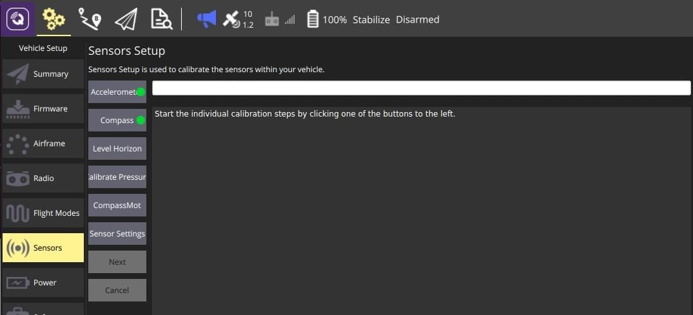
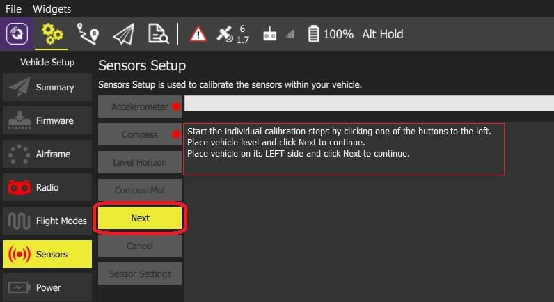
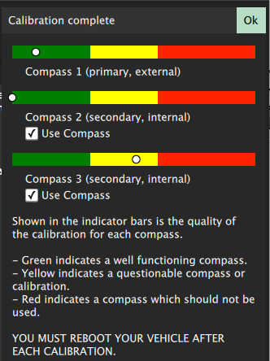
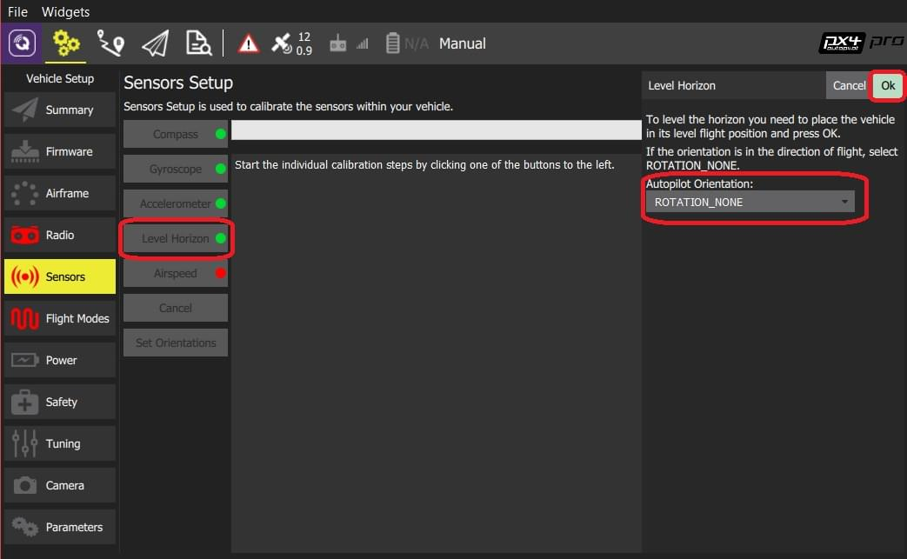
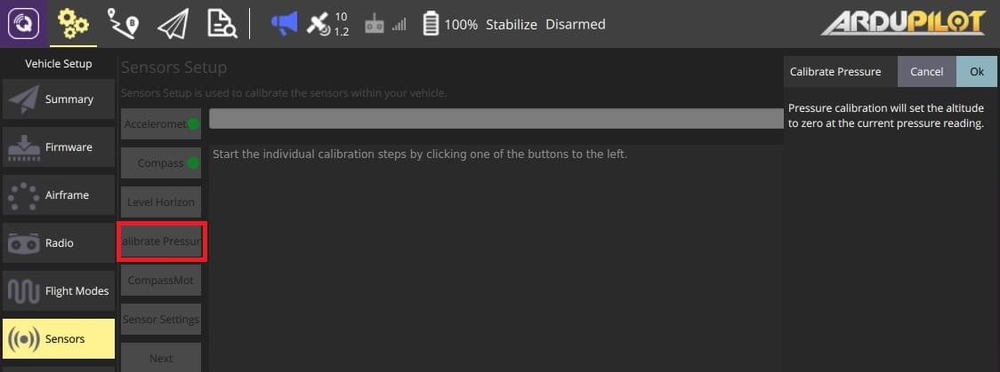
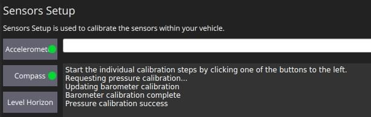
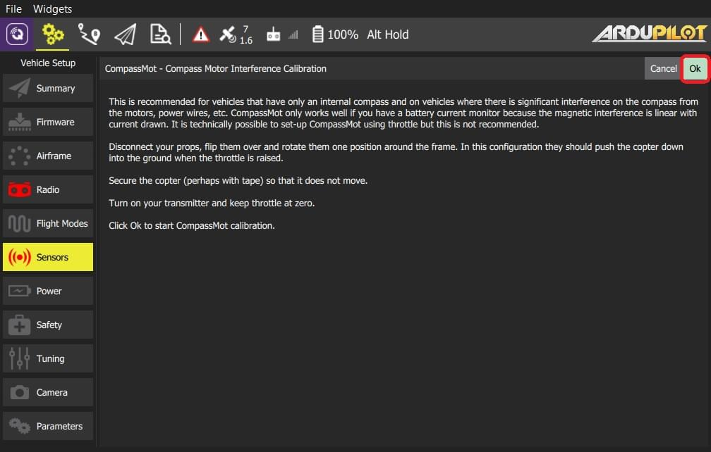
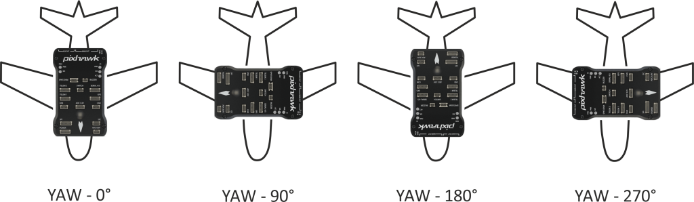
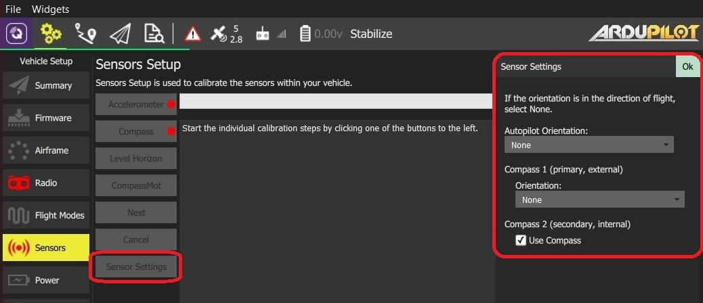

# Sensor Setup (ArduPilot)

The _Sensor Setup_ section allows you to configure and calibrate the vehicle's compass, gyroscope, accelerometer and any other sensors (the available sensors will depend on the vehicle type).

Available sensors are displayed as a list of buttons beside the sidebar.
Sensors marked with green are already calibrated, while sensors marked with red require calibration prior to flight.
Sensors with no light are simple settings with default values that you may choose not to calibrate.

Click on the button for each sensor to start its calibration sequence.

## Accelerometer {#accelerometer}

To calibrate the flight controller accelerometers you will be asked to place and hold your vehicle a number of orientations (you will be prompted when to move between positions).

The calibration steps are:

1. Click the **Accelerometer** sensor button.
   

   ::: info
   You should already have set the [Flight Controller Orientation](#flight_controller_orientation) above.
   If not, you can also set it here.
   :::

2. Click **OK** to start the calibration.

3. Position the vehicle based on text instructions in the center display.
   Click the **Next** button to capture each position.
   

## Compass {#compass}

ArduPilot uses onboard calibration support that allows for more accurate calibration.

:::info
Older ArduPilot firmware can be calibrated using the [same process as PX4](../setup_view/sensors_px4.md#compass).
:::

You need to rotate the vehicle randomly around all axes until the progress bar fills all the way to the right and the calibration completes. When the calibration completes you will get the following results:

This shows you the quality of the calibration for each compass. Using these values you can determine whether you may want to turn off usage of poorly performing compasses.

## Level Horizon {#level_horizon}

If the horizon (as shown in the HUD) is not level after completing accelerometer calibration you can calibrate the level horizon for your vehicle.
You will be asked to place the vehicle in a level orientation while it captures the information.

1. Click the **Level Horizon** sensor button.
   

   ::: info
   You should already have set the [Flight Controller Orientation](#flight_controller_orientation) above.
   If not, you can also set it here.
   :::

2. Place the vehicle in its level flight orientation on a level surface:

- For planes this is the position during level flight (planes tend to have their wings slightly pitched up!)
- For copters this is the hover position.

1. Click **OK** to start the calibration.

## Pressure/Barometer {#pressure}

This calibration set's the altitude to zero at the current pressure.

To perform **Pressure** calibration:

1. Click the **Calibrate Pressure** button and then **Ok**.

   

   The calibration result is immediately displayed:

   

## CompassMot (Optional)

CompassMot calibration is optional! It is recommended for vehicles that only have an internal compass and when there is significant interference on the compass from the motors, power wires, etc.
CompassMot only works well if you have a battery current monitor because the magnetic interference is linear with current drawn.

To perform **CompassMot** calibration:

1. Click the **CompassMot** sensor button.

   

2. Follow the onscreen prompts.

   

## Sensor Settings {#sensor_settings}

The _Sensor Settings_ section allows you to specify the compass orientation and which compasses are enabled.

:::tip
You can skip this section if the flight controller and compass are mounted upright on the vehicle and facing the front (this is the default orientation - `ROTATION_NONE`).
:::

If the autopilot/compass are mounted in any other way you will need to specify their orientations as YAW, PITCH and/or ROLL offsets relative to the forward-facing-upright orientation (clock-wise rotation around the Z, Y and X axis, respectively).

For example, the image below are at orientations: `ROTATION_NONE`, `ROTATION_YAW_90`,`ROTATION_YAW_180`,`ROTATION_YAW_270`.

To set the orientation(s) and compasses used:

1. Select the **Sensor Settings** button.

   

2. Select the **AutoPilot Orientation**.

3. Select the _orientation_ from **Compass 1 (primary/external) > Orientation** (or check **Compass2 (secondary, external) > Use Compass** to instead use the internal compass).

4. Press **OK**.
