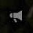
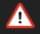
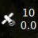
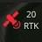

# Ana Araç Çubuğu

Ana araç çubuğu, farklı uygulama görünümlerine erişmenize ve bağlı araçlarınız için öndemli durumların bilgisine ulaşmanıza olanak sağlar.
Araç çubuğu, "PlanView" haricindeki tüm ekranlarda aynıdır (sizi "Fly" görünümüne geri götüren tek bir simgeye sahiptir).

## Seç-Görüntüle Simgeler

Aşağıdaki simgeler ana _Views _ arasında geçiş yapmak için kullanılır. Hiçbir araç bağlı olmasa bile bu simgeler ekranda bulunur.

 **[Settings](../settings_view/settings_view.md)**  _QGroundControl_ uygulamasını düzenleyin.

 **[Setup](../setup_view/setup_view.md)**   Aracınızı ayarlayın ve yapılandırın.

 **[Plan](../plan_view/plan_view.md)**   Otonom göevler oluşturun.

 **[Fly](../fly_view/fly_view.md)**  Monitor your vehicle(s) while flying, including streaming video.

 **[Analyze](../analyze_view/index.md)**   Uçuş kayıtlarını indirebilir, gözlem görevindeki görüntüler coğrafi olark etiketlenebilir, MAVLink konsoluna erişebilirsiniz.

## Durum Simgeleri

Durum simgeleri _QGroundControl_ bir araca bağlıyken gözükür.
Bunlar araçla ilgili önemli bilgileri gösterir ve üstlerine tıklayarak daha ayrıntılı bilgilere erişilebilir.

  **Vehicle Messages**  Click to show a list of messages from the vehicle. Note that version on the right is displayed when there are critical messages.

 **GPS Status**  Shows you satellite count and curent HDOP.

 **RC RSSI**  RC signal strength information.

 **Telemetry RSSI**  Telemetri sinyalleri güç bilgisi.

 **Battery**  Kalan batarya yüzde bilgisi.

 **Flight Mode**  Mevcut uçuş modu. Uçuş modunu değiştirmek için tıklayın.

 **RTK GPS Survey-In Status**  RTK GPS Survey-In'in ilerlemesini gösterir.
