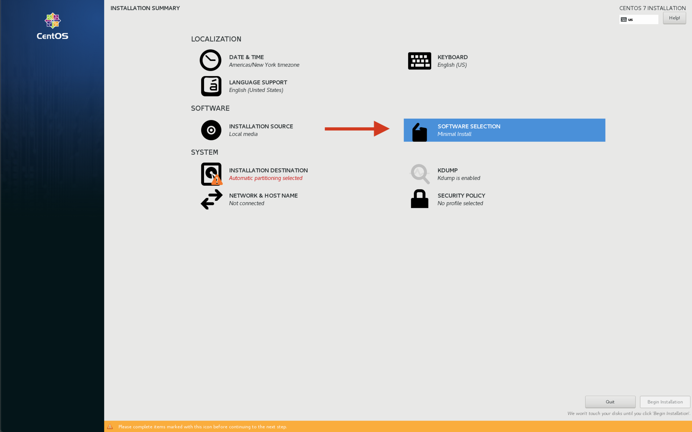

# 在 CentOS 7 上使用 QGC

## 安装操作系统

安装CentOS 7

1. 从这里获取最新[CentOS 7 ISO ](http://isoredirect.centos.org/centos/7/isos/x86_64/CentOS-7-x86_64-DVD-1810.iso)
2. 通过[following this guide](https://linuxize.com/post/how-to-create-a-bootable-centos-7-usb-stick/)制作一个 USB 启动盘。
3. 从USB启动盘中启动目标设备。

下面的示例将说明如何从USB启动盘启动目标设备。

**Example：** _Panasonic Toughpad FZ-M1_ （为方便遵循本指南操作，建议在设备上附上一个键盘和鼠标）。

1. 在附加的 USB 键盘上按住 **Delete** 键，或者在启动时按下电源按钮周围的所有按钮，便可进入BIOS 菜单。
2. 在 BIOS 菜单界面使用箭头键或触摸屏切换到 _Exit_ 选项卡。
3. 从启动设备列表中，选择已插入的USB启动盘。

**Example** [UAV 组件微导航](https://www.uavcomp.com/command-control/micronav/) 设备：

1. CentOS 不会以默认配置安装。 为解决这个问题，可进行如下操作：
   1. 如上述的示例中所述，转到BIOS菜单。
   2. 在“Advanced”选项卡下禁用“Extension Port”设备。
   3. 在BIOS菜单的退出页面上选择“Exit and save”，然后从USB启动盘启动目标设备。
   4. 在 CentOS 安装成功后，可再次恢复更改，以便微硬网络正常工作。
2. 如果想要重新进入Linux操作系统，请先关闭设备，而不是热重启。 否则微硬网络适配器将无法正常工作并怠速整个系统。

### CentOS 软件选择安装选项

这些都是用于安装CentOS开发系统的选项。 使用它作为指南。




### 更新 GStreamer

CentOS 安装并启动后，我们需要为QGC 搭建环境。 首先，我们需要将GStreamer更新为最新版本。 本指南遵循Alice Wonder的提示：https://media.librelamp.com。

    sudo yum install epel-release -y
    wget http://awel.domblogger.net/7/media/x86_64/awel-media-release-7-6.noarch.rpm
    sudo yum localinstall awel-media-release-7-6.noarch.rpm -y
    sudo yum clean all
    sudo yum update
    sudo yum install gstreamer1* --skip-broken -y

**Note:**确保如下组件已安装 (Intel GPUs的 vaapi)

    sudo yum install gstreamer1-vaapi
    sudo yum install gstreamer1-libav

**Note:** Install these to enable hardware accelerated video decoding

    sudo yum install libva
    sudo yum install libva-utils
    sudo yum install libva-intel-driver

If libva-intel-driver is not found you can download it and install it manually

    wget http://download1.rpmfusion.org/free/el/updates/7/x86_64/l/libva-intel-driver-1.8.3-4.el7.x86_64.rpm
    sudo yum localinstall libva-intel-driver-1.8.3-4.el7.x86_64.rpm -y

### 安装SDL2

SDL2 is used for joystick support.

    sudo yum install SDL2 SDL2-devel -y

### 更新内核(可选)

::: tip
当运行命令`/dev/input/*` 时， 如果游戏杆被成功识别并显示为`/dev/input/js0` ，则可以跳过这一步。
:::

We recommend updating the kernel for:

- 更好地触摸屏幕响应性能。
- 正确识别某些USB设备 - 特别是游戏杆。

The following joysticks are known not do work out of the box with the default CentOS 7 kernel (3.10.0):

- Logitech F310
- Microsoft Xbox 360 controller (USB)

To fix the joystick not being recognized (even if the same unit is working under Windows or Ubuntu) please [follow this guide to update the kernel](https://www.howtoforge.com/tutorial/how-to-upgrade-kernel-in-centos-7-server/).

Here's a short summary of the commands that you need to execute to update the kernel:

    sudo rpm --import https://www.elrepo.org/RPM-GPG-KEY-elrepo.org
    sudo rpm -Uvh http://www.elrepo.org/elrepo-release-7.0-2.el7.elrepo.noarch.rpm
    sudo yum --enablerepo=elrepo-kernel install kernel-ml -y

Reboot your device afterwards and make sure the new kernel version shows up as the default start option in the GRUB menu on boot.

::: info
您可能需要在 BIOS 中禁用安全启动才能启动新内核。
:::

## 在 CentOS 上运行 QGC

Before launching QGC, you need to make sure the current user has access to the dialout group (serial port access permission):

    sudo usermod -a -G dialout $USER

### 防火墙

The default firewall security level of Red Hat distributions like CentOS block MAVLink communication and also the camera video stream. So you need to create rules to open the incoming ports for MAVLink and camera stream. For non-production local environment testing purposes ONLY you can temporarily disable the firewall using the following commands ([from here](https://www.liquidweb.com/kb/how-to-stop-and-disable-firewalld-on-centos-7/)):

Temporary:

    systemctl stop firewalld

Permanent (at your own risk):

    systemctl disable firewalld

Undo permanent change:

    systemctl enable firewalld

### 与多网络的连接问题

In our test with CentOS we had problems when connecting to multiple networks through multiple network devices even with appropriate IP address and subnet assignment.

Issues consisted of:

- 连接到第二个网络时失去互联网连接
- 与载具的连接质量不佳，存在有大量不确定非再现问题和包丢失（例如，在常规模式中， 30秒完美连接，4秒丢失数据包)

If you face any of these problems avoid them by only connecting one network at a time e.g. switching between WiFi and Microhard.

### 执行预构建的 QGC 二进制文件

- 为CentOS保留包含预构建的QGC二进制文件的归档。 目前，这个构建没有自动部署，如果您迫切需要，请与开发者取得联系，。
- [解压归档](https://www.hostdime.com/kb/hd/command-line/how-to-tar-untar-and-zip-files)
- 从解压文件里找到脚本文件`qgroundcontrol-run.sh`
- 输入如下命令，运行该脚本

      ./qgroundcontrol-run.sh
      ```

  ## Building QGC on CentOS

  ### Installing Qt

mkdir ~/devel cd ~/devel

    <br />Install Qt 5.12.4 from the Qt installation script that can be downloaded [here](https://www.qt.io/download-thank-you?os=linux&hsLang=en).
    Once downloaded, make it executable and run it:

chmod +x qt-unified-linux-x64-3.1.1-online.run ./qt-unified-linux-x64-3.1.1-online.run

    <br />Select the following options and install it under `~/devel/Qt`:

    

    ### Clone and Build QGC

git clone --recursive https://github.com/mavlink/qgroundcontrol.git mkdir build cd build

    For a debug/test build:

../Qt/5.12.4/gcc_64/bin/qmake ../qgroundcontrol/qgroundcontrol.pro -spec linux-g++ CONFIG+=debug

    For a release build:

../Qt/5.12.4/gcc_64/bin/qmake ../qgroundcontrol/qgroundcontrol.pro -spec linux-g++ CONFIG+=qtquickcompiler

    Build it:

make -j4 ```

You can alternatively launch _QtCreator_ (found under `~/devel/Qt/Tools/QtCreator/bin/qtcreator`), load the `qgroundcontro.pro` project and build/debug from within its IDE.

By default, this will build the regular QGC. To build the sample, customized UI version, follow [these instructions](https://github.com/mavlink/qgroundcontrol/blob/master/custom-example/README.md).
