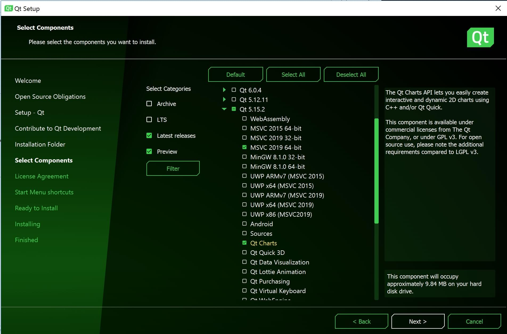
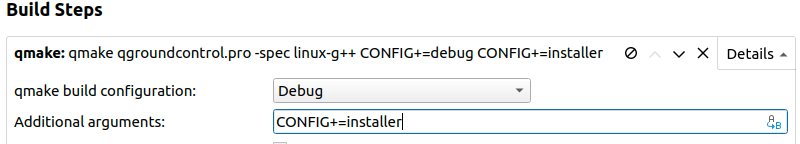

# Getting Started

本主题说明如何获取QGroundControl源代码并在本机或在Vagrant(虚拟机)环境中构建它。 本主题还提供其他可选功能信息及特定于操作系统的功能信息。
It also provides information about optional or OS specific functionality.

## 每日构建

如果您只是想测试 (而不是调试) 最近生成的 _QGroundControl_ ，那么请使用[Daily build](https://docs.qgroundcontrol.com/en/releases/daily_builds.html)。 官方提供了适用于所有平台的版本。 Versions are provided for all platforms.

## 源代码

_QGroundControl_ 的源代码保存在 github 上，下载地址为: https\://github.com/mavlink/qgroundcontrol。 QGroundControl源代码在Apache 2.0和GPLv3下是双许可的。 有关更多信息，请参阅：许可证。
It is [dual-licensed under Apache 2.0 and GPLv3](https://github.com/mavlink/qgroundcontrol/blob/master/COPYING.md).

要获取源文件, 请执行以下操作:

1. Clone the repo (or your fork) including submodules:
   ```
   克隆存储库 (或您的分叉), 包括子模块: `git clone --recursive -j8 https://github.com/mavlink/qgroundcontrol.git`
   ```
2. Update submodules (required each time you pull new source code):
   ```
   2.更新子模块（每次拉新源代码时都这样做）： `git submodule update --recursive`
   ```

:::tip
提示：不能使用Github以zip形式下载源文件，因为zip压缩包中不包含相应的子模块源代码。 你必须使用git工具！
You must use git!
:::

## 构建QGroundControl开发环境

### Using Containers

We support Linux builds using a container found on the source tree of the repository, which can help you develop and deploy the QGC apps without having to install any of the requirements on your local environment.

[Container Guide](../getting_started/container.md)

### Native Builds

_QGroundControl_ builds are supported for macOS, Linux, Windows, iOS and Android.
_QGroundControl_ uses [Qt](http://www.qt.io) as its cross-platform support library and uses [QtCreator](http://doc.qt.io/qtcreator/index.html) as its default build environment.

- macOS：v10.11或更高版本
- Ubuntu：64位，gcc编译器
- **Windows:** Vista or higher, [Visual Studio 2019 compiler](#vs) (64 bit)
- iOS：10.0及更高版本
- **Android:** Android 5.0 and later.
  - Standard QGC is built against ndk version 19.
  - Java JDK 11 is required.
- **Qt version:** {{ $frontmatter.qt\_version }} **(only)** <!-- NOTE {{ $frontmatter.qt_version }} is set in the frontmatter above -->

  :::warning
  **Do not use any other version of Qt!** QGC has been thoroughly tested with the specified version of Qt ({{ $frontmatter.qt\_version }}).
  There is a significant risk that other Qt versions will inject bugs that affect stability and safety (even if QGC compiles).
  :::

For more information see: [Qt 5 supported platform list](http://doc.qt.io/qt-5/supported-platforms.html).

:::info
Native [CentOS Builds](../getting_started/cent_os.md) are also supported, but are documented separately (as the tested environment is different).
:::

#### Install Visual Studio 2019 (Windows Only) {#vs}

The Windows compiler can be found here: [Visual Studio 2019 compiler](https://visualstudio.microsoft.com/vs/older-downloads/) (64 bit)

When installing, select _Desktop development with C++_ as shown:


:::info
Visual Studio is ONLY used to get the compiler. Actually building _QGroundControl_ should be done using [Qt Creator](#qt-creator) or [qmake](#qmake) as outlined below.
:::

#### 安装Qt

You **need to install Qt as described below** instead of using pre-built packages from say, a Linux distribution, because _QGroundControl_ needs access to private Qt headers.

To install Qt:

1. 下载并运行[Qt Online Installer](http://www.qt.io/download-open-source)
   - **Ubuntu:**
     - 使用以下命令将下载的文件设置为可执行文件：`chmod + x`
     - 请安装到默认位置, 以便与 **./qgroundcontrol-start.sh** 一起使用。如果将 Qt 安装到非默认位置, 则需要修改 **qgroundcontrol-start.sh** ，才能运行下载的组件。

2. In the installer _Select Components_ dialog choose: {{ $frontmatter.qt\_version }}.

   ::: info
   If the version needed is not displayed, check the archive (show archive and refresh).
   :::

   然后，按如下向导，安装组件:

   - **Windows**: _MSVC 2019 64 bit_
   - **MacOS**: _macOS_
   - **Linux**: _Desktop gcc 64-bit_
   - All:
     - _Qt Charts_ <!-- and *Qt Remote Objects (TP)* -->
     - _Android ARMv7_ (optional, used to build Android)

   

3. Install Additional Packages (Platform Specific)

   - **Ubuntu:** `sudo apt-get install speech-dispatcher libudev-dev libsdl2-dev patchelf build-essential curl`
   - **Fedora:** `sudo dnf install speech-dispatcher SDL2-devel SDL2 systemd-devel patchelf`
   - **Arch Linux:** `pacman -Sy speech-dispatcher patchelf`
   - **Android:** [Qt Android Setup](http://doc.qt.io/qt-5/androidgs.html)

     ::: info
     JDK11 is required (install if needed)!
     :::

4. Install Optional/OS-Specific Functionality

   Optional features that are dependent on the operating system and user-installed libraries are linked/described below.
   These features can be forcibly enabled/disabled by specifying additional values to qmake.
   :::

   - - **Video Streaming/Gstreamer:** - see [Video Streaming](https://github.com/mavlink/qgroundcontrol/blob/master/src/VideoReceiver/README.md).
     - **Airmap SDK:** - TBD.
   - **Airmap SDK:** - TBD.

5. Disable platform-specific optional features that are enabled (but not installed), by default.

   ::: info
   This currently applies to Airmap on Linux, which is optional but enabled by default.
   :::

   - **Ubuntu:**
     - Airmap: Create a file named **user\_config.pri** (in the repo root directory) containing the text `DEFINES += DISABLE_AIRMAP`.
       This can be done in a bash terminal using the command:
       ```
       This can be done in a bash terminal using the command: `echo -e "DEFINES += DISABLE_AIRMAP\r\n" | tee user_config.pri`
       ```

#### Building using Qt Creator {#qt-creator}

1. Launch _Qt Creator_ and open the **qgroundcontrol.pro** project.

2. In the **Projects** section, select the appropriate kit for your needs:

   - **OSX:** Desktop Qt {{ $frontmatter.qt\_version }} clang 64 bit

     ::: info
     iOS builds must be built using [XCode](http://doc.qt.io/qt-5/ios-support.html).
     :::

   - **Ubuntu:** Desktop Qt {{ $frontmatter.qt\_version }} GCC 64bit

   - **Windows:** Desktop Qt {{ $frontmatter.qt\_version }} MSVC2019 **64bit**

   - **Android:** Android for armeabi-v7a (GCC 4.9, Qt {{ $frontmatter.qt\_version }})
     - JDK11 is required.
       You can confirm it is being used by reviewing the project setting: **Projects > Manage Kits > Devices > Android (tab) > Android Settings > _JDK location_**.

3. Build using the "hammer" (or "play") icons:

   

#### Build using qmake on CLI {#qmake}

Example commands to build a default QGC and run it afterwards:

1. Make sure you cloned the repository and updated the submodules before, see chapter _Source Code_ above and switch into the repository folder: `cd qgroundcontrol`
   ```
   cd qgroundcontrol
   ```

2. Create and enter a shadow build directory:
   ```
   mkdir build
   cd build
   ```

3. Configure the build using the qmake script in the root of the repository: `qmake ../`
   ```
   入门指南
   ```

4. Run make to compile and link.
   To accelerate the process things you can use the `-j{number of threads}` parameter.

   ```
   `make -j12`
   ```

   ::: info
   You can also specify build time flags here.
   For example, you could disable airmap inclusion using the command:

   ```
   DEFINES+=DISABLE_AIRMAP make build
   ```

   :::

5. Run the QGroundcontrol binary that was just built: `./staging/QGroundControl`
   ```
   ./staging/QGroundControl
   ```

### Vagrant

[Vagrant](https://www.vagrantup.com/) can be used to build and run _QGroundControl_ within a Linux virtual machine (the build can also be run on the host machine if it is compatible).

1. [Download](https://www.vagrantup.com/downloads.html) and [Install](https://www.vagrantup.com/docs/getting-started/) Vagrant
2. From the root directory of the _QGroundControl_ repository run `vagrant up`
3. To use the graphical environment run `vagrant reload`

### Additional Build Notes for all Supported OS

- **Parallel builds:** For non Windows builds, you can use the `-j#` option to run parellel builds.
- **Location of built files:** Individual build file results can be found in the `build_debug` or `build_release` directories. The built executable can be found in the `debug` or `release` directory.
- **If you get this error when running _QGroundControl_**: `/usr/lib/x86_64-linux-gnu/libstdc++.so.6: version 'GLIBCXX_3.4.20' not found.`, you need to either update to the latest _gcc_, or install the latest _libstdc++.6_ using: `sudo apt-get install libstdc++6`.
- **Unit tests:** To run the [unit tests](../contribute/unit_tests.md), build in `debug` mode with `UNITTEST_BUILD` definition, and then copy `deploy/qgroundcontrol-start.sh` script into the `debug` directory before running the tests.

## Building QGC Installation Files

You can additionally create installation file(s) for _QGroundControl_ as part of the normal build process.

:::tip
On Windows you will need to first install [NSIS](https://sourceforge.net/projects/nsis/).
:::

To add support for installation file creation you need to add `CONFIG+=installer` to your project file, or when you call _qmake_.

To do this in _Qt Creator_:

- Open **Projects > Build > Build Steps > qmake > Additional arguments**.
- Enter `CONFIG+=installer` as shown: 
