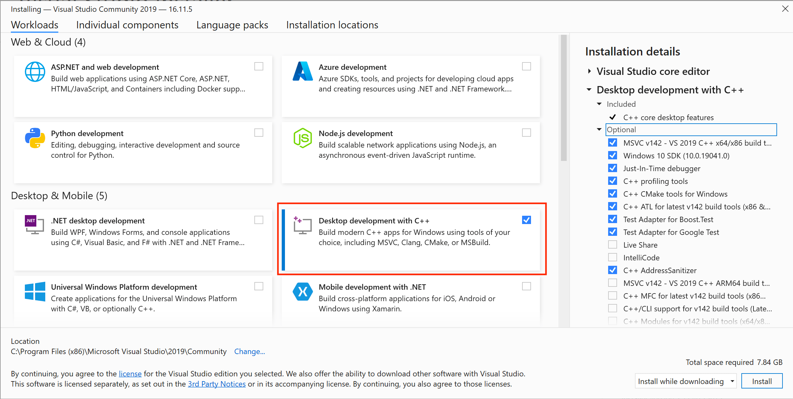

# 从源码开始并构建

本主题说明如何获取 _QGroundControl_ 源代码并在本机或在 _Vagrant_ 环境中构建它。 本主题还提供其他可选功能信息及特定于操作系统的功能信息。
本主题还提供其他可选功能信息及特定于操作系统的功能信息。

## 每日构建

如果您只是想测试 (而不是调试) 最近生成的 _QGroundControl_ ，那么请使用[Daily build](../../qgc-user-guide/releases/daily_builds.md)。 官方提供了适用于所有平台的版本。
官方提供了适用于所有平台的版本。

## 源代码

_QGroundControl_ 的源代码保存在GitHub 上：https://github.com/mavlink/qgroundcontrol。
它采用 [Apache 2.0 和 GPLv3 双重授权](https://github.com/mavlink/qgroundcontrol/blob/master/.github/COPYING.md)。

要获取源文件, 请执行以下操作:

1. 克隆存储库 (或您的分叉), 包括子模块：

  ```sh
  git clone --recursive -j8 https://github.com/mavlink/qgroundcontrol.git
  ```

2. 2.更新子模块（每次拉新源代码时都这样做）：

  ```sh
  git submodule update --recursive
  ```

:::tip
提示：不能使用Github以zip形式下载源文件，因为zip压缩包中不包含相应的子模块源代码。 你必须使用git工具！
你必须使用git工具！
:::

## 构建QGroundControl开发环境

### 使用容器

我们支持使用存储库源代码树上的容器进行 Linux 构建，这可以帮助您开发和部署 QGC 应用程序，而无需在本地环境中安装任何要求。

[容器指南](../getting_started/container.md)

### 原生构建

_QGroundControl_ 支持macos、linux、windows 和 Android 平台的构建。 理论上可以为iOS创建一个 QGC 版本，但不再支持作为标准构建。
_QGroundControl_ 使用 [Qt](http://www.qt.io)作为其跨平台支持库。

所需的 Qt 版本为 {{ $frontmatter.qt_version }} **(必须无误)**。

::: warning
**请勿使用任何其他版本的 Qt！**
QGC 已通过指定 Qt 版本（{{ $frontmatter.qt_version }}）的全面测试。
其它的 Qt 版本很可能会注入影响稳定和安全的 bug (即使QGC 编译通过)。
:::

更多信息请看: [Qt 6 支持平台列表](https://doc.qt.io/qt-6/supported-platforms.html)。

#### 安装Qt

您**必须像下面描述的那样安装Qt** ，而不是使用预构建的软件包，例如Linux发行版。

如何安装Qt：

1. 下载并运行[Qt Online Installer](https://www.qt.io/download-qt-installer-oss)
  - **Ubuntu:**
    - 使用以下命令将下载的文件设置为可执行文件：`chmod + x`
    - 您可能还需要安装 libxcb-cursor0

2. 在 _Installation 文件夹页面选择"自定义安装"

3. 在 _选择组件_ 页面：

  - 如果您没有看到 {{ $frontmatter.qt_version }}_ 列出_Qt选中 _Archive_ 复选框并单击 _Filter_。

- 在 Qt -> _Qt {{ $frontmatter.qt_version }}_ 下选择：
  - **Windows**: MSVC 2022 _arch_ - 其中 “arch” 指的是您机器的架构
  - **Mac**：桌面
  - **Linux**: gcc 64-bit 桌面
  - **Android**: Android
- 选择所有 _Additional Libraries_
- 取消选择 QT Design Studio

1. 安装附加软件包(特殊平台)

  - **Ubuntu:** `sudo bash ./qgroundcontrol/tools/setup/install-dependencies-debian.sh`
  - **Fedora:** `sudo dnf install speech-dispatcher SDL2-devel SDL2 systemd-devel patchelf`
  - **Arch Linux:** `pacman -Sy speech-dispatcher patchelf`
  - **Mac** `sh qgroundcontrol/tools/setup/macos-dependencies.sh`
  - **Android** [Setup](https://doc.qt.io/qt-6/android-getting-started.html)。 最新版本需要 JDK17 。 NDK 版本：25.1.8937393
    您可以通过审查项目设置确认它正在使用：**Projects > Managing Kits >  Devices > Android (tab) > Android Settings > _JDK location_**。
    注意：访问此处查看更详细的配置 [android.yml](.github/workflows/android.yml)

2. 安装可选/特定操作功能

  ::: info
  依赖操作系统和用户安装的库的可选功能在下面链接/描述。
  这些功能可以被强制启用/禁用，为qmake指定额外的值。
  :::

  - **视频流/Gstream:** - 查看 [视频流](https://github.com/mavlink/qgroundcontrol/blob/master/src/VideoManager/VideoReceiver/GStreamer/README.md)

#### 安装 Visual Studio (仅限Windows) {#vs}

安装 [Visual Studio 2022 Community Edition](https://visualstudio.microsoft.com/downloads/)。

进行安装时，选择 _使用 C++ 进行桌面开发_ ：



:::info
Visual Studio 仅用于获取编译器。 构建 _QGroundControl_ 可直接按以下概述，使用 [Qt Creator](#qt-creator) 或 [cmake](#cmake) 完成。
:::

#### 使用 Qt Creator {#qt-creator} 进行构建

1. 启动 _Qt Creator_，选择 Open Project 并选择 **CMakeLists.txt** 文件。

2. 在 _Configure Project_ 页面上，它应该默认您刚刚使用上面的说明安装的 Qt 版本。 如果不从列表中选择该套件，然后点击 _Configure Project_。

3. 使用"hammer" (或"play") 图标或菜单构建：

  

#### 在CLI（命令行界面）使用 CMake {#cmake} 进行构建

构建默认的 QGC 示例命令并在此后运行它：

1. 请确保您克隆了仓库并先更新子模块，见上文 _源代码_ 章节并切换到仓库文件夹：

  ```sh
  cd qgroundcontrol
  ```

2. 配置：

  ```sh
  ~/Qt/6.8.3/gcc_64/bin/qt-cmake -B build -G Ninja -DCMAKE_BUILD_TYPE=Debug
  ```

  修改 qt-cmake 的目录，使其与你安装 Qt 的位置以及你想要使用的工具包相匹配。

3. 构建

  ```sh
  cmake --build build --config Debug
  ```

4. Run the QGroundcontrol binary that was just built: `./staging/QGroundControl`

  ```sh
  ./build/Debug/QGroundControl
  ```

### Vagrant

[Vagrant](https://www.vagrantup.com/) 可以在 Linux 虚拟机内构建和运行 _QGroundControl_ (如果兼容，也可以在主机机上运行)。

1. [下载](https://www.vagrantup.com/downloads.html) 并 [安装](https://www.vagrantup.com/docs/getting-started/) Vagrant
2. 在 _QGroundControl_ 仓库的根目录运行 `vagrant up`
3. 若要使用图形环境，请运行 `vagrant reload`

### 所有支持的操作系统的额外构建备注

- **并行构建：** 对于非Windows构建，您可以使用 "-j#" 选项来运行并行构建。
- **如果你在运行 _QGroundControll_**时遇到此错误: `/usr/lib/x86_64-linux-gnu/libstdc++.so.6: version 'GLIBCXX_3.4.20' not found.`，你需要更新到最新的 _gcc_ ，或者通过使用 `sudo apt-get install libstdc++6` 安装最新的 _libstdc++.6_ 。
- **单元测试:** 若要运行 [单元测试](../contribute/unit_tests.md)，使用 `QGC_UNITEST_BUILD` 定义在 `debug` 模式下构建，然后复制 `deposition / qgroundcontrol-start。 运行测试前，将 `deploy/qgroundcontrol-start.sh\` 脚本复制到debug目录中。

## 构建 QGC 安装文件

作为正常构建过程的一部分，您还可以为 _QGroundControl_ 创建安装文件。

```sh
cmake --install . --config Release
```
