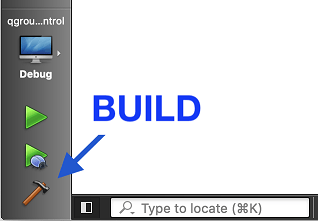

# 从源码开始并构建

本主题说明如何获取 _QGroundControl_ 源代码并在本机或在 _Vagrant_ 环境中构建它。 本主题还提供其他可选功能信息及特定于操作系统的功能信息。
本主题还提供其他可选功能信息及特定于操作系统的功能信息。

## 每日构建

如果您只是想测试 (而不是调试) 最近生成的 _QGroundControl_ ，那么请使用[Daily build](../../qgc-user-guide/releases/daily_builds.md)。 官方提供了适用于所有平台的版本。
官方提供了适用于所有平台的版本。

## 源代码

_QGroundControl_ 的源代码保存在 github 上，下载地址为: https://github.com/mavlink/qgroundcontrol。 QGroundControl源代码在Apache 2.0和GPLv3下是双许可的。 有关更多信息，请参阅：许可证。
它是 [Apache 2.0 和 GPLv3下的双重授权](https://github.com/mavlink/qgroundcontrol/blob/master/.github/COPYING.md)。

要获取源文件, 请执行以下操作:

1. 克隆存储库 (或您的分叉), 包括子模块：

  ```sh
  git clone --recursive -j8 https://github.com/mavlink/qgroundcontrol.git
  ```

2. 2.更新子模块（每次拉新源代码时都这样做）：

  ```sh
  git submodule update --recursive
  ```

:::tip
提示：不能使用Github以zip形式下载源文件，因为zip压缩包中不包含相应的子模块源代码。 你必须使用git工具！
你必须使用git工具！
:::

## 构建QGroundControl开发环境

### Using Containers

We support Linux builds using a container found on the source tree of the repository, which can help you develop and deploy the QGC apps without having to install any of the requirements on your local environment.

[Container Guide](../getting_started/container.md)

### Native Builds

QGroundControl 支持macos、linux、windows 和 Android 平台的构建。 理论上可以为iOS创建一个 QGC 版本，但不再支持作为标准构建。
_QGroundControl_ 使用 [Qt](http://www.qt.io)作为其跨平台支持库。

所需的 Qt 版本为 {{ $frontmatter.qt_version }} **(必须无误)**。

:::warning
**Do not use any other version of Qt!** QGC has been thoroughly tested with the specified version of Qt ({{ $frontmatter.qt_version }}).
There is a significant risk that other Qt versions will inject bugs that affect stability and safety (even if QGC compiles).
:::

更多信息请看: [Qt 6 支持平台列表](https://doc.qt.io/qt-6/supported-platforms.html)。

#### 安装Qt

您**必须像下面描述的那样安装Qt** ，而不是使用预构建的软件包，例如Linux发行版。

To install Qt:

1. 下载并运行[Qt Online Installer](https://www.qt.io/download-qt-installer-oss)
  - **Ubuntu:**
    - 使用以下命令将下载的文件设置为可执行文件：`chmod + x`
    - 您可能还需要安装 libxcb-cursor0

2. 在 _Installation 文件夹页面选择"自定义安装"

3. 在 _选择组件_ 页面：

  - 如果您没有看到 {{ $frontmatter.qt_version }}_ 列出_Qt选中 _Archive_ 复选框并单击 _Filter_。

- 在 Qt -> _Qt {{ $frontmatter.qt_version }}_ 下选择：
  - **Windows**: MSVC 2022 _arch_ - 其中 “arch” 指的是您机器的架构
  - **Mac**：桌面
  - **Linux**: Desktop gcc 64-bit
  - **Android**: Android
- 选择所有 _Additional Libraries_
- 取消选择 QT Design Studio

1. Install Additional Packages (Platform Specific)

  - **Ubuntu:** `sudo bash ./qgroundcontrol/tools/setup/install-dependencies-debian.sh`
  - **Fedora:** `sudo dnf install speech-dispatcher SDL2-devel SDL2 systemd-devel patchelf`
  - **Arch Linux:** `pacman -Sy speech-dispatcher patchelf`
  - **Mac** `sh qgroundcontrol/tools/setup/macos-dependencies.sh`
  - **Android** [Setup](https://doc.qt.io/qt-6/android-getting-started.html)。 最新版本需要 JDK17 。 NDK 版本：25.1.8937393
    您可以通过审查项目设置确认它正在使用：**Projects > Managing Kits >  Devices > Android (tab) > Android Settings > _JDK location_**。
    注意：访问此处查看更详细的配置 [android.yml](.github/workflows/android.yml)

2. Install Optional/OS-Specific Functionality

  Optional features that are dependent on the operating system and user-installed libraries are linked/described below.
  These features can be forcibly enabled/disabled by specifying additional values to qmake.
  :::

  - **视频流/Gstream:** - 查看 [视频流](https://github.com/mavlink/qgroundcontrol/blob/master/src/VideoManager/VideoReceiver/GStreamer/README.md)

#### 安装 Visual Studio (仅Windows) {#vs}

安装 [Visual Studio 2022 Community Edition](https://visualstudio.microsoft.com/downloads/)。

When installing, select _Desktop development with C++_ as shown:


:::info
Visual Studio is ONLY used to get the compiler. 构建 _QGroundControl_ 可直接按以下概述，使用 [Qt Creator](#qt-creator) 或 [cmake](#cmake) 完成。
:::

#### 使用 Qt Creator {#qt-creator} 进行构建

1. 启动 _Qt Creator_，选择 Open Project 并选择 **CMakeLists.txt** 文件。

2. 在 _Configure Project_ 页面上，它应该默认您刚刚使用上面的说明安装的 Qt 版本。 如果不从列表中选择该套件，然后点击 _Configure Project_。

3. 使用"hammer" (或"play") 图标或菜单构建：

  

#### 在CLI（命令行界面）使用 CMake {#cmake} 进行构建

Example commands to build a default QGC and run it afterwards:

1. Make sure you cloned the repository and updated the submodules before, see chapter _Source Code_ above and switch into the repository folder: `cd qgroundcontrol`

  ```sh
  cd qgroundcontrol
  ```

2. 配置：

  ```sh
  ~/Qt/6.8.3/gcc_64/bin/qt-cmake -B build -G Ninja -DCMAKE_BUILD_TYPE=Debug
  ```

  修改 qt-cmake 的目录，使其与你安装 Qt 的位置以及你想要使用的工具包相匹配。

3. 构建

  ```sh
  cmake --build build --config Debug
  ```

4. Run the QGroundcontrol binary that was just built: `./staging/QGroundControl`

  ```sh
  ./build/Debug/QGroundControl
  ```

### Vagrant

[Vagrant](https://www.vagrantup.com/) can be used to build and run _QGroundControl_ within a Linux virtual machine (the build can also be run on the host machine if it is compatible).

1. [Download](https://www.vagrantup.com/downloads.html) and [Install](https://www.vagrantup.com/docs/getting-started/) Vagrant
2. From the root directory of the _QGroundControl_ repository run `vagrant up`
3. To use the graphical environment run `vagrant reload`

### Additional Build Notes for all Supported OS

- **Parallel builds:** For non Windows builds, you can use the `-j#` option to run parellel builds.
- **If you get this error when running _QGroundControl_**: `/usr/lib/x86_64-linux-gnu/libstdc++.so.6: version 'GLIBCXX_3.4.20' not found.`, you need to either update to the latest _gcc_, or install the latest _libstdc++.6_ using: `sudo apt-get install libstdc++6`.
- **Unit tests:** 若要运行 [unit tests](../contribute/unit_tests.md)，使用 `QGC_UNITEST_BUILD` 定义在 `debug` 模式下构建，然后复制 `deposition / qgroundcontrol-start。 运行测试前，将 `deploy/qgroundcontrol-start.sh\` 脚本复制到debug目录中。

## Building QGC Installation Files

You can additionally create installation file(s) for _QGroundControl_ as part of the normal build process.

```sh
cmake --install . --config Release
```
