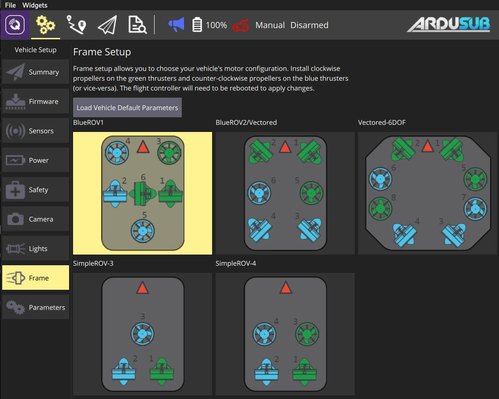

# Airframe Setup (ArduPilot)

Airframe Setup is used to select the frame class and type that matches your vehicle

> **Note** Airframe Setup is only available on *ArduCopter* and *ArduSub* vehicles (it is not shown for *ArduPilot* Rover or Plane vehicles).

## ArduCopter Airframe Setup

To select the airframe in Copter:

1. First select the **Gear** icon (Vehicle Setup) in the top toolbar and then **Airframe** in the sidebar.
    
    

2. Select the broad *Frame Class* for your vehicle:
    
    
    
    > **Note** You will need to reboot the vehicle for class changes to take effect.

3. Select the specific *Frame Type* for your vehicle:
    
    

## ArduSub Frame Setup {#ardusub}

To select the frame type for Sub:

1. First select the **Gear** icon (Vehicle Setup) in the top toolbar and then **Frame** in the sidebar.
2. Select the frame type that matches your vehicle (selecting a frame applies the selection).
3. Make sure that all **green** thrusters have **clockwise** propellers and all **blue** thrusters have **counter-clockwise** propellers (or vice-versa).
    
    

- You can also click **Load Vehicle Default Parameters** to load default parameter set for ArduSub.
    
    