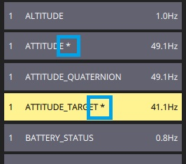

# MAVLink 检测器

_MAVLink 检查器_提供实时信息并绘制由 _QGroundControl_接收的 MAVLink 流量图。

:::warning
此功能主要适用于 **autopilot 开发者**/**载具制造者**。
它仅在桌面版本上支持 (Windows, Linux, Mac OS)。
:::

检测器列出了当前载具收到的所有信息，以及其源组件标识和更新频率。
您可以深入查看单个消息，以获取消息ID、源组件ID以及所有单个字段的值。
您也可以实时绘制字段值，从多个消息中选择多个字段以显示在两个图表中的一个。

要使用 _MAVLink 检查器_：

1. 通过选择 _QGroundControl_ 应用程序菜单打开_分析视图_ (左上角的 "Q" 图标)，然后(在 _选择工具_ 弹窗)选择 **分析工具** 按钮。
   

2. 从侧边栏中选择**MAVLink检查器**。

   

   视图会在接收到消息时开始填充这些消息。

3. 选择一个消息来查看其字段及其(动态更新) 值：

   

4. 启用相邻的复选框，将字段添加到图表(图1显示在图2下方)。

   

   - 字段只能添加到一个图表。

   - 一个图表可以有多个字段和多个消息中的字段 (这些都在每个图表上列出)。
      包含正在绘制的字段的消息用星号高亮显示。

      

   - _比例_ 和 _范围_ 已设置为合理的值，但在需要时可以修改。
