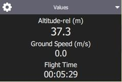
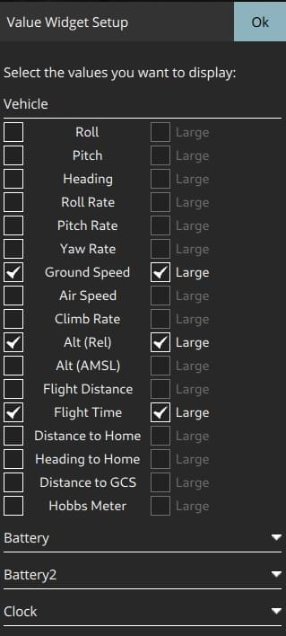
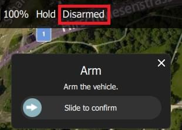
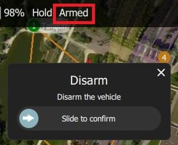

# 飞行视图

飞行视图用于在飞行时对车辆进行指挥和监视。

您可以使用它：

- 自动运行[航前检查表](#preflight_checklist)。
- Arm the vehicle (or check why it won't arm).
- 控制飞行任务：[启动](#start_mission), [继续](#continue_mission), [暂停](#pause), 和[恢复](#resume_mission)。
- 引导飞行器执行[解锁](#arm)/[上锁](#disarm)/[急停](#emergency_stop)、[起飞](#takeoff)/[着陆](#land)、[改变高度](#change_altitude)、[去](#goto)或[环绕](#orbit)指定位置，以及[返航/RTL](#rtl)。
- 在地图视图和视频视图之间切换(如果可用)
- Display video, mission, telemetry, and other information for the current vehicle, and also switch between connected vehicles.

## 界面概述

以上屏幕截图显示了飞行视图的主要元素：

- **地图：** 显示所有已连接飞行器的位置及当前飞行器的任务。
  - You can drag the map to move it around (the map automatically re-centres after a certain amount of time).
  - Once flying, you can click on the map to set a [Go to](#goto) or [Orbit at](#orbit) location.
- **Fly Toolbar:** Key status information for sensors (GPS, battery, RC control), and vehicle state (Flight mode, Armed/Disarmed status).
  - Select the sensor indicators to view more detail.
  - Press the _Flight mode_ text (e.g. "Hold") to select a new mode.
    Not every mode may be available.
  - The text next to the **Q** icon indicates the flight readiness using text: "Not Ready", "Ready to Fly", "Flying", and status using colour: "green" (all good!), amber (a warning), red (serious problem).
    Select the text when the background is amber or red to find out the cause of any preflight issues (QGC 4.2.0 and later).
    You can also select the text to reach a button to arm/disarm/emergency-stop the vehicle.
- **Fly tools:** You can use these to:
  - Toggle between takeoff/land.
  - Pause/restart the current operation (e.g. landing, or the mission).
  - Safety return (also known as RTL or Return).
  - The _Action_ button offers other appropriate options for the current state (these overlay the _Confirmation Slider_).
    Actions include changing the altitude or continuing a mission.
  - Enable the [preflight checklist](#preflight_checklist) (tool option disabled by default).
- **[Instrument Panel](#instrument_panel):** A multi-page widget that displays vehicle information including: telemetry, camera, video, system health, and vibration.
- **Attitude/Compass**: A widget that provides virtual horizon and heading information.
- **Camera Tools**: A widget for switching between still and video modes, starting/stopping capture, and controlling camera settings.
- **[Video/Switcher](#video_switcher):** Toggle between video or map in a window.
  - Press the element to switch _Video_ and _Map_ to foreground.
  - _QGroundControl_ supports RTP and RTSP video streaming over your vehicles UDP connection.
    It also supports directly connected UVC devices.
    QGC video support is further discussed in the [Video README](https://github.com/mavlink/qgroundcontrol/blob/master/src/VideoStreaming/README.md).
  - A [Telemetry Overlay](../fly_view/video_overlay.md) is automatically generated as a subtitle file
- **Confirmation Slider:** Context sensitive slider to confirm requested actions.
  Slide to start operation. Press **X** to cancel.

There are a number of other elements that are not displayed by default/are only displayed in certain conditions.
For example, the multi-vehicle selector is only displayed if you have multiple vehicles, and the preflight checklist tool button is only displayed if the appropriate setting is enabled.

## Instrument Panel {#instrument_panel}

The instrument panel is a multi-page widget that displays information about the current vehicle, including: telemetry, camera, video, system health, and vibration information.

The values page shows telemetry information; by default the altitude (relative to the home location) and the ground speed.

You can configure what information is display by pressing the small gear icon on the top left of the panel.
This toggles the position of the panel between bottom centre and right-centre.

You configure what information is display by selecting the edit/pencil icon.
The grid will then display "+" and "-" icons that you can use to add or remove rows and columns (and the pencil icon is replaced by a "lock" icon that you can use to save the settings).

Select a value to launch its "Value Display" editor.
This allows you to change the icon, text, size, units and so on of the current telemetry value.

Press the _Armed/Disarmed_ text to toggle the armed state.

The selection list on the top left is used to change the source of the telemetry.
By default this is the vehicle, but you can use the selector to choose a particular sensor type.

 

The selection list on the top right is used to select a particular telemetry value for the vehicle or sensor.

### Camera {#camera_instrument_page}

The camera page is used to configure and control the camera.

The camera capture and configuration options depend on the connected camera.
The configuration options are selected using the panel gear icon.
The configuration for a simple autopilot-connected camera are shown below.

Most of the settings that are displayed depend on the camera (they are defined in its [MAVLink Camera Definition File](https://mavlink.io/en/services/camera_def.html)).

When connected to camera that supports the [MAVLink Camera Protocol](https://mavlink.io/en/services/camera.html) you can additionally configure and use other camera services that it makes available.
For example, if your camera supports video mode you will be able to switch between still image capture and video mode, and start/stop recording.

::: info
Most of the settings that are displayed depend on the camera (they are defined in its [MAVLink Camera Definition File](https://mavlink.io/en/services/camera_def.html)).

> A few common settings at the end are hard-coded: Photo Mode (Single/Time Lapse), Photo Interval (if Time Lapse), Reset Camera Defaults (sends a reset command to the camera), Format (storage)

### Video Stream {#video_instrument_page}

The video page is used to enable/disable video streaming.
When enabled, you can start/stop the video stream, enable a grid overlay, change how the image fits the screen, and record the video locally with QGC.

## Actions/Tasks

The following sections describe how to perform common operations/tasks in the Fly View.

Many of the available options depend on both the vehicle type and its current state.
:::

### Pre Flight Checklist {#preflight_checklist}

An automated preflight checklist can be used to run through standard checks that the vehicle is configured correctly and it is safe to fly.

To view the checklist, first enable the tool by navigating to [Application Settings > General > Fly View](../settings_view/general.md) and selecting the **Use preflight checklist** checkbox.
The tool will then be added to the _Flight Tools_.
Press it to open the checklist:

Once you have performed each test, select it on the UI to mark it as complete.

### Arming and Preflight Checks {#arm}

Arming a vehicle starts the motors in preparation for takeoff.
You will only be able to arm the vehicle if it is safe and ready to fly.

:::tip
Generally _QGroundControl_ does not require you to arm the vehicle explicitly; this is done for you if you start a mission or takeoff.
:::

The vehicle is ready to fly in all modes if the status text says "Ready to Fly" and the background is green.

If the background is amber then it is ready to take off in the current mode, but may not be able to switch to other modes.
If the background is red and the text is "Not Ready" then you will not be able to arm in the current mode.

From QGC 4.2.0 (at time of writing, a daily build) you can find out the exact cause of the warning or error, and possible solutions, by pushing the status text.

This launches the preflight arming checks popup with a list of all preflight warnings.
The toggle on the right expands each error with additional information and possible solutions.

Once each issue is resolved it will disappear from the UI.
When all issues blocking arming have been removed you can use the arm button to display the arming confirmation slider, and arm the vehicle (or you can just take off - note that the vehicles will (by default) disarm automatically if you do not take off after a few seconds.

To arm the vehicle, select **Disarmed** in the _Fly Toolbar_ and then use the confirmation sider.

::: info
The status text also displays when flying.

> To disarm the vehicle select **Armed** in the _Fly Toolbar_ when the vehicle is **landed**.
>
> The arming checks UI will open even when flying, allowing you to emergency disarm.
> :::

### Disarm {#disarm}

Disarming the vehicle stops the motors (making the vehicle safe).

Vehicles usually disarm automatically if you do not take off after a few seconds.

If needed, you can do so from the Arming Preflight Checks UI.

You will then need to use the disarming slider.

Disarming the vehicle while it is flying is called an [Emergency Stop](#emergency_stop)

### Emergency Stop {#emergency_stop}

Emergency stop is effectively the same as disarming the vehicle while it is flying.
Your vehicle will crash!

If needed, you can do so from the Arming Preflight Checks UI.

To disarm the vehicle select **Armed** in the _Fly Toolbar_ when the vehicle is flying.

You will then need to use the emergency disarming slider.

### Takeoff {#takeoff}

:::tip
If you are starting a mission for a multicopter, _QGroundControl_ will automatically perform the takeoff step.
:::

To takeoff (when landed):

1. Press the **Takeoff** button in the _Fly Tools_ (this will toggle to a **Land** button after taking off).
2. Optionally set the takeoff altitude in the right-side vertical slider.
3. Confirm takeoff using the slider.

### Land {#land}

You can land at the current position at any time while flying:

1. Press the **Land** button in the _Fly Tools_ (this will toggle to a **Takeoff** button when landed).
2. Confirm landing using the slider.

### RTL/Return

Return to a "safe point" at any time while flying:

1. Press the **RTL** button in the _Fly Tools_.
2. Confirm RTL using the slider.

:::info
Vehicles commonly return to the "home" (takeoff) location and land.
This behaviour depends on the vehicle type and configuration.
For example, rally points or mission landings may be used as alternative return targets.
:::

### Change Altitude {#change_altitude}

You can change altitude while flying, except when in a mission:

1. Press the **Action** button on the _Fly Tools_

2. Select the _Change Altitude_ action from the dialog.

   

3. Move the vertical slider to the desired altitude, then drag the confirmation slider to start the action.

   

### Goto Location {#goto}

After taking off you can specify that you want to fly to a particular location.

1. Left click/Press on the map where you want the vehicle to move and select **Go to location** on the popup.

1. The location will be displayed on the map, along with a confirmation slider.

   

2. When you're ready, drag the slider to start the operation (or press the **X** icon to cancel it).

:::info
Goto points must be set within 1 km of the vehicle (hard-coded in QGC).
:::

### Orbit Location {#orbit}

After taking off you can specify that you want to orbit a particular location.

1. Left click/Press on the map (near the centre of your desired orbit) and select **Orbit at location** on the popup.

1. The proposed orbit will be displayed on the map, along with a confirmation sider.

   

   - Select and drag the central marker to move the orbit location.
   - Select and drag the dot on the outer circle to change the orbit radius

2. When you're ready, drag the slider to start the operation (or press the **X** icon to cancel it).

### Pause

You can pause most operations, including taking off, landing, RTL, mission execution, orbit at location.
The vehicle behaviour when paused depends on the vehicle type; typically a multicopter will hover, and a fixed wing vehicle will circle.

:::info
You cannot pause a _Goto location_ operation.
:::

To pause:

1. Press the **Pause** button in the _Fly Tools_.
2. Optionally set a new altitude using the right-side vertical slider.
3. Confirm the pause using the slider.

### Missions

#### Start Mission {#start_mission}

You can start a mission when the vehicle is landed (the start mission confirmation slider is often displayed by default).

To start a mission from landed:

1. Press the **Action** button on the _Fly Tools_

2. Select the _Start Mission_ action from the dialog.

   

   (to display the confirmation slider)

3. When the confirmation slider appears, drag it to start the mission.

   

#### Continue Mission {#continue_mission}

You can _continue_ mission from the _next_ waypoint when you're flying (the _Continue Mission_ confirmation slider is often displayed by default after you takeoff).

:::info
Continue and [Resume mission](#resume_mission) are different!
Continue is used to restart a mission that has been paused, or where you have taken off, so you've already missed a takeoff mission command.
Resume mission is used when you've used a RTL or landed midway through a mission (e.g. for a battery change) and then wish to continue the next mission item (i.e. it takes you to where you were up to in the mission, rather than continuing from your place in the mission).
:::

You can continue the current mission while (unless already in a mission!):

1. Press the **Action** button on the _Fly Tools_

2. Select the _Continue Mission_ action from the dialog.

   

3. Drag the confirmation slider to continue the mission.

   

#### Resume Mission {#resume_mission}

_Resume Mission_ is used to resume a mission after performing an [RTL/Return](#rtl) or [Land](#land) from within a mission (in order, for example, to perform a battery change).

:::info
If you are performing a battery change, **do not** disconnect QGC from the vehicle after disconnecting the battery.
After you insert the new battery _QGroundControl_ will detect the vehicle again and automatically restore the connection.
:::

After landing you will be prompted with a _Flight Plan complete_ dialog, which gives you the option to remove the plan from the vehicle, leave it on the vehicle, or to resume the mission from the last waypoint that was traveled through.

If you select to resume the mission, then _QGroundControl_ will rebuild the mission and upload it to the vehicle.
Then use the _Start Mission_ slider to continue the mission.

The image below shows the mission that was rebuilt after the Return shown above.

:::info
A mission cannot simply resume from the last mission item that the vehicle executed, because there may be multiple items at the last waypoint that affect the next stage of the mission (e.g. speed commands or camera control commands).
Instead _QGroundControl_ rebuilds the mission, starting from the last mission item flown, and automatically prepending any relevant commands to the front of the mission.
:::

#### Remove Mission Prompt After Landing {#resume_mission_prompt}

You will be prompted to remove the mission from the vehicle after the mission completes and the vehicle lands and disarms.
This is meant to prevent issues where stale missions are unknowingly left on a vehicle, potentially resulting in unexpected behavior.

### Display Video {#video_switcher}

When video streaming is enabled, _QGroundControl_ will display the video stream for the currently selected vehicle in the "video switcher window" at the bottom left of the map.
You can press the switcher anywhere to toggle _Video_ and _Map_ to foreground (in the image below, the video is shown in the foreground).

:::info
Video streaming is configured/enabled in [Application Settings > General tab > Video](../settings_view/general.md#video).
:::

You can further configure video display using controls on the switcher:

- Resize the switcher by dragging the icon in the top right corner.
- Hide the switcher by pressing the toggle icon in the lower left.
- Detach the video switcher window by pressing on the icon in its top left corner (once detached, you can move and resize the window just like any other in your OS).
  If you close the detached window the switcher will re-lock to the QGC Fly view.

### Record Video

If supported by the camera and vehicle, _QGroundControl_ can start and stop video recording on the camera itself. _QGroundControl_ can also record the video stream and save it locally.

:::tip
Video stored on the camera may be of much higher quality, but it is likely that your ground station will have a much larger recording capacity.
:::

#### Record Video Stream (on GCS)

Video stream recording is controlled on the [video stream instrument page](#video_instrument_page).
Press the red circle to start recording a new video (a new video file is created each time the circle is pressed); the circle will change into a red square while recording is in progress.

Video stream recording is configured in the [Application Settings > General tab](../settings_view/general.md):

- [Video Recording](../settings_view/general.md#video-recording) - specifies the recording file format and storage limits.

  ::: info
  Videos are saved in Matroska format (.mkv) by default.
  This format is relatively robust against corruption in case of errors.
  :::

- [Miscellaneous](../settings_view/general.md#miscellaneous) - Streamed video is saved under the **Application Load/Save Path**.

:::tip
The stored video includes just the video stream itself.
To record video with QGroundControl application elements displayed, you should use separate screen recording software.
:::

#### Record Video on Camera

Start/stop video recording _on the camera itself_ using the [camera instrument page](#camera_instrument_page).
First toggle to video mode, then select the red button to start recording.

