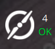
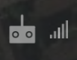
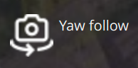
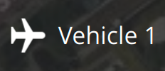
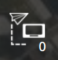

# 飞行视图工具栏

## 视图

工具栏左边的“Q”图标允许您在其他顶级视图中选择：

- **[Plan Flight](../plan_view/plan_view.md)：** 用于创建任务、地理栅栏和集结点
- **分析工具：** 用于日志下载、地理标记图像或查看遥测等事项的一组工具。
- **车辆配置：** 新车初始配置的各种选项。
- **应用程序设置：** QGroundControl应用程序本身的设置。

## 工具栏指示器

Next are multiple toolbar indicators for vehicle status. 每个工具栏指示器的下拉功能提供了关于状态的更多细节。 您也可以展开指示器以显示与指示器相关联的其他应用程序和载具设置。 按">"按钮来扩展。

### Flight Status 

飞行状态指示器显示载具是否可以飞行。 它可以是下列状态之一：

- **准备好飞速** (_绿色背景) - 载具已准备就绪。
- **准备好飞行** (_黄色背景) - 载具已准备好在当前飞行模式下飞行。 但有些警告可能造成问题。
- **尚未准备好** - 载具没有准备好飞行，也不会起飞。
- **解锁** - 载具已解锁并准备起飞。
- **飞行** - 载具在空中飞行和飞行中。
- **着陆** - 载具正在着陆。
- **通信丢失** - QGroundControl已失去与载具的通信。

The Flight Status indicator dropdown also gives you access to:

- **解锁** - 解锁一辆载具开启发动机以准备起飞。 你只有在载具安全和准备飞行时才能解锁载具。 通常你不需要手动解锁载具。 你可以简单地起飞或开始执行任务，载具将解锁自己。
- **Disarm** - Disarming a vehicle is only available when the vehicle is on the ground. 它会关停电机。 一般来说，你无需明确进行锁定操作，因为飞行器会在着陆后自动锁定，或者如果在解锁后若未起飞，不久后也会自动锁定。
- **紧急停机** - 在载具飞行时用紧急停机锁定载具。 仅供紧急情况使用，你的飞行器会坠毁！

在警告或尚未准备好状态的情况下，您可以点击指示器来显示下拉菜单，显示原因(s)。 右侧的切换按钮会展开每个错误，并显示更多信息及可能的解决方案。

每个问题解决后，将从用户界面中消失。 当所有阻止解锁的问题被移除时，你现在应该可以准备飞行了。

### Flight Mode 

飞行模式指示器显示您当前的飞行模式。 下拉菜单允许您在飞行模式之间切换。 扩展页面允许您：

- 配置载具降落设置
- 设置全局地理栅栏设置
- 从显示列表中添加/删除飞行模式

### Vehicle Messages 

车辆消息指示器下拉显示来自车辆的消息。 如果有重要信息，指示器将会变红。

### GPS / RTK GPS 

The GPS/RTK GPS indicator shows satellite and GNSS status in the toolbar, and the dropdown provides additional GPS details.

With an active vehicle, the indicator shows vehicle GPS information (for example, satellite count and HDOP), and the expanded page provides access to RTK-related settings.

When there is no active vehicle but RTK is connected, the indicator switches to RTK status so you can still monitor the correction link.

### GPS Resilience

The GPS Resilience indicator appears when the vehicle reports GPS resilience telemetry (authentication, spoofing, or jamming state). The dropdown provides summary status and per-GPS details when available.

### Battery 

电池指示器向您展示了一个可配置的充电图标。 它也可以配置为显示剩余的电压或两种电压。 扩展页面允许您：

- 设定电池图标中显示的值 (s)
- 配置图标着色
- 设置低电量故障安全

### Remote ID 

The Remote ID indicator appears when Remote ID is available on the active vehicle. Its color indicates overall Remote ID health, and the dropdown shows Remote ID status details.

### ESC 

The ESC indicator appears when ESC telemetry is available from the vehicle. It shows overall ESC health and online motor count, and opens a detailed ESC status page.

### Joystick 

The Joystick indicator appears when a joystick/gamepad is detected. The dropdown shows device status and connection details.

### Telemetry RSSI 

The Telemetry RSSI indicator appears when telemetry signal information is available. It provides local/remote RSSI and additional radio link quality details.

### RC RSSI 

The RC RSSI indicator appears when RC signal information is available. It shows current RC link strength and opens a page with RC RSSI details.

### Gimbal 

The Gimbal indicator is shown when the vehicle supports the [MAVLink Gimbal Protocol](https://mavlink.io/en/services/gimbal_v2.html). It displays active gimbal status and provides access to gimbal controls and settings.

### VTOL Transitions 

For VTOL vehicles, a VTOL transition status indicator is shown when applicable. It indicates the current VTOL mode/state and provides transition-related status information.

### Multi-Vehicle Selector 

The Multi-Vehicle selector appears when more than one vehicle is connected. It allows you to quickly switch the active vehicle from the toolbar.

### APM Support Forwarding 

On ArduPilot, an APM Support Forwarding indicator appears when MAVLink traffic forwarding to a support server is enabled.
