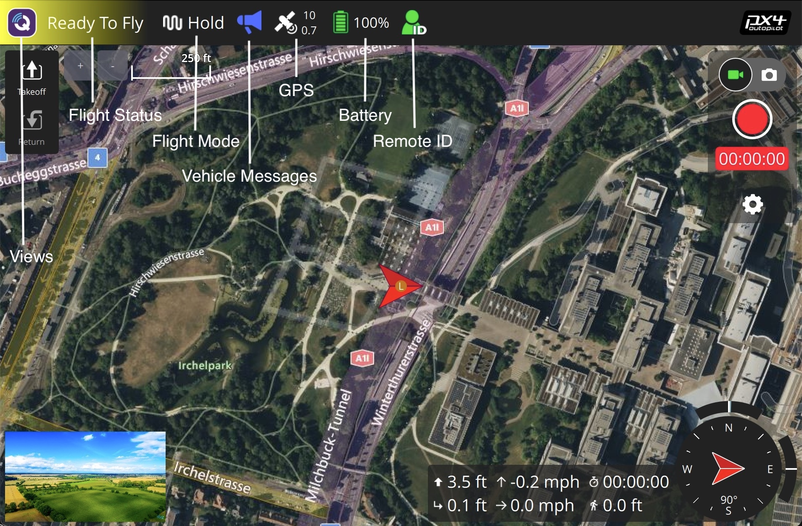
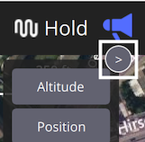

# 飞行视图工具栏

## 视图

工具栏左边的“Q”图标允许您在其他顶级视图中选择：

- **[Plan Flight](../plan_view/plan_view.md)：** 用于创建任务、地理栅栏和集结点
- **分析工具：** 用于日志下载、地理标记图像或查看遥测等事项的一组工具。
- **车辆配置：** 新车初始配置的各种选项。
- **应用程序设置：** QGroundControl应用程序本身的设置。

## 工具栏指示器

接下来是关于车辆状况的多个工具栏指标。 每个工具栏指示器的下拉功能提供了关于状态的更多细节。 您也可以展开指示器以显示与指示器相关联的其他应用程序和载具设置。 按">"按钮来扩展。

### 飞行状态

飞行状态指示器显示载具是否可以飞行。 它可以是下列状态之一：

- **准备好飞速** (_绿色背景) - 载具已准备就绪。
- **准备好飞行** (_黄色背景) - 载具已准备好在当前飞行模式下飞行。 但有些警告可能造成问题。
- **尚未准备好** - 载具没有准备好飞行，也不会起飞。
- **解锁** - 载具已解锁并准备起飞。
- **飞行** - 载具在空中飞行和飞行中。
- **着陆** - 载具正在着陆。
- **通信丢失** - QGroundControl已失去与载具的通信。

飞行状态指示器下拉也让您可以：

- **解锁** - 解锁一辆载具开启发动机以准备起飞。 你只有在载具安全和准备飞行时才能解锁载具。 通常你不需要手动解锁载具。 你可以简单地起飞或开始执行任务，载具将解锁自己。
- **锁定** - 只有当载具在地面时才能锁定载具。 它会关停电机。 一般来说，你无需明确进行锁定操作，因为飞行器会在着陆后自动锁定，或者如果在解锁后若未起飞，不久后也会自动锁定。
- **紧急停机** - 在载具飞行时用紧急停机锁定载具。 仅供紧急情况使用，你的飞行器会坠毁！

在警告或尚未准备好状态的情况下，您可以点击指示器来显示下拉菜单，显示原因(s)。 右侧的切换按钮会展开每个错误，并显示更多信息及可能的解决方案。

每个问题解决后，将从用户界面中消失。 当所有阻止解锁的问题被移除时，你现在应该可以准备飞行了。

## 飞行模式

飞行模式指示器显示您当前的飞行模式。 下拉菜单允许您在飞行模式之间切换。 扩展页面允许您：

- 配置载具降落设置
- 设置全局地理栅栏设置
- 从显示列表中添加/删除飞行模式

## 载具信息

车辆消息指示器下拉显示来自车辆的消息。 如果有重要信息，指示器将会变红。

## GPS

GPS指示器在工具栏图标中向您显示卫星计数和HDOP。 下拉菜单显示您额外的 GPS 状态。 扩展页面允许您访问RTK设置。

## 电池

电池指示器向您展示了一个可配置的充电图标。 它也可以配置为显示剩余的电压或两种电压。 扩展页面允许您：

- 设定电池图标中显示的值 (s)
- 配置图标着色
- 设置低电量故障安全

## 远程 ID

## 其他指标

还有其他指标只能在某些情况下显示：

- 遥测信号强度指示
- 遥控信号强度指示
- 云台
- 垂直起降转换
- 从多个连接的载具中选择
