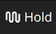
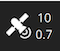

# 飞行视图

飞行时使用飞行视图来指挥和监视载具。

您可以使用它：

- 运行一个自动的[飞行前检查列表](#preflight_checklist)。
- 把载具解锁(或检查它为什么不会解锁)。
- 控制任务： [开始](#start_mission)、 [继续](#continue_mission)、 [暂停](#pause)和 [恢复](#resume_mission)。
- 引导飞行器进行[解锁](#arm)/[锁定](#disarm)/[紧急停止](#emergency_stop)、[起飞](#takeoff)/[降落](#land)、[改变高度](#change_altitude)、[前往](#map_actions)或[环绕](#map_actions)特定位置，以及[返航/按预设路线返航](#rtl)。
- 在地图视图和视频视图之间切换(如果可用)
- 显示当前载具的视频、飞行任务、遥测和其他信息，同时在已连接的载具之间切换。

## 界面概述

上面的屏幕截图显示了直观的主要元素：

- **[飞行工具栏](fly_view_toolbar.md)：** 载具部件的关键状态信息(GPS、电池、遥控器控制)和载具状态(轻型模式、解锁/锁定)。
  - 选择 [工具栏指标] (#toolbar_indicator) 查看更多细节。
  - 按 _飞行模式_ 文本(例如“保持”) 可选择一个新模式。
    并非每种模式都可用。
  - **Q**图标旁边的文本使用文本表示飞行准备状态：“未准备好”， "准备好飞行", "准备飞行", 以及使用颜色的状态: “绿色”（一切正常！）、“黄色”（警告）、“红色”（严重问题）。 您也可以选择要到达按钮来解除/解除/紧急停止载具的文本。
- **[飞行工具](fly_tools.md)：** 您可以使用这些：
  - 选择 [飞行前检查列表] (#preflight_checklist) (默认禁用工具选项)。
  - 切换起飞/着陆。
  - 暂停/重新启动当前操作(例如着陆或飞行任务)。
  - 安全返回（也称为返航或返回）。
  - _操作_ 按钮为当前状态提供了其他适当的选项。 行动包括改变高度或继续飞行任务。
- **地图：** 显示所有连接载具的位置和当前载具的任务。
  - 你可以拖动地图来移动它周围(地图在一定时间后自动重置到载具上)。
  - 您可以使用缩放按钮、鼠标滚轮、轨迹板或固定在平板电脑上来放大地图。
  - 一旦飞行，您可以点击地图来设置[转到](#goto)或[轨道](#orbit) 位置。
- **[仪器面板](instrument_panel.md)：** 显示载具遥测器的部件。
- **[姿态/罗盘](hud.md)：** 一个提供虚拟地平线和航向信息的部件。
- **相机工具**：用于在仍然和视频模式之间切换、启动/停止捕获以及控制相机设置的部件。
- **[视频/切换器](#video_switcher)：** 在窗口中切换视频或地图
  - 按下元素切换到 _视频_ 和 _地图_ 到前台。
  - _QGroundControl_ 支持您的载具通过UDP连接上的RTP和RTSP视频流媒体。
    它还支持直接连接的通用视频类（UVC）设备。
    QGC 视频支持将在 [Video README](https://github.com/mavlink/qgroundcontrol/blob/master/src/VideoStreaming/README.md)中进一步讨论。
  - [遥测叠加](../fly_view/video_overlay.md) 将自动生成为字幕文件
- **确认滑块:** 上下文敏感滑块以确认请求的操作。 滑动以确认操作。 您也可以按住空格键确认。 按 **X** 可取消。

还有一些其他元素没有在默认情况下显示/仅在某些条件下显示。
例如，多飞行器选择器仅在你拥有多个飞行器时才会显示，而飞行前检查清单工具按钮仅在启用相应设置时才会显示。

## 飞行工具栏 {#toolbar}

### 视图选择器

工具栏左边的“Q”图标允许您在其他顶级视图中选择：

- **[计划飞行](../plan_view/plan_view.md)：** 用于创建任务、地理栅栏和集结点
- **分析工具：** 用于日志下载、地理标记图像或查看遥测等事项的一组工具。
- **载具配置：** 新载具初始配置的各种选项。
- **应用程序设置：** QGroundControl应用程序本身的设置。

### 工具栏指示器 {#toolbar_indicators}

接下来是载具状况的工具栏指标。 每个工具栏指示器的下拉功能提供了关于状态的更多细节。 您也可以展开指示器以显示与指示器相关联的其他应用程序和载具设置。 按">"按钮来扩展。

这是运行PX4固件的载具飞行模式的扩展工具栏示例指示器。 此指示器中的设置提供了可能与从飞行到飞行的更改相关的东西的访问权限。

他们还提供查阅与指标有关的载具配置的机会。 在此示例：_飞行模型_ - _配置_。

### 准备/未准备就绪指示器

工具栏中的下一个是显示载具是否已准备好飞行。

它可以是下列状态之一：

- **准备好飞行** (_绿色背景) - 载具已准备就绪
- **准备好飞行** (_黄色背景) - 载具已准备好在当前飞行模式下飞行。 但有些警告可能造成问题。
- **尚未准备好** - 载具没有准备好飞行，也不会起飞。
- **解锁** - 载具已解锁并准备起飞。
- **飞行** - 载具在空中飞行和飞行中。
- **着陆** - 载具正在着陆。
- **通信丢失** - QGroundControl已失去与载具的通信。

“准备就绪指示器”下拉菜单还可让你访问：

- **解锁** - 解锁一辆载具开启发动机以准备起飞。 你只有在载具安全和准备飞行时才能解锁载具。 通常你不需要手动解锁载具。 你可以简单地起飞或开始执行任务，载具将解锁自己。
- **锁定** - 只有当载具在地面时才能解除载具。 它会关停电机。 一般来说，你无需明确进行锁定操作，因为飞行器会在着陆后自动锁定，或者如果在解锁后若未起飞，不久后也会自动锁定。
- **紧急停机** - 紧急停机实际上与在飞行时锁定载具相同。 仅供紧急情况使用，你的飞行器会坠毁！

在警告或尚未准备好状态的情况下，您可以点击指示器来显示下拉菜单，显示原因。 右侧的切换按钮会展开每个错误，并显示更多信息及可能的解决方案。

每个问题解决后，将从用户界面中消失。
当所有阻止解锁的问题被移除时，你现在应该可以准备飞行了。

### 飞行模式指示器

飞行模式指示器下拉允许您在飞行模式之间切换。 扩展页面允许您：

- 配置载具降落设置
- 设置全局地理栅栏设置
- 从显示列表中添加/删除飞行模式

### 载具消息指示器

载具消息指示器下拉显示来自载具的消息。 如果有重要信息，指示器将会变红。

### GPS 指示器

GPS指示器在工具栏图标中显示卫星计数和HDOP。 下拉菜单显示您额外的 GPS 状态。 扩展页面允许您访问RTK设置。

### 电量指示器

电池指示器向您展示了一个可配置的充电图标。 它也可以配置为显示剩余的电压或两种电压。 扩展页面允许您：

- 设定电池图标中显示的值
- 配置图标着色
- 设置低电量故障安全

## 飞行工具 {#fly_tools}

### 飞行检查清单 {#preflight_checklist}

飞行前自动核对表可以用来进行标准检查，检查载具配置正确，可以安全飞行。

要查看检查清单，首先需通过导航至[应用程序设置 > 常规 > 飞行视图](../settings_view/general.md)并勾选**使用飞行前检查清单**复选框来启用该工具。
然后工具将被添加到 _飞行工具_。
按下它以打开检查清单：

完成每项测试后，在用户界面上选择该项测试，将其标记为已完成。

### 起飞{#takeoff}

:::tip
如果你正在为多功能飞行器启动任务，_QGroundControl_ 将自动执行起飞步骤。
:::

起飞(降落时)：

1. 按 _飞行工具_ 中的 **起飞** 按钮(这将在起飞后切换到 **着陆** 按钮)。
2. 可选设置右侧垂直滑块的起飞海拔。

- 您可以向上/向下滑动以更改高度
- 您也可以点击指定的高度(例如10英尺)，然后输入特定的海拔。

1. 使用滑块确认起飞。

### 着陆 {#land}

你可以在飞行时随时降落在当前位置：

1. 按下 _飞行工具_ 中的 **着陆** 按钮(当降落将切换到 **起飞** 按钮)。
2. 使用滑块确认降落。

### 返航/返回

飞行时返回“安全点”：

1. 按 _飞行工具_ 中的 **返航** 按钮。
2. 使用滑块确认返航。

:::info
飞行器通常返回 “Home点”（起飞）位置并着陆。
这种行为取决于载具类型和配置。
例如，集结点或飞行任务着陆可能被用作替代返回目标。
:::

### 更改高度 {#change_altitude}

飞行过程中你可以改变高度，但执行任务时除外：

1. 按 _飞行工具_ 上的 **操作** 按钮
2. 选择 _改变高度_ 按钮
3. 从垂直滑块选择新高度
4. 确认操作

## 仪器面板(电子版) {#instrument_panel}

仪器面板显示关于当前载具的遥测信息。

默认值包括高度(相对于Home点位置)、横向和纵向速度、飞行总时间和载具与地面站之间的距离。

你可以通过以下方式配置信息显示位置：

- 平板电脑：按住控件
- 桌面：右键点击控制
- 点击锁定图标以关闭并保存更改

您通过选择编辑/铅笔图标来配置显示的信息。
然后，网格将显示您可以用来添加或移除行和列的"+"和"-"图标(而且铅笔图标被您可以用来保存设置的“锁”图标所取代)。

选择一个值来启动其"值显示"编辑器。
这允许您更改当前遥测值的图标、文本、大小、单位等。

左上方的选择列表用于更改遥测源源。
默认情况下是载具，但你可以使用选择器选择特定的传感器类型。

右上方的选择列表用于为载具或传感器选择一个特定的遥测值。

## 态度/指南针 {#hud}

您可以从多种类型的工具中选择：

- 平板电脑：按住控件
- 桌面：右键点击控制
- 点击锁定图标以关闭并保存更改

### 相机{#camera_instrument_page}

相机面板用于拍摄仍然存在的图像和视频，并配置相机。

相机捕获和配置选项取决于已连接的相机。
配置选项是使用面板装备图标选择的。
一个简单的自动化摄像头的配置显示在下面。

When connected to camera that supports the [MAVLink Camera Protocol](https://mavlink.io/en/services/camera.html) you can additionally configure and use other camera services that it makes available.
For example, if your camera supports video mode you will be able to switch between still image capture and video mode, and start/stop recording.

:::info
Most of the settings that are displayed depend on the camera (they are defined in its [MAVLink Camera Definition File](https://mavlink.io/en/services/camera_def.html)).

> A few common settings at the end are hard-coded: Photo Mode (Single/Time Lapse), Photo Interval (if Time Lapse), Reset Camera Defaults (sends a reset command to the camera), Format (storage)
> :::

### Video Stream {#video_instrument_page}

The video page is used to enable/disable video streaming.
When enabled, you can start/stop the video stream, enable a grid overlay, change how the image fits the screen, and record the video locally with QGC.

## Actions/Tasks

The following sections describe how to perform common operations/tasks in the Fly View.

::: 信息
许多可用的选项都取决于载具类型和当前状态。
:::

### Actions associated with a map position (#map_actions)

There are a number of actions which can be taken which are associated with a specific position on the map. To use these actions:

1. Click on the map at a specific position
2. A popup will display showing you the list of available actions
3. Select the action you want
4. Confirm the action

Examples of map position actions are Go To Location, Orbit and so forth.

### Pause

You can pause most operations, including taking off, landing, RTL, mission execution, orbit at location. 暂停使用时的载具行为取决于载具类型；通常是多层飞行器悬停，固定翼飞行器将环绕。

:::info
You cannot pause a _Goto location_ operation.
:::

To pause:

1. Press the **Pause** button in the _Fly Tools_.
2. Optionally set a new altitude using the right-side vertical slider.
3. Confirm the pause using the slider.

### Missions

#### Start Mission {#start_mission}

你可以在载具着陆时开始执行任务(起始任务确认滑块通常默认显示)。

To start a mission from landed:

1. Press the **Action** button on the _Fly Tools_

2. Select the _Start Mission_ action from the dialog.

  

  (to display the confirmation slider)

3. When the confirmation slider appears, drag it to start the mission.

  

#### Continue Mission {#continue_mission}

You can _continue_ mission from the _next_ waypoint when you're flying (the _Continue Mission_ confirmation slider is often displayed by default after you takeoff).

:::info
Continue and [Resume mission](#resume_mission) are different!
Continue is used to restart a mission that has been paused, or where you have taken off, so you've already missed a takeoff mission command.
Resume mission is used when you've used a RTL or landed midway through a mission (e.g. for a battery change) and then wish to continue the next mission item (i.e. it takes you to where you were up to in the mission, rather than continuing from your place in the mission).
:::

You can continue the current mission while (unless already in a mission!):

1. 按下 _飞行工具_ 上的**操作**按钮

2. 在对话框中选择 _继续任务_ 操作。

  

3. 拖动滑块以确认继续执行任务。

  

#### 恢复任务{#resume_mission}

您可以在任何地方按切换器来切换 _视频_ 和 _地图_ 到前台(在下面的图像中，视频会显示在前台)。

:::info
如果你正在更换电池，断开电池后**请勿**断开 QGC 与飞行器的连接。
插入新电池后，“QGroundControl” 将再次检测到飞行器并自动恢复连接。
:::

着陆后，系统将弹出 _飞行计划完成” 对话框，你可以选择从飞行器中删除该计划、_将其保留在飞行器上，或者从最后经过的航点恢复任务。

如果你选择回复任务，_QGroundControl_ 会重新构建任务并将它上传到载具。
然后使用 _启动任务_ 滑块以继续任务。

下图展示了在上述返航操作后重新生成的任务。

:::info
任务不能简单地从飞行器执行的最后一个任务项目继续，因为在最后一个航点可能有多个影响任务下一阶段的项目（例如速度指令或相机控制指令）。
相反，_QGroundControl_ 会从最后飞行的任务项目开始重构任务，并自动将任何相关指令添加到任务开头。
:::

#### 着陆后移除任务提示 {#resume_mission_prompt}

任务完成、载具着陆并锁定后，系统会提示你从载具中移除该任务。
这旨在防止陈旧的任务在不知不觉中留在载具上，从而可能导致意外行为的问题。

### 显示视频 {#video_switcher}

启用视频流传输后，_QGroundControl_ 会在地图左下角的 “视频切换窗口” 中显示当前选定载具的视频流。
您可以在任何地方按切换器来切换 _视频_ 和 _地图_ 到前台(在下面的图像中，视频会显示在前台)。

:::info
视频流已配置/启用在 [应用程序设置 > 常规 > 视频](../settings_view/general.md#video)。
:::

您可以在开关上使用控件来进一步配置视频显示：

- 通过拖动右上角的图标来调整切换器的大小。
- 点击左下方的切换图标来隐藏切换器。
- 按下视频切换器窗口左上角的图标可将其分离（分离后，你可以像操作系统中的其他窗口一样移动和调整该窗口的大小）。
  如果您关闭分离的窗口，切换器将重新锁定到 QGC 飞行视图。

### 录制视频

如果相机和载具支持，_QGroundControl_ 可以在相机上开始和停止视频录制。 _QGroundControl_ 也可以录制视频流并在本地保存。

:::tip
存储在相机上的视频质量可能要高得多。 但你的地面站很可能有更大的录制能力。
:::

#### 录制视频流 (GCS)

视频流录制在[视频流仪表页面](#video_instrument_page)进行控制。
按下红色圆圈开始录制新视频(每次按下圆圈时创建新视频文件)； 正在录制时，圆圈将会变成红色正方形。

视频流录制已配置在 [应用程序设置 > 常规](../settings_view/general.md)：

- [视频录制](../settings_view/general.md#video-recording) - 指定录制文件格式和存储限制。

  ::: 信息
  视频默认保存为 Matroska 格式 (.mkv) 。
  这种格式在出现错误的情况下，相对不容易损坏。
  :::

- [杂项](../settings_view/general.md#miscellaneous) - 流视频保存在**应用程序加载/保存路径**下。

:::tip
存储的视频仅包括视频流本身。
要使用显示的 QGroundControl 应用程序元素录制视频，您应该使用单独的屏幕录制软件。
:::

#### 在相机上录制视频

使用[相机仪表页面](#camera_instrument_page)_在相机上_开始/停止视频录制。
先切换到视频模式，然后选择红色按钮开始录制。

