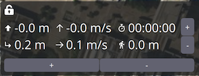
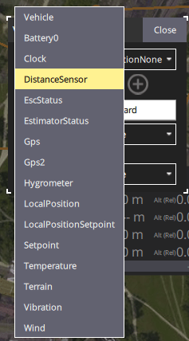

# 仪表板

仪器面板显示关于当前载具的遥测信息。

默认值包括高度(相对于Home点位置)、横向和纵向速度、飞行总时间和载具与地面站之间的距离。

你可以通过以下方式配置信息显示位置：

- 平板电脑：按住控件
- 桌面：右键点击控制
- 点击锁定图标以关闭并保存更改

您通过选择编辑/铅笔图标来配置显示的信息。
然后，网格将显示您可以用来添加或移除行和列的"+"和"-"图标(而且铅笔图标被您可以用来保存设置的“锁”图标所取代)。

选择一个值来启动其"值显示"编辑器。
这允许您更改当前遥测值的图标、文本、大小、单位等。

左上方的选择列表用于更改遥测源源。
默认情况下是载具，但你可以使用选择器选择特定的传感器类型。

右上方的选择列表用于为载具或传感器选择一个特定的遥测值。

