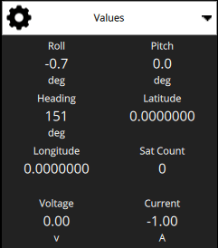

# Video Overlay

When QGroundControl is recording a video stream to a file, it will also export a subtitle file with telemetry data that can be used to overlay the telemetry on the video during playback. Whichever telemetry values are selected for display in the telemetry [values widget](FlyView.md#values-telemetry) will also be exported to the overlay. The overlay values are updated at 1Hz.

The selected values are laid out in three columns to optimize the screen utilization.

## Playing

The overlay can be used with any player that [supports the SubStation Alpha](https://en.wikipedia.org/wiki/SubStation_Alpha#Players_and_renderers) subtitle format.
Most players will open both files together when you try to play the video. They need to be in the same folder and with the same name, which is how they are created by QGC.

## Permanent Video Subtitles using Handbrake

Subtitles can be permanently added to a video file using [HandBrake](https://handbrake.fr/).
This will make the subtitles permanently visible on any video player.

Open **HandBrake**, you should see its main interface.
Click **Open** and select the video file.

With the video file loaded, switch to the subtitles tab.
Click **Add** to load the subtitle file.

Choose **import SSA** ([ASS](https://en.wikipedia.org/wiki/SubStation_Alpha#Advanced_SubStation_Alpha) is an extension of SSA).

Load the **.ass** file corresponding to your video and tick the **Burn into video** checkbox.

Choose where you want to save the new file and click **Start**.

This will start burning the subtitle and video to a new file.
