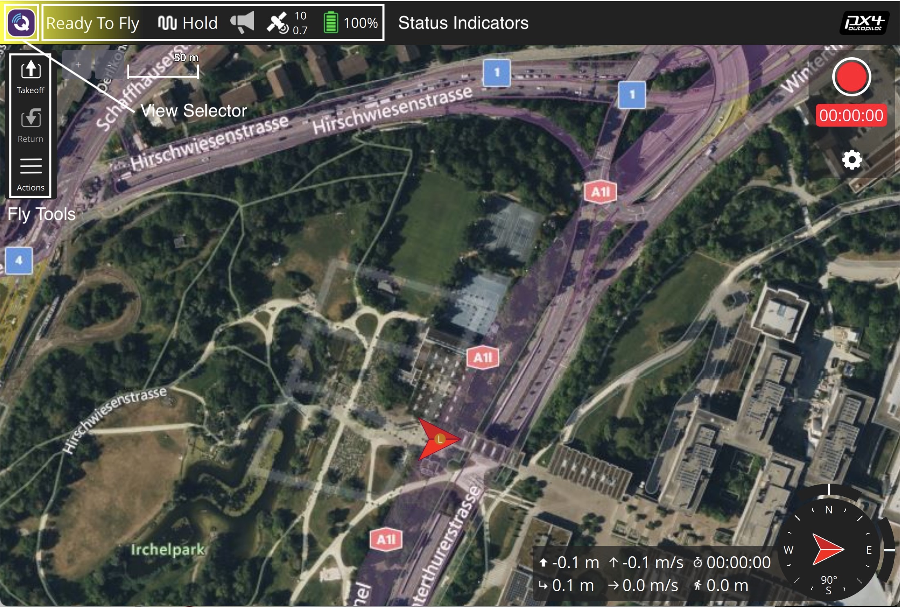

# QGroundControl快速上手指南

让 _QGroundControl_ 轻松入门上手使用：

1. [下载并安装](../getting_started/download_and_install.md) 应用程序.
2. 启动*QGroundControl*。
3. 通过USB有线通讯线缆、无线数据传输或WiFi将您的设备与地面站设备相联接。 *QGroundControl*应检测您的设备并自动连接它。

就这么简单！ 如果设备准备飞行（无人机是飞，其它设备是运行），*QGroundControl*应显示如下[Fly View](../fly_view/fly_view.md) (否则将打开[Setup View](../setup_view/setup_view.md))。

要想把*QGroundControl*玩的纯熟，最好方法是亲自上手折腾：

- 使用[工具栏](../toolbar/toolbar.md)在主视图之间切换：
  - [Settings](../settings_view/settings_view.md)：配置 _QGroundControl_ 应用程序。
  - [Setup](../setup_view/setup_view.md)：配置和调试你的设备。
  - [Plan](../plan_view/plan_view.md)：创建自主自动执行的任务
  - [Fly](../fly_view/fly_view.md)：在飞行时监测您的车辆，包括视频流。
  - [Analyze] ** Description of Analyze view is missing **
- 点击工具栏上的*Status 图标*来确认已连接设备的状态。

虽然软件的界面相当直观亲和，但是这篇文档也能给您带来更多信息让您更加容易上手把玩QGC。
