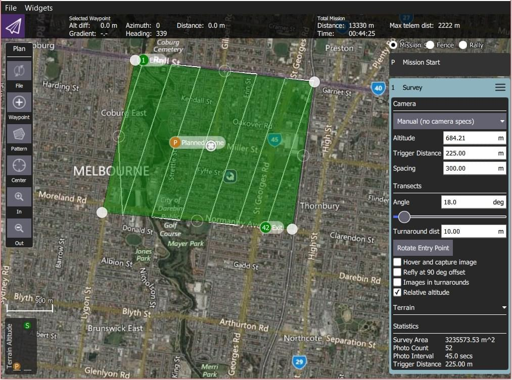
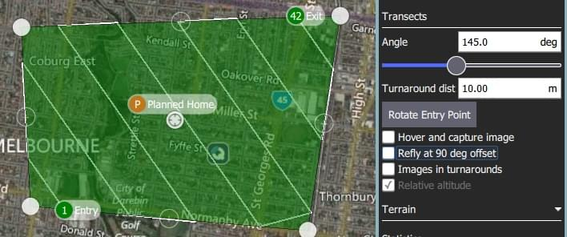
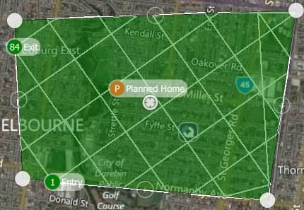

# Survey (Plan Pattern)

A survey allows you to create a grid flight pattern over a polygonal area.
You can specify an arbitrary polygon, the angle and other properties of the grid, and camera settings appropriate for creating geotagged images.

::: warning
If the survey area has significant elevation variation then consider enabling [Terrain Following](#terrain).

When planning a Survey using camera specifications, the ground under the survey area are assumed to be flat - i.e. at the same altitude as the launch/home location.
If the ground elevation under the survey is either higher or lower than the home location the effective overlap in images will be less or more (respectively) than calculated.
If ground elevation under the survey area is _significantly_ higher than the home location you could inadvertently plan a mission path that causes the vehicle to fly into ground-level obstacles.

Using terrain following ensures that the survey more closely matches the desired altitude above terrain, and reduces the likelihood of planning a mission that is too close to ground level.
:::

## Creating a Survey

To create a survey:

1. Open [PlanView](../plan_view/plan_view.md) _Plan Tools_.

2. Choose the _Pattern Tool_ from the _Plan Tools_ and then select _Survey_.

   

   This will add a survey grid to the map, and a _Survey_ item to the mission list (on the right).

3. On the map drag the vertices to change the shape of the polygon.

4. Click the `(+)` symbol between existing vertices to create a new vertix.
   The new vertix can then be dragged into a new position.

The survey settings are covered in the next section.

## Settings

The survey can be further configured in the associated mission item (in the mission item list on the right hand side of the _Plan View_).

### Camera

Camera triggering behaviour depends on the camera/camera settings.
You can select an existing camera, custom camera, or manually enter the settings.
The list of available cameras (QGC 3.4) is given below.

#### Known Camera {#known_camera}

Selecting a known camera from the option dropdown generates a grid pattern based on the camera capabilities.

The default settings can be tuned for your survey using the configuration options:

- **Landscape/Portrait** - Camera orientation relative to the "normal" orientation of the vehicle.
- **Overlap** - Overlap between each image capture.
  This can be configured separately for when flying along grid lines or across them.
- Select one of:
  - **Altitude** - Survey altitude (ground resolution will be calculated/displayed for this altitude).
  - **Ground resolution** - Ground resolution for each image (altitude required to achieve this resolution calculated and shown).

#### Custom Camera {#custom_camera}

Selecting the custom camera option allows you to specify the settings for a new camera in a similar way to a known camera.

The camera-specific settings are:

- **Sensor width/height** - The size of the image sensor of the camera.
- **Image width/height** - The resolution of the image captured by the camera.
- **Focal Length** - The focal length of the camera lens.

The remaining settings are the same as for a [known camera](#known_camera).

#### Manual Camera

The manual camera option allows you to specify desired survey height, trigger interval and appropriate grid spacing for your camera.

The configurable options are:

- **Altitude** - Survey altitude to fly the whole grid.
- **Trigger Distance** - The distance over ground between each camera shot.
- **Spacing** - Distance between adjacent grid (flight path) lines across the corridor.

### Transects

The _Transects_ section is used for grid settings that are independent of the camera used.

The configurable options are:

- **Angle** - The angle of the grid lines, relative to North.
  
- **Turnaround dist** - Amount of additional distance to add outside the survey area for vehicle turn around.
- **Rotate Entry Point** - Press button to swap the start and end point of the survey.
- **Hover and capture image** - Hover to capture images (multicopter only).
- **Refly at 90 degree offset** - Check to refly the whole mission at a 90 degree offset.
  
- **Images in turnarounds** - Check to take images when turning
- **Relative altitude** - Check to make specified altitudes relative to home (if unchecked they are AMSL).

### Terrain

By default, a flying vehicle will follow the survey path at a fixed altitude.
Enabling _Terrain Following_ makes the vehicle maintain a constant height relative to ground.

:::info
Terrain following uses terrain heights queried from _AirMap_ servers.
:::

The configurable options are:

- **Vehicle follows terrain** - Check to enable terrain following (and display the following options).
  - **Tolerance** - The accepted deviation in altitude from the target altitude.
  - **Max Climb Rate** - Maximum climb rate when following terrain.
  - **Max Descent Rate** - Maximum descent rate when following terrain.

### Statistics

The _Statistics_ section shows the calculated survey area, photo interval, photo spacing and planned photo count.

