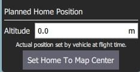
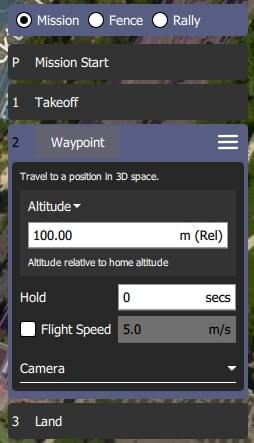

# 计划视图

_计划视图_ 用于为你的载具规 划自动化任务_ 并上传到载具。 一旦任务已 [规划](#plan_mission) 并被送往载具，您将切换到[飞行视图](../fly_view/fly_view.md) 来执行任务。

如果固件支持，它也可以用来配置 [地理围栏](plan_geofence.md) 和 [集结点](plan_rally_points.md)。

## 界面概述{#ui_overview}

[屏幕截图](#plan_screenshot) 显示一个简单的任务计划，该任务从计划起始点位置（H）起飞，途经三个航点，然后在最后一个航点（即航点 3）降落。

界面的主要要素是：

- **地图：** 显示当前任务的带编号指示器，其中包括 [计划起始点](#planned_home)。
  点击指示器来选择他们(用于编辑)或将他们拖动到周围来重新定位。
- **计划工具栏：** 当前选定的航点相对于上一个航点的状态信息，以及整个任务的统计资料（飞行任务的水平距离和时间）。
  - `最大距离`是[计划起始点](#planned_home)与最远路点之间的距离。
  - 当连接到载具时，它也会显示一个 **上传** 按钮，可以用来上传计划到载具上。
- **[计划工具](#plan_tools)：** 用于创建和管理任务。
- **[任务命令列表](#mission_command_list):** 显示当前任务项目列表 (选择项目到 [编辑](#mission_command_editors))。
- **地形高度概览：** 显示每个任务命令的相对高度.

它显示了您当前选择的航点信息以及整个飞行任务的统计数据。

## 规划一个任务 {#plan_mission}

概括来说，创建任务的步骤如下：

1. 更改 _计划视图_。
2. 添加航点或命令到任务中并根据需要编辑。
3. 将任务上传到载具上。
4. 更改为 _飞行视图_ 并执行任务。

以下各节解释了视图中的一些细节。

## 计划起始位置 {#planned_home}

在 _计划视图_ 中显示的 _计划起始点_ 用于设置计划任务时的大致起点(此时飞行器甚至可能并未与 QGC 连接)。
它被QGC会用来估计飞行任务时间和绘制航线。

您应该移动/拖动计划中的起始位置到您计划起飞的大致位置。
计划起始位置的高度设置在[任务设置](#mission_settings) 面板中。

:::tip
飞行视图显示由载具固件设置的 _实际_ 起始位置。(这是载具在返回/返航 模式返回的地方)。
:::

## 计划工具 {#plan_tools}

计划工具用于添加单独的航点，方便任务创建复杂的几何，上传/下载/保存/恢复飞行任务，以及导航地图。 主要工具说明如下。

:::info
**地图居中**, **放大**, **缩小**工具可以帮助用户更好地查看和浏览 _计划视图_ 地图 (他们不影响送往载具的任务命令)。
:::

### 添加航点

点击**添加航点** 工具激活它。 当激活时，点击地图将在点击的位置添加新的飞行任务航点。
该工具将保持激活状态，直到你再次选中它。
一旦您添加了一个航点，您可以选择它并将它拖动到周围以改变它的位置。

### 文件 (同步) {#file}

_文件工具_ 用于在地面站和载具之间传输任务，并保存/还原文件。
工具显示了一个 `!` 来表示你没有发送给载具进行任务变更。

:::info
在你执行飞行任务之前，你必须将它上传到载具上。
:::

_文件工具_ 提供以下功能：

- 上传(向载具发送)
- 下载 (从载具加载)
- 保存/保存到文件, 包括 KML 文件。
- 从文件加载
- 移除所有 (从 _计划视图_ 和 从载具中移除所有飞行任务航点)

### Pattern

The [Pattern](Pattern.md) tool simplifies the creation of missions for flying complex geometries, including [surveys](../plan_view/pattern_survey.md) and [structure scans](../plan_view/pattern_structure_scan_v2.md).

## Mission Command List {#mission_command_list}

Mission commands for the current mission are listed on the right side of the view.
At the top are a set of options to switch between editing the mission, GeoFence and rally points.
Within the list you can select individual mission items to edit their values.

### Mission Command Editors {#mission_command_editors}

Click on a mission command in the list to display its editor (in which you can set/change the command attributes).

You can change the **type** of the command by clicking on the command name (for example: _Waypoint_).
This will display the _Select Mission Command_ dialog shown below.
By default this just displays the "Basic Commands", but you can use the **Category** drop down menu to display more (e.g. choose **All commands** to see all the options).

To the right of each command name is a menu that you can click to access to additional options such as _Insert_ and _Delete_.

:::info
The list of available commands will depend on firmware and vehicle type.
Examples may include: Waypoint, Start image capture, Jump to item (to repeat mission) and other commands.
:::

### Mission Settings {#mission_settings}

The _Mission Start_ panel is the first item that appears in the [mission command list](#mission_command_list).
It may be used to specify a number default settings that may affect the start or end of the mission.

#### Mission Defaults

##### Waypoint alt

Set the default altitude for the first mission item added to a plan (subsequent items take an initial altitude from the previous item).
This can also be used to change the altitude of all items in a plan to the same value; you will be prompted if you change the value when there are items in a plan.

##### Flight speed

Set a flight speed for the mission that is different than the default mission speed.

#### Mission End

##### Return to Launch after mission end

Check this if you want your vehicle to Return/RTL after the final mission item.

#### Planned Home Position

The [Planned Home Position](#planned_home) section allows you to simulate the vehicle's home position while planning a mission.
This allows you to view the waypoint trajectory for your vehicle from takeoff to mission completion.

:::info
This is only the _planned_ home position and you should place it where you plan to start the vehicle from.
It has no actual impact on flying the mission.
载具的实际Home位置由载具本身在解锁时确定。
:::

This section allows you to set the **Altitude** and **Set Home to Map Centre** (you can move it to another position by dragging it on the map).

#### Camera

The camera section allows you to specify a camera action to take, control the gimbal and set your camera into photo or video mode.

The available camera actions are:

- No change (continue current action)
- Take photos (time)
- Take photos (distance)
- Stop taking photos
- Start recording video
- Stop recording video

#### Vehicle Info

The appropriate mission commands for the vehicle depend on the firmware and vehicle type.

If you are planning a mission while you are _connected to a vehicle_ the firmware and vehicle type will be determined from the vehicle.
This section allows you to specify the vehicle firmware/type when not connected to a vehicle.

The additional value that can be specified when planning a mission is the vehicle flight speed.
By specifying this value, total mission or survey times can be approximated even when not connected to a vehicle.

## Troubleshooting

### Mission (Plan) Upload/Download Failures {#plan_transfer_fail}

Plan uploading and downloading can fail over a noisy communication link (affecting missions, GeoFence, and rally points).
If a failure occurs you should see a status message in the QGC UI similar to:

> Mission transfer failed. Retry transfer. Error: Mission write mission count failed, maximum retries exceeded.

The loss rate for your link can be viewed in [Settings View > MAVLink](../settings_view/mavlink.md).
The loss rate should be in the low single digits (i.e. maximum of 2 or 3):

- A loss rate in the high single digits can lead to intermittent failures.
- Higher loss rates often lead to 100% failure.

There is a much smaller possibility that issues are caused by bugs in either flight stack or QGC.
To analyse this possibility you can turn on [Console Logging](../settings_view/console_logging.md) for Plan upload/download and review the protocol message traffic.

## Further Info

- [QGC v3.2](../qgc-user-guide/releases/release_note_stable_v3.md#plan_view)上新的计划视图功能
- [QGC v3.3](../qgc-user-guide/releases/release_note_stable_v3.md#plan-view-1)上新的计划视图功能
