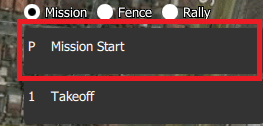
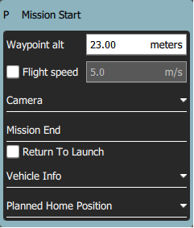

# Plan View

The _Plan View_ is used to plan _autonomous missions_ for your vehicle, and upload them to the vehicle. Once the mission is [planned](#plan_mission) and sent to the vehicle, you switch to the [Fly View](../fly_view/fly_view.md) to fly the mission.

It is also use to configure the [GeoFence](plan_geofence.md) and [Rally Points](plan_rally_points.md) if these are supported by the firmware.

## UI Overview {#ui_overview}

The [screenshot above](#plan_screenshot) shows a simple mission plan that starts with a takeoff at the [Planned Home](#planned_home) position (H), flies through three waypoints, and then lands on the last waypoint (i.e. waypoint 3).

The main elements of the UI are:

- **Map:** Displays the numbered indicators for the current mission, including the [Planned Home](#planned_home).
  Click on the indicators to select them (for editing) or drag them around to reposition them.
- **Plan Toolbar:** Status information for the currently selected waypoint relative to the previous waypoint, as well as statistics for the entire mission (e.g. horizontal distance and time for mission).
  - `Max telem dist` is the distance between the [Planned Home](#planned_home) and the furthest waypoint.
  - When connected to a vehicle it also shows an **Upload** button, can be used to upload the plan to the vehicle.
- **[Plan Tools](#plan_tools):** Used to create and manage missions.
- **[Mission Command List/Overlay](#mission_command_list):** Displays the current list of mission items (select items to [edit](#mission_command_editors)).
- **Terrain Altitude Overlay:** Shows the relative altitude of each mission command.

It shows you information related to the currently selected waypoint as well as statistics for the entire mission.

## Planning a Mission {#plan_mission}

At very high level, the steps to create a mission are:

1. Change to _Plan View_.
2. Add waypoints or commands to the mission and edit as needed.
3. Upload the mission to the vehicle.
4. Change to _Fly View_ and fly the mission.

The following sections explain some of the details in the view.

## Planned Home Position {#planned_home}

The _Planned Home_ shown in _Plan View_ is used to set the approximate start point when planning a mission (i.e. when a vehicle may not even be connected to QGC).
It is used by QGC to estimate mission times and to draw waypoint lines.

You should move/drag the planned home position to roughly the location where you plan to takeoff.
The altitude for the planned home position is set in the [Mission Settings](#mission_settings) panel.

:::tip
The Fly View displays the _actual_ home position set by the vehicle firmware when it arms (this is where the vehicle will return in Return/RTL mode).
:::

## Plan Tools {#plan_tools}

The plan tools are used for adding individual waypoints, easing mission creation for complicated geometries, uploading/downloading/saving/restoring missions, and for navigating the map. The main tools are described below.

:::info
**Center map**, **Zoom In**, **Zoom Out** tools help users better view and navigate the _Plan view_ map (they don't affect the mission commands sent to the vehicle).
:::

### Add Waypoints

Click on the **Add Waypoint** tool to activate it. While active, clicking on the map will add new mission waypoint at the clicked location.
The tool will stay active until you select it again.
Once you have added a waypoint, you can select it and drag it around to change its position.

### File (Sync) {#file}

The _File tools_ are used to move missions between the ground station and vehicle, and to save/restore them from files.
The tool displays an `!` to indicate that there are mission changes that you have not sent to the vehicle.

:::info
Before you fly a mission you must upload it to the vehicle.
:::

The _File tools_ provide the following functionality:

- Upload (Send to vehicle)
- Download (Load from vehicle)
- Save/Save as to File, including as KML file.
- Load from File
- Remove All (removes all mission waypoints from _Plan view_ and from vehicle)

### Pattern

The [Pattern](Pattern.md) tool simplifies the creation of missions for flying complex geometries, including [surveys](../plan_view/pattern_survey.md) and [structure scans](../plan_view/pattern_structure_scan_v2.md).

## Mission Command List {#mission_command_list}

Mission commands for the current mission are listed on the right side of the view.
At the top are a set of options to switch between editing the mission, GeoFence and rally points.
Within the list you can select individual mission items to edit their values.

### Mission Command Editors {#mission_command_editors}

Click on a mission command in the list to display its editor (in which you can set/change the command attributes).

You can change the **type** of the command by clicking on the command name (for example: _Waypoint_).
This will display the _Select Mission Command_ dialog shown below.
By default this just displays the "Basic Commands", but you can use the **Category** drop down menu to display more (e.g. choose **All commands** to see all the options).

To the right of each command name is a menu that you can click to access to additional options such as _Insert_ and _Delete_.

:::info
The list of available commands will depend on firmware and vehicle type.
Examples may include: Waypoint, Start image capture, Jump to item (to repeat mission) and other commands.
:::

### Mission Settings {#mission_settings}

The _Mission Start_ panel is the first item that appears in the [mission command list](#mission_command_list).
It may be used to specify a number default settings that may affect the start or end of the mission.

#### Mission Defaults

##### Waypoint alt

Set the default altitude for the first mission item added to a plan (subsequent items take an initial altitude from the previous item).
This can also be used to change the altitude of all items in a plan to the same value; you will be prompted if you change the value when there are items in a plan.

##### Flight speed

Set a flight speed for the mission that is different than the default mission speed.

#### Mission End

##### Return to Launch after mission end

Check this if you want your vehicle to Return/RTL after the final mission item.

#### Planned Home Position

The [Planned Home Position](#planned_home) section allows you to simulate the vehicle's home position while planning a mission.
This allows you to view the waypoint trajectory for your vehicle from takeoff to mission completion.

:::info
This is only the _planned_ home position and you should place it where you plan to start the vehicle from.
It has no actual impact on flying the mission.
The actual home position of a vehicle is set by the vehicle itself when arming.
:::

This section allows you to set the **Altitude** and **Set Home to Map Centre** (you can move it to another position by dragging it on the map).

#### Camera

The camera section allows you to specify a camera action to take, control the gimbal and set your camera into photo or video mode.

The available camera actions are:

- No change (continue current action)
- Take photos (time)
- Take photos (distance)
- Stop taking photos
- Start recording video
- Stop recording video

#### Vehicle Info

The appropriate mission commands for the vehicle depend on the firmware and vehicle type.

If you are planning a mission while you are _connected to a vehicle_ the firmware and vehicle type will be determined from the vehicle.
This section allows you to specify the vehicle firmware/type when not connected to a vehicle.

The additional value that can be specified when planning a mission is the vehicle flight speed.
By specifying this value, total mission or survey times can be approximated even when not connected to a vehicle.

## Troubleshooting

### Mission (Plan) Upload/Download Failures {#plan_transfer_fail}

Plan uploading and downloading can fail over a noisy communication link (affecting missions, GeoFence, and rally points).
If a failure occurs you should see a status message in the QGC UI similar to:

> Mission transfer failed. Retry transfer. Error: Mission write mission count failed, maximum retries exceeded.

The loss rate for your link can be viewed in [Settings View > MAVLink](../settings_view/mavlink.md).
The loss rate should be in the low single digits (i.e. maximum of 2 or 3):

- A loss rate in the high single digits can lead to intermittent failures.
- Higher loss rates often lead to 100% failure.

There is a much smaller possibility that issues are caused by bugs in either flight stack or QGC.
To analyse this possibility you can turn on [Console Logging](../settings_view/console_logging.md) for Plan upload/download and review the protocol message traffic.

## Further Info

- New Plan View features for [QGC release v3.2](../releases/stable_v3.2_long.md#plan_view)
- New Plan View features for [QGC release v3.3](../releases/stable_v3.3_long.md#plan_view)
