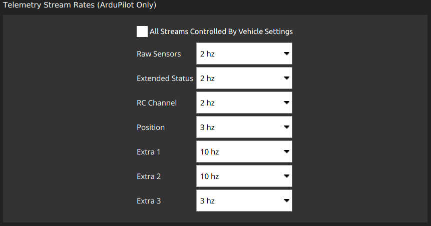
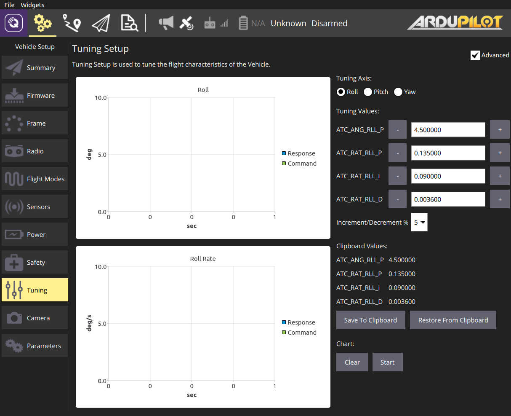
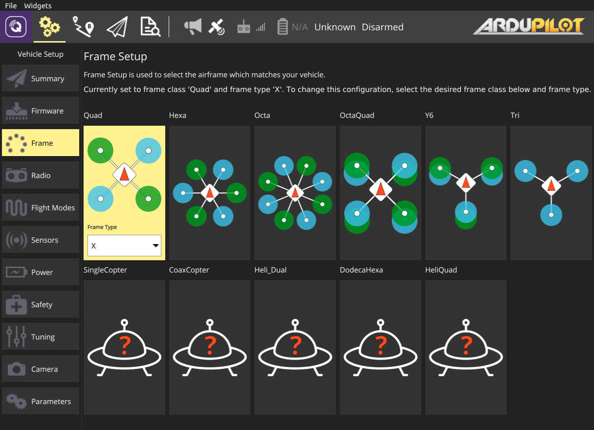

# QGC v4 Release Notes

:::warning
Release notes are now tracked in the [Github release page](https://github.com/mavlink/qgroundcontrol/releases).
See that page for information about changes after v4.0.0.
:::

## Stable Version 4.0

:::info
The format for Settings in QGC had to change in this release. Which means all QGC settings will be reset to defaults.
:::

- Settings
  - Language: Allow selection of language
  - Optional [CSV Logging](../settings_view/csv.md) of telemetry data for improved accessibility.
  - ArduPilot
    - Support configurable mavlink stream rates. Available from Settings/Mavlink page.
      
    - Improved support for flashing ChibiOS firmware
    - Improved support for connecting to ChibiOS bootloader boards
- Setup
  - Joystick
    - New joystick setup ui
    - Ability to configure held button to single or repeated action
  - ArduPilot
    - Motor Test
    - ArduSub
      - Automatic motor direction detection
    - ArduCopter
      - PID Tuning support 
      - Additional Basic Tuning options 
      - Copter/Rover - Frame setup ui 
- Plan
  - Create Plan from template with wizard like progression for completing full Plan.
  - Survey: Save commonly used settings as a Preset
  - Polygon editing
    - New editing tools ui
    - Support for tracing a polygon from map locations
  - ArduPilot
    - Support for GeoFence and Rally Points using latest firmwares and mavlink v2
  - [Pattern Presets](../plan_view/pattern_presets.md)
    - Allows you to save settings for a Pattern item (Survey, Corridor Scan, ...) into a named preset. You can then use this preset over and over again as you create new Pattern.
- Fly
  - Click to ROI support
  - Added support for connecting to ADSB SBS server. Adds support for ADSB data from USB SDR Dongle running 'dump1090 --net' for example.
  - Ability to turn on Heading to home, COG and Next Waypoint heading indicators in Compass.
  - Video
    - Add support for h.265 video streams
    - Automatically add a [Video Overlay](../fly_view/video_overlay.md) with flight data as a subtitle for locally-recorded videos
  - Vehicle type specific pre-flight checklists. Turn on from Settings.
- Analyze
  - New Mavlink Inspector which includes charting support. Supported on all builds including Android and iOS.
- General
  - Released Windows build are now 64 bit only
  - Log Replay: Ability to specify replay speed
  - ArduPilot
    - Improved support for chibios firmwares and ArduPilot bootloader with respect to flashing and auto-connect.
