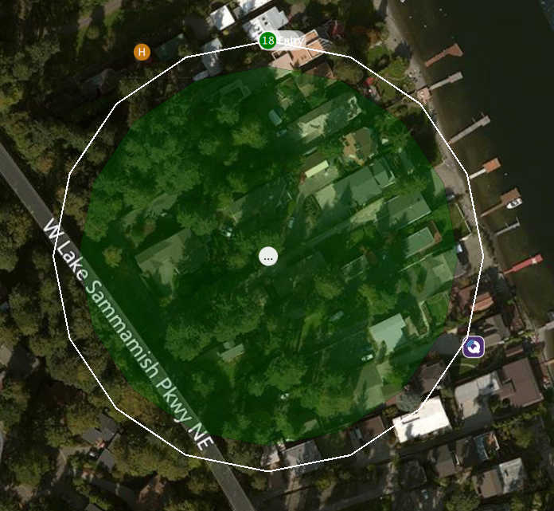
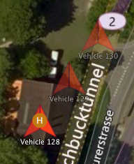
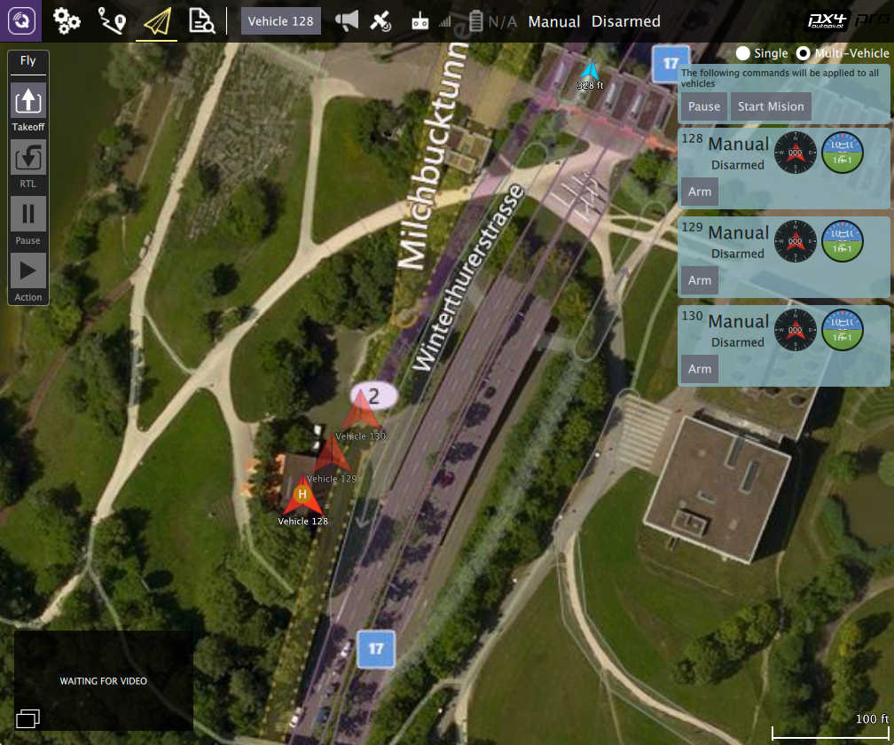

# QGroundControl v3.3 Release Notes (Detailed)

This topic contains a high level and _non-exhaustive_ list of new features added to _QGroundControl_ in version 3.3.

## Detailed Notes

### Settings View

#### NMEA GPS Device support

You can specify a connection to one of these devices on the General page.
The GPS information will then be used for ground station location and in turn follow me support.

For more information see [Settings > General (AutoConnect to the following devices)](../settings_view/general.md#auto_connect).

#### Video Recording

Videos will be saved to the Video directory of your QGC file save path.
You can also specify the maximum amount of space you want video files to consume.
After that size if exceeded the oldest video files will be removed.
Video Recording is turned on/off from the Video widget in the Fly View.

For more information see [Settings > General (Video / Video Recording)](../settings_view/general.md#video).

### Plan View {#plan_view}

#### Structure Scan

A Structure Scan allows you to create a grid flight pattern that captures images over vertical surfaces (polygonal or circular).
These are typically used for the visual inspection or creation of 3d models of structures.

Details [here](../plan_view/pattern_structure_scan_v2.md).

#### New MAVLink GeoFence, Rally Point support

QGC supports the new MAVLink GeoFence and Rally Point specification/protocol. This new system supports multiple polygonal and/or circular fences which can be specified as an exclusion or an inclusion fence.

The fence which is currently selected by the "Edit" radio button will show the on screen editing controls such as the drag points for polygon editing.

**Note** Only PX4 Pro firmware supports the new specification. ArduPilot does not yet support the new spec. Support for GeoFence/Rally is temporarily disabled in QGC until QGC ArduPilot code is reworked to the new architecture.

#### Edit Position Dialog

The Edit Position Dialog allows you to specify a detailed position for an item in either Geographic or UTM coordinate systems. It is available from the Polygon Tools menu as well as the hamburger menu of any mission item which specifies a coordinate:

#### Polygon Tools

You can now also click on the polygon center drag handle to bring up a set of polygon manipulation tools. The tools are available anywhere polygon editing is supported: Survey, Structure Scan, GeoFence, ...

- Circle - Converts the polygon to a circular polygon.
- Polygon - Changes a circular polygon back to a rectangular polygon.
- Set radius - Set radius for circular polygons.
- Edit position - Displays the edit position dialog to specify a detailed position for the circular center.
- Load KML - Set polygon to polygon loaded from KML file.

Circular polygon example:

### Fly View

#### Start/Stop Video Recording

This is now a video record button in the video window. Settings for saved videos are available from General Page of Setup view.

#### Multi-Vehicle vehicle indicators

When you are connected to multiple vehicles the vehicle id will be shown below the vehicle icon. The active vehicle will be opaque and the inactive vehicles will be semi-transparent.

#### Multi-Vehicle View supports batch commands

The multi-vehicle list now supports commands which apply to all vehicles.

The current list of available commands are Pause and Start Mission but that will be exapanded upon with further development.

#### ADS-B sensor vehicle display

Vehicle reported by ADS-B sensor on vehicle are shown on map as smaller blue icons with altitude and callsign below the icon.

